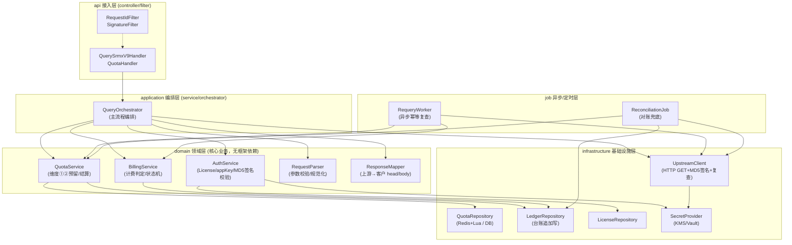
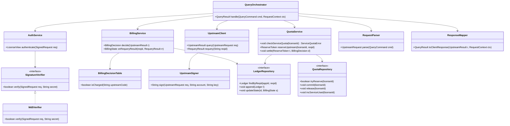
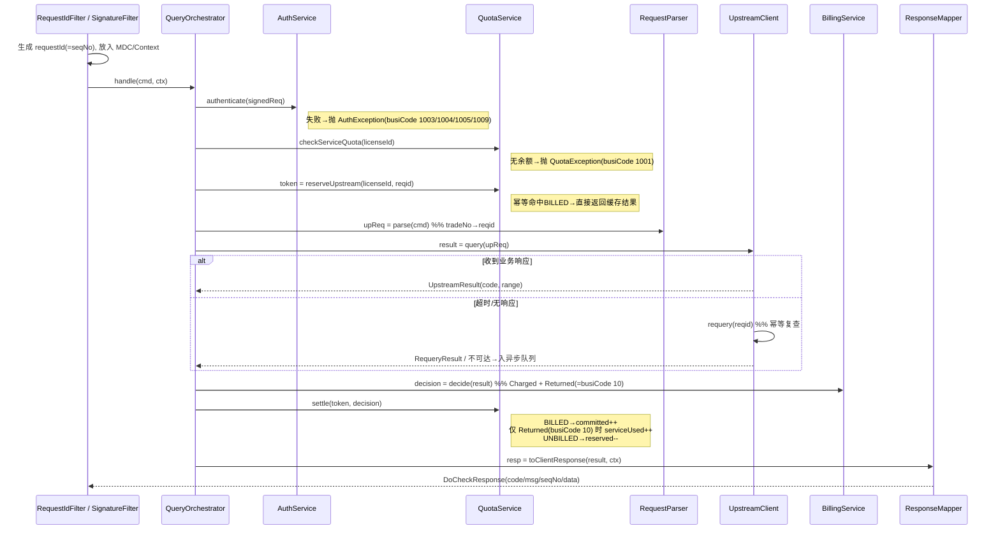
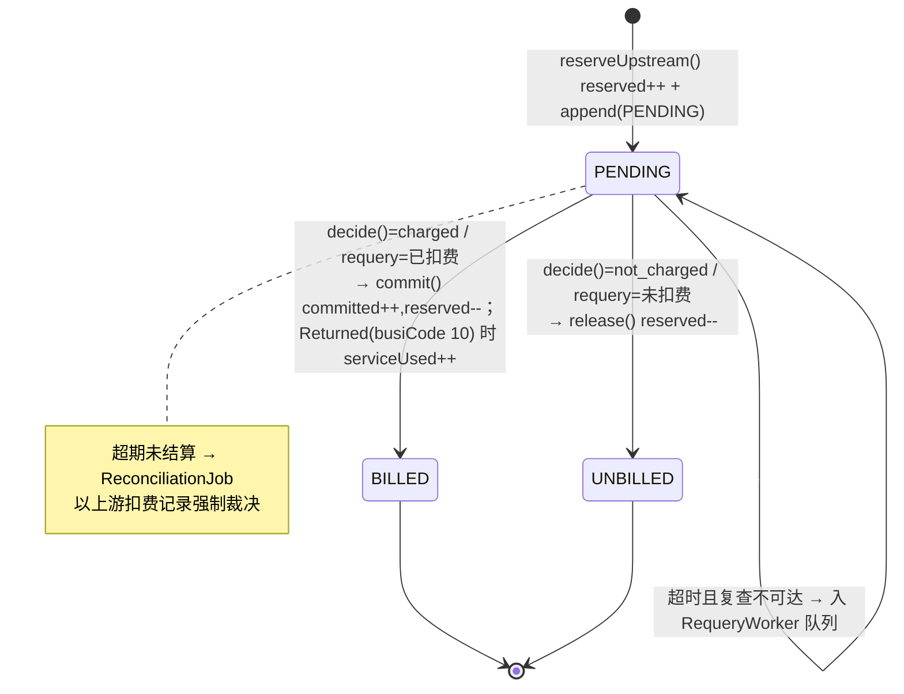
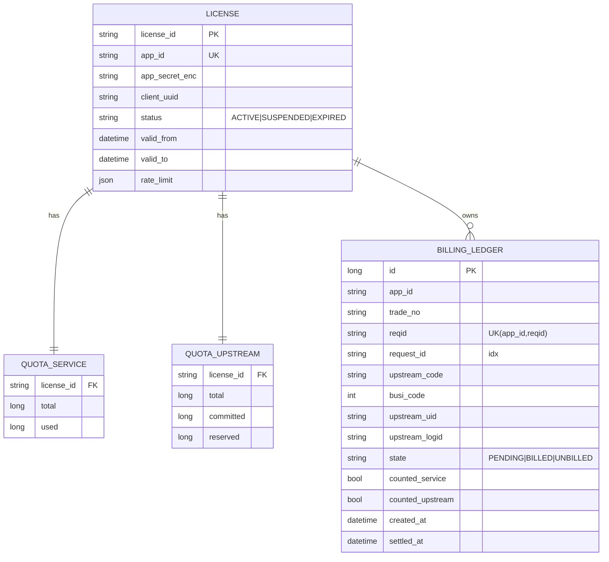
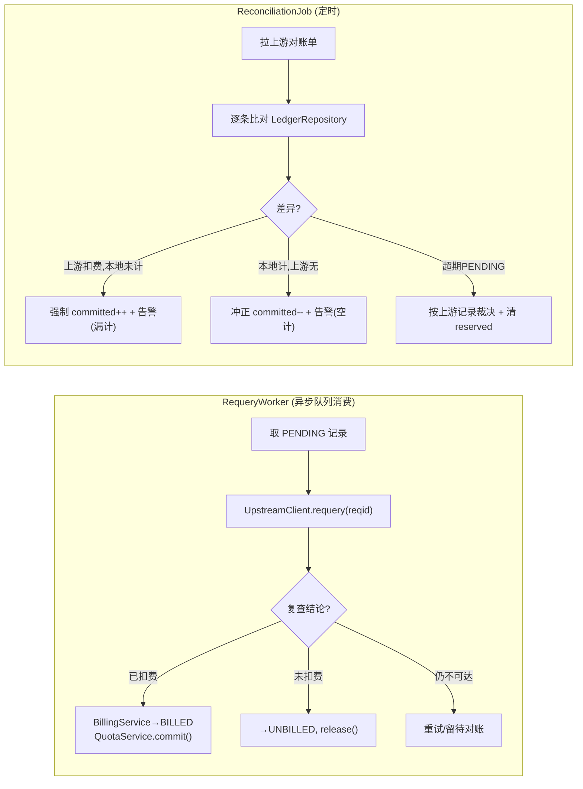
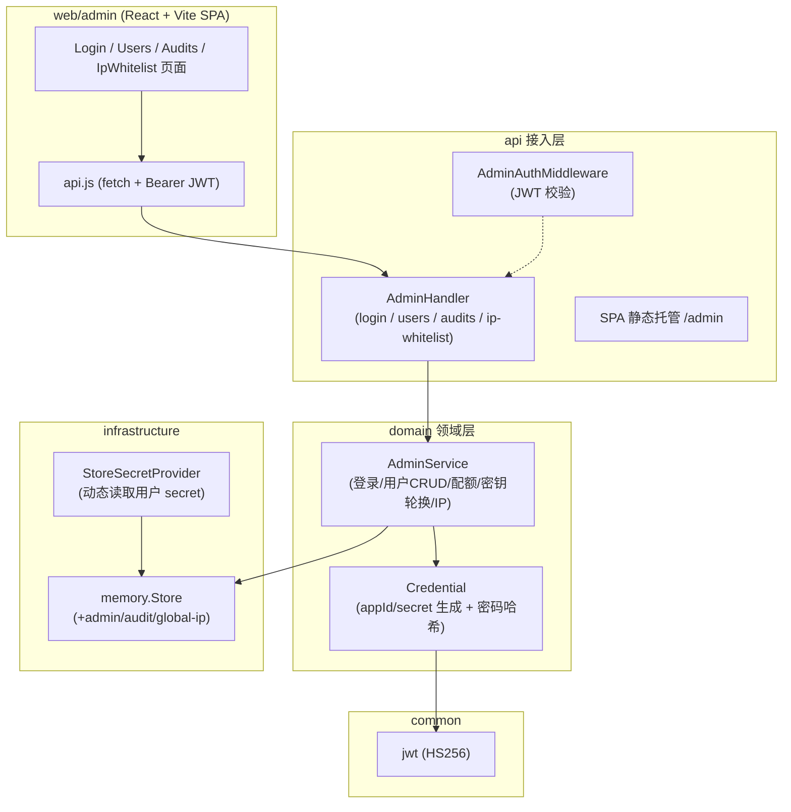
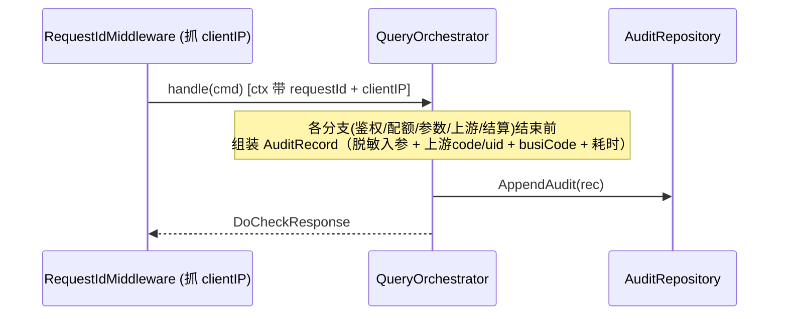
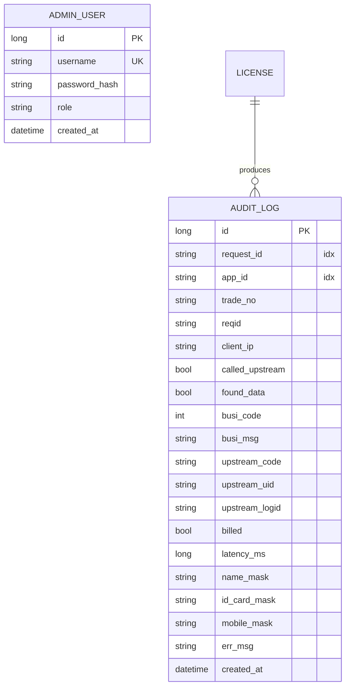

# 经济能力查询转接服务 — 架构图（ARCHITECTURE.md / 指导代码生成）

> 配套文档：业务/决策口径见 [`DESIGN.md`](./DESIGN.md)；下游契约见《接口文档 - 经济能力》；上游契约见 [`income_cls.md`](./income_cls.md) 与《伽马分层分_定制版》PDF。
> 本文目标：把设计落成**可直接指导代码生成**的结构图——包/模块边界、类与接口、调用链方法签名、状态机、数据模型、组件↔代码映射。

> **v0.4 拓扑**：下游对客户 = `POST /v1/openapi/zlx/querySrmxV9`（信封 `appKey/sign/encryptionType/body`，响应 `head/body`）。上游经 `upstream.Router` 路由到 **GamaClient（默认）/ IncomeClsClient**，由 `UPSTREAM_PROVIDER` 选择；两者实现同一 `UpstreamPort`，归一化为 `UpstreamResult`（`001`查得/`999`查无）。`head.errorCode` 由 `errs.ErrorCode(busiCode)` 映射。

---

## 0. 阅读指引

| 你想生成 | 看本文第几节 |
|---|---|
| 工程目录 / 包结构 | §1 分层与包结构 |
| 各层有哪些类/接口、方法签名 | §2 类与接口图 |
| 一次查询的代码调用链 | §3 调用链（带方法名） |
| 计费状态机 → BillingService 实现 | §4 计费状态机 |
| 建表 / ORM 实体 | §5 数据模型（ER） |
| 异步复查 + 对账兜底 | §6 异步与对账 |
| 组件落到哪个类/文件 | §7 组件↔代码映射表 |

---

## 1. 分层与包结构（Package / Module）



**包命名建议（语言无关，Java 示例）**

```
com.datahub.relay
├── api            // controller, filter, dto(request/response)
├── application    // QueryOrchestrator（事务/流程编排）
├── domain
│   ├── auth       // AuthService, SignatureVerifier
│   ├── quota      // QuotaService, 配额聚合
│   ├── billing    // BillingService, BillingDecisionTable, 状态机
│   ├── parse      // RequestParser
│   └── mapping    // ResponseMapper
├── infrastructure
│   ├── upstream   // UpstreamClient, UpstreamSigner(MD5)
│   ├── persistence// *Repository 实现 (Redis/MyBatis/JPA)
│   └── secret     // SecretProvider
├── job            // RequeryWorker, ReconciliationJob
└── common         // RequestId 生成, 错误码枚举, 日志/MDC, 异常
```

---

## 2. 类与接口图（Class Diagram）



---

## 3. 调用链（带方法名的主流程）

> 对应 `DESIGN.md §4`，此处标注**类.方法()**，可直接据此生成实现。



---

## 4. 计费状态机（BillingService 实现依据）

> 对应 `DESIGN.md §7.3`。状态只有三态，`PENDING` 为中间态，**无 UNKNOWN 终态**。



> `Charged`（维度②，是否上游扣费）与 `Returned`（维度①，是否查得数据=busiCode 10）**可分离**：999 查无结果 `Charged=true, Returned=false`。

**判定表（`BillingDecisionTable`，应配置化，对应 §7.4）**

| 上游 code | isCharged(维度②) | busiCode | Returned(维度①) | 落地常量 |
|---|---|---|---|---|
| 001 | `true` | 10 | `true` | `CHARGED_CODES = {001, 999}` |
| 999 | `true` | 1000 | `false` | `RETURNED_CODES = {001}` |
| 003/002/004/012/013/005.. | `false` | 1007 | `false` | 其余一律 false + 触发告警 |

---

## 5. 数据模型（ER，对应 §11）



- 维度①剩余 `= quota_service.total - used`
- 维度②剩余 `= quota_upstream.total - committed - reserved`
- 计数与预留必须**原子**（Redis+Lua 或 DB 条件更新），见 §7.5。

---

## 6. 异步复查与对账兜底（job 层）



---

## 7. 组件 ↔ 代码模块映射表（生成代码时对号入座）

| DESIGN 章节 | 组件/职责 | 落地类（建议） | 关键依赖 |
|---|---|---|---|
| §3.1 网关 / §9 | 接入、requestId、签名入口 | `RequestIdFilter`, `SignatureFilter`, `QueryController`, `QuotaController` | `RequestIdGenerator`, `SignatureVerifier` |
| §8.1 | 客户侧 MD5 加签校验（appId + body 排序拼接 + secret） | `Md5Verifier`（实现 `SignatureVerifier`） | `LicenseRepository`, `SecretProvider` |
| §8.2 / §6 | 上游 MD5 签名 + 调用 | `UpstreamSigner`, `UpstreamClient` | HTTP 连接池/超时/熔断 |
| §7 / §6.3 | 双维度配额预留/结算 | `QuotaService`, `QuotaRepository` | Redis+Lua / DB 条件更新 |
| §7.3 / §7.4 | 计费判定与状态机 | `BillingService`, `BillingDecisionTable` | `LedgerRepository` |
| §5 / §6.1 | 参数校验、响应映射 | `RequestParser`, `ResponseMapper` | 错误码枚举 |
| §7.6 | 复查/对账兜底 | `RequeryWorker`, `ReconciliationJob` | `UpstreamClient`, `LedgerRepository` |
| §9 | 全链路追踪 | `RequestIdGenerator`, MDC/Context 注入 | 日志 pattern `[%X{requestId}]` |
| §5.3 | 网关错误码 | `GatewayErrorCode` 枚举 + 全局异常处理 | `@ControllerAdvice` / middleware |
| §11.4 | 密钥管理 | `SecretProvider`(KMS/Vault) | 加密列兜底 |

---

## 8. 业务码 → 异常 → 响应映射（生成全局异常处理依据）

> 对齐 PDF（§5.3）：业务态一律 `code=0`，成败在 `data.busiCode` 表达；仅**请求体无法解析 / 系统级异常**返回 `code=-1`（无 `data`）。HTTP 状态统一 `200`。

| busiCode | 含义 | 异常类（建议） | 计① | 计② | 触发点 |
|---|---|---|---|---|---|
| 10 | 查询成功【计费】 | —（正常流） | 是 | 是（上游扣费） | 上游 001 |
| 1000 | 数据未查得 | —（正常流） | 否 | 是（上游扣费） | 上游 999 |
| 1001 | 账户余额不足 | `ServiceQuotaExhaustedException` | 否 | 否 | `QuotaService.checkServiceQuota` |
| 1002 | 账户信息不存在 | `AccountNotFoundException` | 否 | 否 | `AuthService`（appId 查无 license） |
| 1003 | appId 异常 | `AppIdInvalidException` | 否 | 否 | `AuthService`（缺少/非法 appId） |
| 1004 | 产品编号异常 | `ProductInvalidException` | 否 | 否 | `AuthService`（apiKey ≠ 固定值） |
| 1005 | 账号信息异常 | `SignatureInvalidException` | 否 | 否 | `AuthService`（MD5 验签失败） |
| 1006 | 透支余额已达上限 | `UpstreamQuotaExhaustedException` | 否 | 否 | `QuotaService.reserveUpstream` |
| 1007 | 数据请求异常 | `ParamValidationException` / `UpstreamBusinessException` / `UpstreamNotExecutedException` | 否 | 否 | `RequestParser` / 判定表 `isCharged=false` / 复查确认未扣费 |
| 1009 | 服务尚未开通 | `LicenseInactiveException` | 否 | 否 | `AuthService`（license 停用/过期/未开通） |

| 全局 code | 含义 | 触发点 |
|---|---|---|
| 0 | 正常（含上述所有 busiCode 业务态） | 正常流 + 业务异常 |
| -1 | 响应异常 | 请求体不可解析 / 系统级未捕获异常 |

> 全局异常处理器把上述异常统一封装为 PDF 信封 `{code, msg, seqNo, data:{busiCode, busiMsg, result?}}`；`seqNo = requestId`（§9）。
```

---

## 9. 管理后台（Admin Console，对应 DESIGN §16）

### 9.1 模块与包结构（在原六边形分层上扩展）



**包扩展**

```
internal/
├── api/            // +admin_handler.go, +admin_middleware.go（JWT 校验 / 静态托管）
├── domain/
│   └── admin/      // AdminService, Credential（appId/secret 生成、密码哈希）
├── common/
│   └── jwt/        // 最小 HS256 实现（零外部依赖）
└── infrastructure/
    ├── persistence/memory  // +admin_store.go（admin/audit/global-ip）
    └── secret              // +StoreSecretProvider（按 licenseId 读用户 secret）
web/admin/          // React + Vite 前端工程
```

### 9.2 审计写入链路（不侵入主流程口径）



> 审计与计费台账（§5 ER `BILLING_LEDGER`）以 `request_id` 关联；二者职责分离：台账管"钱"（计费状态），审计管"账"（可读操作记录 + 上下游日志）。

### 9.3 IP 白名单校验点

| 层级 | 位置 | 失败返回 |
|---|---|---|
| 全局白名单 | 业务入口（`doCheck`/`quota`）前置 | `code=-1`「IP 不在白名单」 |
| 每用户白名单 | `QueryOrchestrator` 鉴权后（已知 license） | `busiCode 1005 账号信息异常` |

### 9.4 新增数据模型（ER，对应 DESIGN §16.5）



> `LICENSE` 增加 `ip_whitelist text[]`（每用户白名单）；全局白名单存 `ip_whitelist_global`。

### 9.5 admin 组件 ↔ 代码映射

| DESIGN 章节 | 组件/职责 | 落地类/文件 |
|---|---|---|
| §16.1 | 管理员登录 / JWT | `AdminHandler.login`, `AdminAuthMiddleware`, `common/jwt` |
| §16.2 | 用户 CRUD / 配额 / 密钥 | `AdminService`, `Credential`, `memory.Store` |
| §16.3 | 审计查询 | `AdminService.ListAudits`, `AuditRepository`, `QueryOrchestrator`(写) |
| §16.4 | IP 白名单 | `AdminService`(global/per-user), 业务入口校验 |
| §16.0 | SPA | `web/admin`（Vite 构建产物托管于 `/admin`） |

