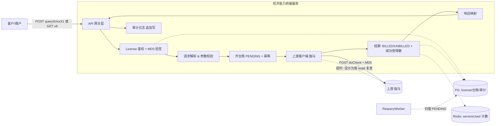
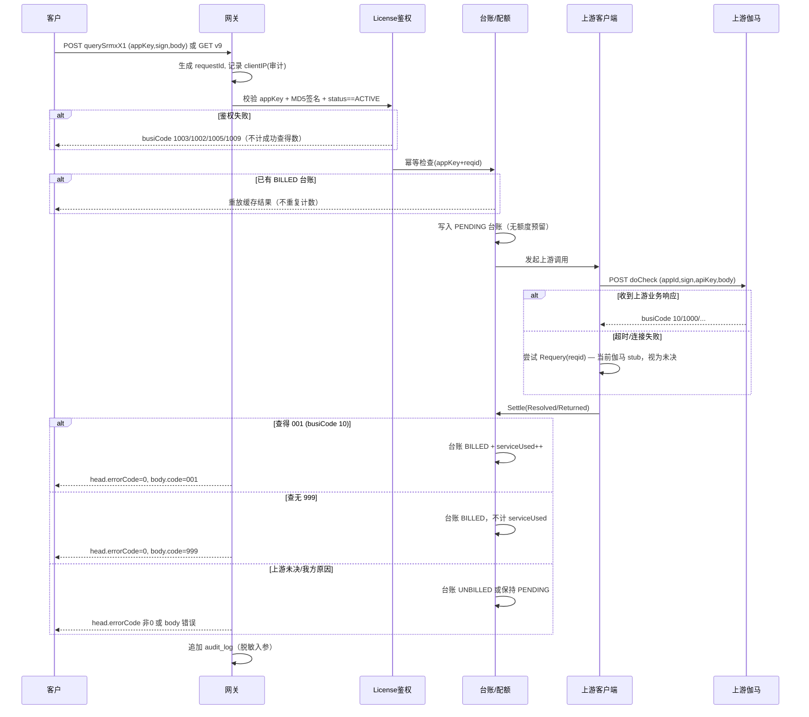
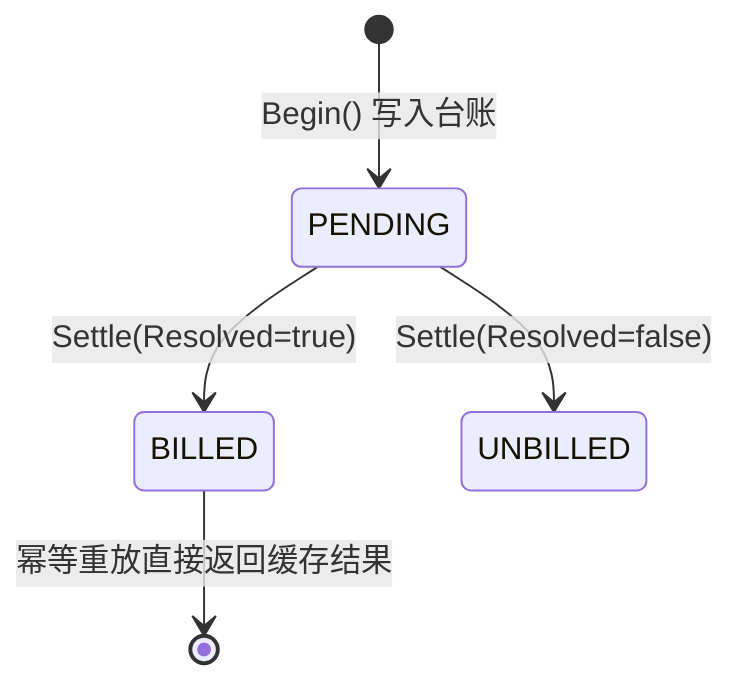

# 经济能力查询转接服务 — 设计文档（DESIGN.md）

> 版本：v0.7（服务版本 **x1**）
> 角色定位：本服务是一个**接口转接（API Relay / Gateway）网关**。对外为客户（商户）提供经济能力查询 API（当前版本 **x1**：`POST /v1/openapi/zlx/querySrmxX1`）；对内调用**上游数据源**（伽马分层分）获取评分后回传。
> 在此基础上提供 **License 鉴权** 与 **成功查得数统计**（无额度限制）能力。

> **v0.7 变更（重要）**：
> - **彻底移除维度②**（上游配额 / 上游调用计数 / 对账作业）。后台只保留单一统计「成功查得数」。删除内容：`QuotaRepository` 的预留/提交/释放、Redis 双维度计数、`billing_ledger.counted_upstream`、`quota.total/reserved` 列与 `UPSTREAM` 行、`ReconciliationJob`、管理端 `serviceTotal/upstreamTotal` 字段。台账状态机（PENDING→BILLED/UNBILLED）与异步复查 worker（RequeryWorker）保留，仅用于幂等与成功查得数结算；**当前伽马 `Requery` 为 stub**，复查 worker 对伽马上游暂无实际效果。
> - **彻底移除 IP 白名单**：删除全局/每用户 IP 白名单表、字段、管理端页面与网关拦截逻辑；来源 IP 仅写入审计。生产 IP 准入交由**阿里云 ECS 安全组**等网络层控制。
> - **管理后台增强**：用户增加手机号（脱敏展示）、密钥创建时间（`secret_created_at`）、授权过期日期（`valid_to`）；支持按 uuid(appKey)/名称/手机号检索用户与过滤审计。
> - **持久化**：支持 `postgres`+`redis` 生产路径；同 RDS 实例内 `dev_db`（开发/e2e）与 `prod_db`（生产）+ Redis 逻辑库 `db0`/`db1` 隔离。
> 本文 §7.x / §11.2 中关于维度② 的预留/提交/释放/对账描述均**已作废**，以本节为准。
>
> **v0.6 变更**：**取消额度限制**。不再对客户做余额拦截、也不再做成本上限拦截；任何持有效 license 的客户均可不受次数限制地调用。系统**仅统计每个用户累计成功查得数据的次数**（上游 001 → busiCode 10）。`busiCode 1001 账户余额不足` 与 `1006 透支余额已达上限` 不再触发。

> **v0.5 变更**：
> - **服务版本升级为 x1**：对外路由由旧版 `querySrmxV9` 改为 `POST /v1/openapi/zlx/querySrmxX1`。请求/响应契约保持不变（仍为 `appKey/sign/encryptionType/body` + MD5 加签、`head/body` 信封）。
> - **旧版 v9（兼容保留）**：[`income_cls.md`](./income_cls.md)（`GET /yrzx/finan/net/10w/v9`，`account/key` 验签 `verify=MD5(account+idCard+mobile+reqid+key)`，响应 `code/msg/uid/result.range/verify`）是**本服务旧版本（v9）下游契约**，仍对老客户提供（§5.4）。它与 x1 **共用同一上游（伽马）、同一 license/鉴权（account=appKey、key=appSecret）与成功查得数统计**，仅对外的请求/响应格式不同。**income_cls.md 不是上游**。
> - **上游唯一**：上游数据源**只有伽马分层分**（《伽马分层分_定制版》PDF，代码中的 `gama`）：`POST /enol/api/v1/doCheck`，信封 `appId/sign/apiKey/encryptionType/body` + MD5，返回 `data.busiCode/result.score`，归一化为 `UpstreamResult`（Code `001`查得/`999`查无）。
> - **对外（下游）**：端点 `POST /v1/openapi/zlx/querySrmxX1`，网关信封 `appKey/sign/encryptionType/body`（**MD5 加签**），响应 `head{errorCode,logId,time,errorMsg,timestamp} / body{code,msg,uid,reqid,verify,result{range}}`。`head.errorCode` 由内部 busiCode 映射（"0"=成功含查得/查无；非0=网关级错误，无 body）；查得/查无落在 `body.code` 001/999。

### 决策基线
1. **签名**：**客户侧（下游）**采用 **appKey + MD5 加签**（对 body 业务参数按键 ASCII 升序拼接后追加 `secret`，再 MD5；见 §8.1）；**上游侧（伽马）**因是第三方服务无法修改，沿用伽马 MD5 信封加签（对 body 业务参数按键 ASCII 升序拼接后追加 `secret`，再 MD5；见 §8.2）。
2. **成功查得数统计（v0.6）**：**仅查得数据（busiCode=10，上游 001）才计入用户的「成功查得数」**。上游查无结果（999 → busiCode 1000）、鉴权/参数拦截、我方内部错误、上游我方原因失败等一律**不计**。这是本服务唯一对客户维度的统计口径。
3. **无额度限制 + 单维度统计（v0.7）**：**不做任何次数上限拦截**，且**已彻底移除维度②上游配额/调用计数与对账作业**。台账（PENDING→BILLED/UNBILLED）与异步复查仅用于幂等与「成功查得数」结算，不再有任何上游计数或对账门槛。
4. **无 UNKNOWN 态**：超时/无响应一律通过**幂等 re-query（按 reqid 复查）**得到确定结论，最终以**上游扣费记录**为准，因此请求结算状态只有"已计费/未计费"两种终态。
5. **客户查询路由**：提供 `GET /v1/openapi/zlx/quota` 查询路由，返回该用户**累计成功查得数**与 license 状态（无余额/上限概念）。

---

## 1. 背景与目标

### 1.1 业务背景
- 客户调用**本服务 x1**（`POST /v1/openapi/zlx/querySrmxX1`，信封 `appKey/sign/encryptionType/body` + MD5 加签，请求体 `mobile/idCard/name`）。
- 本服务鉴权后调用唯一上游**伽马分层分**（《伽马分层分_定制版》PDF）。
- 上游返回收入模型评分（伽马 `result.score`，0~51），归一化后封装进下游 `body.result.range` 返回。

### 1.2 设计目标
1. **协议转接**：屏蔽上游接口细节，对客户提供稳定、统一的 API 契约。
2. **License 鉴权**：只有持有合法 license 的客户才能调用。
3. **成功查得数统计（v0.7，单维度）**：
   - 仅一个对客户的统计口径——**累计成功查得数**：客户调用本服务且**查得数据（busiCode=10）才计**，查无结果/错误一律不计。
   - ~~维度②（我方上游成本）~~：**已移除**（不再有上游配额、上游调用计数与对账）。
4. **结算正确性**：
   - 通过"开台账 → 以上游确定结论结算 → 异步幂等复查"驱动 PENDING→BILLED/UNBILLED，**消除不确定态**；查得时累计成功查得数。

### 1.3 非目标（本期不做）
- 不做客户自助开通 / 充值前台（仅提供查询路由 + 预留数据模型）。
- 不做 V8（`/openapi/zlx/querySrmxV8`，发票明细数组）——本期仅 x1 经济能力评分。
- 多上游：当前仅伽马一个上游；保留 `upstream.Router` 抽象以便未来扩展，但不做同请求并发对比/合并或自动故障转移。

---

## 2. 术语表

| 术语 | 含义 |
|---|---|
| 客户 / 商户 | 调用本服务的外部方 |
| License | 颁发给客户的授权凭证，含 `appKey`/`appSecret`、状态与成功查得数统计 |
| appKey | 网关分配给客户的公开标识（下游信封字段名；DB 列 `app_key`） |
| appSecret | 客户 MD5 加签密钥（仅创建/轮换时一次性返回；DB 列 `app_secret_enc`） |
| 上游 / Provider | 伽马分层分（《伽马分层分_定制版》PDF）经济能力数据源 |
| 成功查得数（serviceUsed） | 客户调用本服务且**查得数据**（busiCode=10，上游 001）的**累计次数**；无上限 |
| 查得数据（returned） | 上游查得到数据（001 → busiCode 10），是**唯一计数**条件；查无(999)不算 |
| re-query（幂等复查） | 超时/无响应时按 `reqid` 向上游复查的设计能力；**当前伽马 client 的 Requery 为 stub** |
| 计费台账（billing ledger） | 记录每次请求结算状态的追加写流水（PENDING/BILLED/UNBILLED） |
| reqid | 幂等键：x1 由本服务内部生成（≤20）；v9 由客户传入 |
| requestId | 本服务生成的全链路追踪 ID，作日志前缀并随 `head.logId` 返回（§9） |

---

## 3. 系统架构



### 3.1 分层职责
| 层 | 职责 |
|---|---|
| API 网关层 | HTTP 接入、信封解析、**生成 requestId**（`head.logId` / `X-Request-Id`）、解析来源 IP（仅审计，**不做 IP 拦截**）、统一响应封装 |
| License 鉴权 | 校验 appKey、license 存在、`status==ACTIVE`、MD5 签名 |
| 配额/台账模块 | **无额度拦截**；幂等检查 → 开 PENDING 台账 → 结算时 BILLED/UNBILLED；查得时 **IncServiceUsed** |
| 请求解析 | 校验 `mobile/idCard/name` 等参数，x1 内部生成 reqid |
| 上游客户端 | 构造伽马 MD5 请求、超时控制、结果归一化（001/999） |
| 结算/响应映射 | 依上游结论结算台账 + 累计成功查得数；映射 x1 head/body 或 v9 JSON |
| 异步复查 | `RequeryWorker` 周期扫描 PENDING 台账（**伽马 Requery 当前 stub，无实际复查**） |
| 存储 | PostgreSQL（license/台账/审计/管理员）+ Redis（成功查得数原子计数）；或 memory（开发） |
| 管理后台 | JWT 管理员、用户 CRUD、密钥轮换、审计查询、React SPA |

---

## 4. 核心调用流程



---

## 5. 对外接口契约（客户侧）

> 权威=《接口文档 - 经济能力》：信封 `appKey/sign/encryptionType/body` + MD5 加签，响应 `head/body`。
> 通信：`POST` + HTTPS + JSON（UTF-8）。网关前缀 `/v1`。
> 环境：测试 apiHost `http://api-jcdz-test.jcszfw.com/v1`（联调提供正式地址）。

### 5.0 请求/响应公共结构

**请求信封**
| 字段 | 类型 | 必填 | 说明 |
|---|---|---|---|
| appKey | String | 是 | 网关分配的客户公开标识 |
| sign | String | 是 | 签名（见 §8.1，对 body 业务参数 MD5 加签） |
| encryptionType | int | 否 | 参数加密类型，`1`=明文（本期仅支持明文） |
| body | JSON | 是 | 接口请求体，见各接口定义 |

**响应信封（head/body）**
| 字段 | 类型 | 说明 |
|---|---|---|
| head.errorCode | String | `"0"`=成功（含查得/查无）；非 `"0"`=网关级错误（见 §5.3 映射） |
| head.logId | String | = 本服务 requestId（§9） |
| head.time | Number | 处理耗时 ms |
| head.errorMsg | String | 返回文字描述 / 错误原因 |
| head.timestamp | Number | 毫秒时间戳 |
| body | Object | 业务响应体（网关级错误时省略） |
| - code | String | `001`=查得 / `999`=查无（沿用旧版 v9 业务码口径） |
| - msg / uid / reqid / verify | String | 业务消息 / 上游流水号 / 请求流水号 / 上游签名（伽马为空） |
| - result.range | String | 收入模型评分 |

### 5.1 经济能力查询 x1
- **路径**：`POST /v1/openapi/zlx/querySrmxX1`
- **鉴权**：见 §8.1（appKey + MD5 签名）。

**请求示例**
```json
{
  "encryptionType": 1,
  "appKey": "y89098io",
  "sign": "0528999dd55c025b8f36fc72dceb1f63",
  "body": {
    "mobile": "138xxxx1009",
    "idCard": "330xxxxxxxx4312",
    "name": "张三"
  }
}
```

**body 参数**（《接口文档 - 经济能力》§3.1.3）
| 字段 | 类型 | 必填 | 说明 |
|---|---|---|---|
| mobile | String | 是 | 手机号 |
| idCard | String | 是 | 身份证（末位 X 大写） |
| name | String | 否 | 姓名 |

> 上游 reqid 由本服务内部生成（≤20），不再来自客户 tradeNo。

**成功响应（查得数据）**
```json
{
  "head": { "errorCode": "0", "logId": "<requestId>", "time": 81, "errorMsg": "success", "timestamp": 1778059529352 },
  "body": { "code": "001", "msg": "成功", "uid": "...", "reqid": "...", "verify": "", "result": { "range": "39" } }
}
```

**查无结果**：`head.errorCode="0"` + `body.code="999"`（无 `result` 节点），**不计成功查得数**。

**网关级错误（鉴权/参数/系统，只返回 head）**
```json
{ "head": { "errorCode": "505062", "logId": "...", "time": 12, "errorMsg": "数据请求异常", "timestamp": 1672822394403 } }
```
- v0.6+ **无额度拦截**，不会因余额/上限拒绝请求。

### 5.2 查询路由（本服务扩展，非 .doc 定义）
- **路径**：`GET /v1/openapi/zlx/quota`
- **鉴权**：同主接口（appKey + MD5 签名）。
- **用途**：供客户查询自身**累计成功查得数**与 license 状态。无额度限制，不返回余额/上限。
- **响应**：`{errorCode, errorMsg, status, serviceUsed}`，其中 `serviceUsed` = 累计成功查得数据的次数。

### 5.3 内部 busiCode → head.errorCode 映射
> 查得/查无是业务结果，落在 `body.code`（001/999），`head.errorCode` 恒为 `"0"`。下表非 0 项为网关级错误（只返回 head）。

| 内部 busiCode | 含义 | head.errorCode | 触发条件 | 计成功查得数 |
|---|---|---|---|---|
| 10 | 查得数据 | "0" (body.code 001) | 上游伽马 busiCode 10 | 是 |
| 1000 | 数据未查得 | "0" (body.code 999) | 上游伽马 busiCode 1000 | 否 |
| 1002 | 账户信息不存在 | 505004 | appKey 查无 license | 否 |
| 1003 | appKey 异常 | 505001 | 缺少/非法 appKey | 否 |
| 1005 | 账号信息异常 | 505002 | 签名校验失败 | 否 |
| 1007 | 数据请求异常 | 505062 | 参数校验失败 / 上游我方原因失败 / 内部错误 / 超时复查未决 | 否 |
| 1009 | 服务尚未开通 | 505007 | license 非 ACTIVE（SUSPENDED/EXPIRED） | 否 |

> v0.6 起取消额度限制，`1001 账户余额不足`、`1006 透支余额已达上限` 不再触发（常量保留以兼容历史）。

> `head.errorCode` 字典中 `0` / `505062` 取自 .doc 示例，其余 `5050xx` 为内部约定（待联调对齐真实字典）。

### 5.4 旧版 v9 兼容接口（income_cls.md）

> 面向仍在使用旧格式的老客户保留。**与 x1 共用同一上游（伽马）、license 鉴权与成功查得数统计**，仅对外协议不同。新接入一律用 x1（§5.1）。

- **路径**：`GET /yrzx/finan/net/10w/v9`（HTTP GET，UTF-8，JSON）。
- **入参**（query）：`account`（=客户 appKey）、`idCard`、`name`（选填）、`mobile`、`reqid`（≤20，幂等键）、`verify`。
- **验签**：`verify = MD5(account + idCard + mobile + reqid + key).toUpperCase()`，其中 `key` = 客户 `appSecret`（服务端按 `account` 定位）。
- **响应**：`{code, msg, uid, reqid, result{range}, verify}`；`code`：`001` 查得 / `999` 查无 / 错误码字典（`002/003/004/005/006/008/009/011/012/013/020`，见 income_cls.md）。
- **响应签名**：`verify = MD5(code + uid + key).toUpperCase()`（是签名字段 code+uid+key 的一致口径，**待与旧版实现联调确认**）。
- **错误码映射**（内部 busiCode → v9 code）：`10→001`、`1000→999`、`1002→002`、`1009→004`、`1003→009`、`1005→013`、其余（含 1007 上游/我方原因/超时未决）→`012`。入参存在性/格式在网关层校验：account 空→`009`、reqid 空或 >20→`008`、idCard 空/格式→`005`、mobile 空/格式→`020`、verify 空→`011`。
- **幂等**：以客户传入的 `reqid` 为台账幂等键（x1 为内部生成）。
- **统计口径同 x1**：仅查得数据（→`001`）累计成功查得数；查无（`999`）不计。

---

## 6. 上游对接（Provider 侧）

> 唯一上游：**伽马分层分**（《伽马分层分_定制版》PDF，代码中的 `gama`）。保留 `upstream.Router` 抽象以便未来扩展，但当前仅注册伽马一个 provider。

- **URL**：`POST https://{域名}/enol/api/v1/doCheck`
- **请求信封**：`appId`（商务分配）、`sign`、`apiKey`（固定 `gama_ctmz_layer_score`）、`encryptionType`(1=明文)、`body{name?, idCard, mobile}`
- **签名**：`sign = MD5(body 非空业务参数按键 ASCII 升序拼接 key+value … + secret)`（小写 hex；`appId/sign/apiKey/encryptionType` 不参与）
- **出参**：`code`（0 成功）、`msg`、`seqNo`（上游流水号）、`data.busiCode`、`data.busiMsg`、`data.result.score`
- **归一化**：`data.busiCode 10 → UpstreamResult.Code "001"`（查得，附 `score`）、`1000 → "999"`（查无）、其余 busiCode（1001/1002/1003/1005/1006/1007/1009 等，均为我方在伽马侧的账户/参数/系统问题）→ 视为上游侧错误，触发 re-query/对账兜底、不计费。

### 6.1 字段映射
| 客户侧（下游 body） | → | 上游侧（伽马 body） |
|---|---|---|
| mobile | → | mobile |
| idCard | → | idCard |
| name | → | name |
| （内部生成 reqid，≤20，用于幂等/复查） | → | （伽马以 seqNo 返回上游流水号） |
| （我方配置）| → | appId / secret / apiKey |

> `appId/secret` 为**我方与伽马的凭证**，与客户的 license 无关，存于服务端安全配置（见 §11.4）。

### 6.2 上游 busiCode → 客户 busiCode
归一化后的上游 `Code` 映射为客户 `body.code` / 内部 busiCode：`001 → 10`（查得数据，附 `range`）、`999 → 1000`（数据未查得）、其余我方原因失败（伽马 1001/1002/1003/1005/1006/1007/1009 等）`→ 1007`（数据请求异常）并告警。

### 6.3 计数口径（v0.7 现行）
| 场景 | busiCode | 累计成功查得数 (serviceUsed) |
|---|---|---|
| 上游成功(001) | 10 | ✅ +1 |
| 上游查无结果(999) | 1000 | ❌ 不计 |
| 鉴权/参数拦截 | 1003/1005/1009/1007 等 | ❌ 不计 |
| 超时/上游未决 | 1007 | ❌ 不计（台账可能保持 PENDING） |
| 幂等重放（已有 BILLED） | 10 或 1000 | ❌ 不重复计数 |

---

## 7. License 与成功查得数设计（v0.7 现行）

### 7.1 License 数据模型（代码 / DB）
```text
License (表 license)
├── license_id        主键
├── app_key           客户公开标识 appKey（唯一）
├── app_secret_enc    客户 MD5 加签 secret（当前 e2e 明文存储；生产应加密）
├── client_uuid       内部 UUID（requestId 等用途）
├── name              商户展示名/备注
├── mobile            联系手机号（管理后台脱敏展示）
├── status            ACTIVE / SUSPENDED / EXPIRED
├── valid_from        生效时间
├── valid_to          授权过期日期（后台展示；鉴权当前仅检查 status）
├── secret_created_at 当前密钥创建/轮换时间
├── rate_limit        JSONB（schema 预留，代码未读取）
├── created_at / updated_at

Quota (表 quota, dim='SERVICE' 唯一)
├── license_id
├── used_or_committed 累计成功查得数
└── updated_at
```

- **无额度上限**：不做任何次数拦截。
- **Active()**：代码仅判断 `status == "ACTIVE"`，**未**按 `valid_to` 日期自动过期。

### 7.2 成功查得数（serviceUsed）语义
| 项 | 说明 |
|---|---|
| 计的是什么 | 客户调用本服务且**查得数据**（busiCode=10）的累计次数 |
| 计数时机 | `Settle` 时 `Returned=true` → `IncServiceUsed` |
| 存储 | memory 内存计数；生产 Redis `quota:{licenseId}:svc_used` + PG `quota` 表镜像 |
| 查询 | `GET /v1/openapi/zlx/quota` 返回 `{errorCode, errorMsg, status, serviceUsed}` |

### 7.3 台账状态机（幂等 + 结算）



**流程（`quota.Service` + `QueryOrchestrator`）：**
1. **Begin**：按 `(appKey, reqid)` 查台账；若已有 **BILLED** → 幂等重放，不重复计数。
2. 否则 append **PENDING** 台账（**无预留、无余额检查**）。
3. 调用上游伽马 → `billing.Decide` 产出 `BillingDecision`。
4. **Settle**：
   - `Resolved && Returned` → 台账 **BILLED** + `serviceUsed++`
   - `Resolved && !Returned`（查无）→ 台账 **BILLED**，不计数
   - `!Resolved` → 台账 **UNBILLED**
5. 超时路径：orchestrator 尝试 `upstream.Requery`；**当前伽马实现恒返回不可达**，视为未决 → `1007` / PENDING 留待 worker。

### 7.4 上游伽马 busiCode → 客户响应
| 伽马 busiCode | 含义 | 归一化 Code | 客户 busiCode | serviceUsed |
|---|---|---|---|---|
| 10 | 查询成功 | 001 | 10 | +1 |
| 1000 | 数据未查得 | 999 | 1000 | 0 |
| 其它 | 我方伽马账户/参数/系统问题 | - | 1007 | 0 |

### 7.5 并发与原子性
- **serviceUsed 递增**必须原子：Redis `INCR` + PG 写回（生产）；memory 单 mutex（开发）。
- **幂等**：`(app_key, reqid)` 唯一约束；BILLED 命中直接重放。

### 7.6 异步复查（RequeryWorker）
- 周期扫描 `PENDING` 台账，尝试上游复查并结算。
- **现状**：`upstream/gama.go` 的 `Requery` 为 stub（`Reachable=false`），对伽马上游**无实际复查**；inline 复查同理。

### 7.7 已移除（v0.6/v0.7 勿再实现）
- ~~维度①余额检查、1001/1006 错误~~
- ~~维度②预留/committed/reserved、上游配额、对账任务 ReconciliationJob~~
- ~~全局/每用户 IP 白名单拦截~~

---

## 8. 鉴权与签名（决策 1：客户侧 MD5 加签 / 上游侧 MD5）

> 客户侧（本服务对外）使用 **appKey + MD5 加签**；上游侧（伽马）因是第三方服务无法修改，沿用伽马 **MD5**。两侧签名相互独立、互不影响。

### 8.1 客户 → 本服务（appKey + MD5 加签）
- 客户持 `appKey`（公开标识，由我方分配）与 `appSecret`（加签密钥，仅双方持有、不在请求中传输）。
- 签名材料在请求信封中：`appKey`、`sign`、`encryptionType`、`body`。**本服务下游不使用 `apiKey`**（`apiKey` 仅存在于上游伽马侧）。
- **签名算法**：
  1. 取 `body` 中**所有业务参数**，剔除字节/文件类型与**值为空**的参数；按参数名的 ASCII 升序排序（比较第一个字符，相同则比较下一个字符，依此类推）。
  2. 将排序后的参数与其值拼成 `参数名参数值参数名参数值…`，末尾追加 `appSecret`，得到待签名字符串。
     - 例（业务参数 name/idCard/mobile，按 ASCII 升序 `idCard < mobile < name`）：`idCard330129199511153412mobile13290879000name张三<appSecret>`
  3. 对待签名字符串做 **MD5**（**小写 hex**），赋值给 `sign`；服务端比较时大小写不敏感（统一转小写后常量时间比较）。
  - `appKey / sign / encryptionType` **不参与**拼接；`appKey` 仅用于服务端定位 `appSecret`。
- **服务端校验顺序**（见 §5.3 错误码）：
  1. `appKey` 存在（否则 `1003`，head.errorCode 505001）；
  2. `appKey` 匹配到 license（否则 `1002`，505004）；
  3. license `status == ACTIVE`（否则 `1009`，505007）；**注意**：当前代码**未**校验 `valid_to` 日期；
  4. 用服务端存储的 `appSecret` 按同一算法重算签名并**常量时间比较**，一致才放行（否则 `1005`，505002）。
- **加密类型**：`encryptionType=1` 明文（本期仅支持）；非 1 暂不支持，按 `1007` 处理。
- 上游 reqid 由本服务内部生成（≤20 位，§5.1），不来自客户。

### 8.2 本服务 → 上游伽马（MD5，第三方不可改）
- 按《伽马分层分_定制版》PDF §3.1：`sign = MD5(body 非空业务参数按键 ASCII 升序拼接 key+value … 末尾追加 secret)`，取**小写 hex**；`appId/sign/apiKey/encryptionType` 不参与拼接。
- 请求信封 `appId`（商务分配）+ `apiKey`（固定 `gama_ctmz_layer_score`）+ `encryptionType=1`。
- `appId/secret` 由服务端安全配置注入，不暴露给客户。

---

## 9. 全链路追踪（requestId / Trace）

为支撑后续 debug 与客户问题排查，本服务在**请求入口**生成全链路追踪标识 `requestId`，贯穿整条调用链，**在响应 `head.logId` 与 Header `X-Request-Id` 中返回**，并作为结构化日志的关键字段。

### 9.1 与 reqid 的区别（重要）
| 标识 | 来源 | 粒度 | 用途 |
|---|---|---|---|
| `reqid` | 幂等键：x1 内部生成；v9 客户传入 | 每个业务请求 | **幂等键**、台账去重 |
| `requestId`（响应 `head.logId`） | **本服务生成**的追踪 ID | 每次物理请求 | **全链路追踪 / 日志前缀 / 排障** |

### 9.2 requestId 生成规则
在网关收到请求、完成 body 缓冲后立即生成（鉴权前即生成，保证鉴权失败也可追踪）：

```
输入：
  ts         = 请求到达时间（毫秒时间戳）
  clientShort= 信封 appKey（未鉴权时从 body 解析；空则 "anon"）
  body       = 原始请求体字节

bodyHash  = SHA-256(body) 的前 8 个 hex 字符
seed      = ts + "|" + clientShort + "|" + SHA-256(body) hex
core      = Base32( SHA-256(seed) ) 前 10 位
requestId = ts(Base36) + "-" + clientShort(≤8) + "-" + bodyHash + "-" + core
```

实现见 `internal/common/reqid/reqid.go`、`internal/api/middleware.go`。

### 9.3 返回给客户
- `requestId` 作为响应 `head.logId` 返回。
- 同时通过响应头 `X-Request-Id` 返回。
- 若请求 Header 已带 `X-Request-Id`，网关**直接复用**该值。

```json
{
  "head": { "errorCode": "0", "logId": "lq8x2f-y89098io-9f3a1b2c-K7M2P9QXTV", "time": 81, "errorMsg": "success", "timestamp": 1778059529352 },
  "body": { "code": "001", "msg": "成功", "uid": "...", "reqid": "...", "verify": "", "result": { "range": "39" } }
}
```

### 9.4 日志前缀与上下文传播
- **日志前缀**：所有日志行以 `[requestId]` 开头，例如：
  ```
  [lq8x2f-y89098io-9f3a1b2c-K7M2P9QXTV] INFO  auth ok, appKey=y89098io
  [lq8x2f-y89098io-9f3a1b2c-K7M2P9QXTV] INFO  upstream call start reqid=1778059529283
  [lq8x2f-y89098io-9f3a1b2c-K7M2P9QXTV] WARN  upstream timeout, re-query by reqid
  [lq8x2f-y89098io-9f3a1b2c-K7M2P9QXTV] INFO  billed=true busiCode=10 score=39
  ```
- **上下文传播**：Go 通过 `context.Context`（`appctx.RequestID`）携带 requestId；slog 结构化字段 `requestId`。
- **跨调用关联**：审计与台账写入 `request_id`；上游 uid 记入 audit/ledger。

### 9.5 排障价值
- 客户报障只需提供 `head.logId`（= requestId），即可在日志中检索整条链路。
- 计费争议时，凭 requestId 关联台账与上游 uid，复核是否应计入成功查得数。

---

## 10. 错误处理与重试

| 类别 | 处理 |
|---|---|
| 客户参数错 | 前置校验，返回 `busiCode 1007`，不调用上游、不计数 |
| 鉴权错 | `busiCode 1003/1002/1005/1009`，不计数 |
| 上游超时/无响应 | 尝试 Requery（**伽马 stub**）→ 未决则 `1007`，台账可能 PENDING |
| 上游业务错（我方伽马账户/配置） | `UNBILLED`，`busiCode 1007`，不计数 |
| 服务内部错 | 返回网关级错误；不计数 |

---

## 11. 存储设计

### 11.1 license 表（`migrations/0001_init.sql`）
`license_id, app_key, app_secret_enc, client_uuid, name, mobile, status, valid_from, valid_to, secret_created_at, rate_limit, created_at, updated_at`

- `app_key`：客户公开标识（下游字段名 appKey）。
- `app_secret_enc`：客户 MD5 secret；**当前实现为明文存储**（e2e/开发），生产应加密。
- `mobile`：联系手机号；管理后台列表脱敏展示（前3+后4）。
- `valid_to` / `secret_created_at`：授权过期日、当前密钥创建/轮换时间（后台展示）。
- `rate_limit`：schema 预留，**代码未读取**。

### 11.2 quota 表
`license_id, dim('SERVICE'), used_or_committed, updated_at`

- 仅 **SERVICE** 维度一行；`used_or_committed` = 累计成功查得数。
- 生产环境 Redis 为热计数，PG 为持久镜像（`persistence/redis/quota.go`）。

### 11.3 billing_ledger 表（追加写）
`id, app_key, trade_no, reqid, request_id, upstream_logid, upstream_uid, upstream_code, busi_code, state(PENDING|BILLED|UNBILLED), counted_service(bool), created_at, settled_at`

- 唯一索引：`(app_key, reqid)`；普通索引：`request_id`、`state`。
- `counted_service`：是否计入成功查得数（与 `Returned` 一致）。
- **无** `counted_upstream` 列（v0.7 已删）。

### 11.4 admin_user / audit_log（`migrations/0002_admin.sql`）
- `admin_user`：管理员账号（username 唯一，password_hash 加盐 SHA-256）。
- `audit_log`：每次请求追加写；`app_key`、脱敏入参、`client_ip`（仅记录，**不用于拦截**）、上下游 metadata。

### 11.5 环境与隔离
| 环境 | 配置文件 | PG 库 | Redis DB |
|---|---|---|---|
| 开发/e2e | `config.aliyun.e2e.yaml` | `dev_db` | 0 |
| 生产 | `config.aliyun.prod.yaml` | `prod_db` | 1 |

重建：`scripts/recreate_schema.sql` + `scripts/recreate_databases.go`（删旧表 → 重跑 migrations → SeedDemo）。

### 11.6 请求日志 / PII
- 结构化日志带 `requestId`；审计表存 `name_mask/id_card_mask/mobile_mask`（`common/mask`）。

---

## 12. 技术选型（当前实现）
- **语言**：Go 1.22+；入口 `cmd/relay`。
- **HTTP**：标准库 `net/http`（Go 1.22+ 路由模式）。
- **持久化**：
  - 开发：`persistence/memory`（单进程 mutex，默认）。
  - 生产/e2e：`persistence/postgres`（pgxpool）+ `persistence/redis`（成功查得数 INCR）。
- **管理后台**：React + Vite SPA，JWT（HS256），静态托管 `/admin/`。
- **配置**：YAML + `CONFIG_FILE` 环境变量（`cmd/relay/config.go`）。
- **测试**：PowerShell 编排 `test/run.ps1` + `test/cases/*.go`（`//go:build ignore`）。

---

## 13. 非功能需求
- **超时**：上游连接/读超时可配置（`upstream.timeout`，默认 4s）。
- **安全**：HTTPS（部署侧）、密钥与 PII 脱敏、**IP 准入由 ECS 安全组/网络层控制**（网关不做 IP 白名单）。
- **幂等**：`(app_key, reqid)` 全链路贯穿。
- **可观测**：结构化 slog 日志（带 requestId）；Prometheus 等指标待接入。

---

## 14. 关键设计取舍小结（v0.7 现行）
1. **无额度限制**：任意 ACTIVE license 可无限调用；仅统计成功查得数。
2. **单维度统计**：仅 busiCode=10（上游 001）累计 `serviceUsed`；查无/错误不计。
3. **台账 + 幂等**：PENDING→BILLED/UNBILLED 驱动结算与重放；无维度②预留/对账。
4. **客户 MD5 / 上游 MD5**：两侧独立加签（§8）。
5. **全链路 requestId**：`head.logId` + `X-Request-Id` + 审计/台账关联（§9）。
6. **IP 准入外置**：网关不拦截 IP；ECS 安全组 + 审计记录 `client_ip`。
7. **管理后台**：YAML 引导管理员、用户手机号/密钥时间/过期日、检索与审计过滤。

---

## 15. 待联调确认（实现前对齐）

### 15.0 已确认（按 PDF 拍板，本期实现据此落地）
- **加签排序**：以**参数名 ASCII 升序**为准（与 PDF 末尾 Java `Collections.sort` 示例一致）；PDF 正文里的示例串顺序不作准。
- **`tradeNo` 参与加签**：作为 `body` 业务参数，**非空时一并参与**排序拼接。
- **hex 大小写**：签名取**小写 hex**；服务端比较大小写不敏感。
- **空值剔除**：值为空（空串）的业务参数**不参与**加签。
- **防重放**：MD5 加签不含 nonce/时间戳；依赖 HTTPS + `appKey+reqid` 幂等 + **网络层 IP 控制**（非应用内白名单）。
- **配额查询路由**：`GET /openapi/zlx/quota` 为 PDF 之外的本服务扩展，**保留**，响应对齐 PDF 的 `code/msg/seqNo/data` 风格（§5.2）。
- **`score=0` 处理**：上游 `range=0`（不连续/收入能力弱）时，按 `busiCode=10` **原样透传** `score="0"`（PDF 标称 1-51，0 为上游边界值）。

### 15.1 仍待联调
1. `encryptionType` 是否需要支持**密文**（本期仅明文 `1`；非 1 暂按 `1007` 处理）。
2. 上游对 `999 查无结果` 的**实际扣费口径**（以上游为准；据此校准 §7.4）。
3. 上游是否提供**对账文件 / 单笔查询（按 reqid 复查）接口**及其格式 —— 这是消除不确定态与对账兜底的前提。
4. 伽马上游联调参数：正式/测试`域名`、`appId/secret`、`apiKey`；reqid 由本服务内部生成（≤20 位）。
5. 各 `busiCode` 与上游 code 的最终映射（特别是我方原因失败是否细分到 1002/1005 等）。
6. 正式 / 测试访问地址与**网络层**外网 IP 白名单（阿里云 ECS 安全组 / RDS 白名单）。

---

## 16. 管理后台（Admin Console）

> 面向**管理员（我方运营）**的内部控制台。提供：① 普通用户 CRUD 与密钥轮换；② 累计成功查得数展示；③ 操作/审计记录查询与检索；④ React SPA 托管于 `/admin/`。
>
> **v0.7 已移除**：全局/每用户 IP 白名单管理页与 API；IP 准入交由阿里云 ECS 安全组。

### 16.0 决策基线（与代码一致）
1. **前端形态**：React + Vite SPA；生产构建产物由 relay 静态托管 `/admin/`（`admin.spaDir`）。
2. **管理员鉴权**：独立账号 + JWT（HS256）；**初始管理员由配置文件** `admin.bootstrapUser` / `admin.bootstrapPass` 引导（**非**环境变量）。与客户 appKey/secret 体系隔离。
3. **存储**：`storage.driver=memory`（开发）或 `postgres`+`redis`（生产/e2e）。
4. **密钥**：为用户生成 `appKey` + `secret`；`secret` **仅创建/轮换响应返回一次**；DB 列 `app_secret_enc`（当前明文，生产应加密）。
5. **审计**：每次下游请求追加 `audit_log`（上游是否调用、是否查得、busiCode、脱敏入参、client_ip 等）。
6. **无额度配置**：仅展示 `serviceUsed`（累计成功查得数）。

### 16.1 管理员鉴权与会话
- **登录**：`POST /admin/api/login`，体 `{username, password}` → `{token, expireAt}`。
- **令牌**：JWT HS256，`Authorization: Bearer <token>`；密钥 `admin.jwtSecret`，TTL `admin.tokenTTL`（默认 8h）。
- **密码**：加盐 SHA-256（`admin/credential.go`）；生产应换 bcrypt/argon2。
- **中间件**：除 login 外所有 `/admin/api/**` 需 JWT，否则 401。

### 16.2 普通用户（license）管理
| 操作 | 方法 / 路由 | 说明 |
|---|---|---|
| 列表/检索 | `GET /admin/api/users?q=` | `q` 模糊匹配 appKey / 名称 / 手机号；返回 `serviceUsed`、手机号、密钥创建时间、过期日期等 |
| 详情 | `GET /admin/api/users/{licenseId}` | 单个用户 |
| 新建 | `POST /admin/api/users` | 体 `{name?, mobile?}`；自动生成 appKey+secret+clientUuid；**一次性**返回明文 secret |
| 修改 | `PATCH /admin/api/users/{licenseId}` | 改 `status`、`mobile` |
| 删除 | `DELETE /admin/api/users/{licenseId}` | 删 license + quota |
| 轮换密钥 | `POST /admin/api/users/{licenseId}/rotate-secret` | 新 secret 一次性返回；更新 `secret_created_at` |

- **展示字段**：appKey、名称、手机号（前端脱敏 `138****1009`）、状态、成功查得数、密钥创建时间、过期日期、创建时间。
- **状态**：`SUSPENDED/EXPIRED` → 主接口 `busiCode 1009`。

### 16.3 操作记录 / 审计查询
- `GET /admin/api/audits?appKey=&q=&busiCode=&limit=&offset=`
  - `appKey`：精确匹配
  - `q`：按 uuid(appKey)/名称/手机号解析用户 → 过滤其 appKey 集合
  - `busiCode`、`limit`（默认100，最大500）、`offset`
- 字段：`requestId, appKey, tradeNo, reqid, clientIp, calledUpstream, foundData, busiCode, busiMsg, upstreamCode, upstreamUid, upstreamLogId, billed, latencyMs, nameMask, idCardMask, mobileMask, errMsg, createdAt`

### 16.4 数据模型（`migrations/0002_admin.sql` + license 扩展）
```text
admin_user(id, username, password_hash, role, created_at)

audit_log(id, request_id, app_key, trade_no, reqid, client_ip,
          called_upstream, found_data, busi_code, busi_msg,
          upstream_code, upstream_uid, upstream_logid, billed,
          latency_ms, name_mask, id_card_mask, mobile_mask, err_msg, created_at)

license 扩展字段（0001）: name, mobile, secret_created_at
-- 无 ip_whitelist 列（v0.7 已删）
-- 无 ip_whitelist_global 表（v0.7 已删）
```

### 16.5 安全与边界
- 管理 API / SPA 应仅限内网或受控网络；生产叠加 ECS 安全组。
- `secret` 明文仅创建/轮换响应出现一次。
- 审计与管理入参 PII 脱敏存储（`common/mask`）。
- **不做应用层 IP 白名单**；`client_ip` 仅审计。
