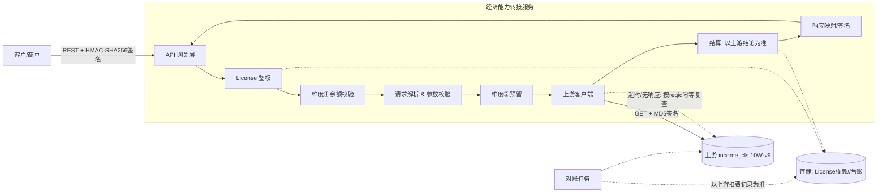
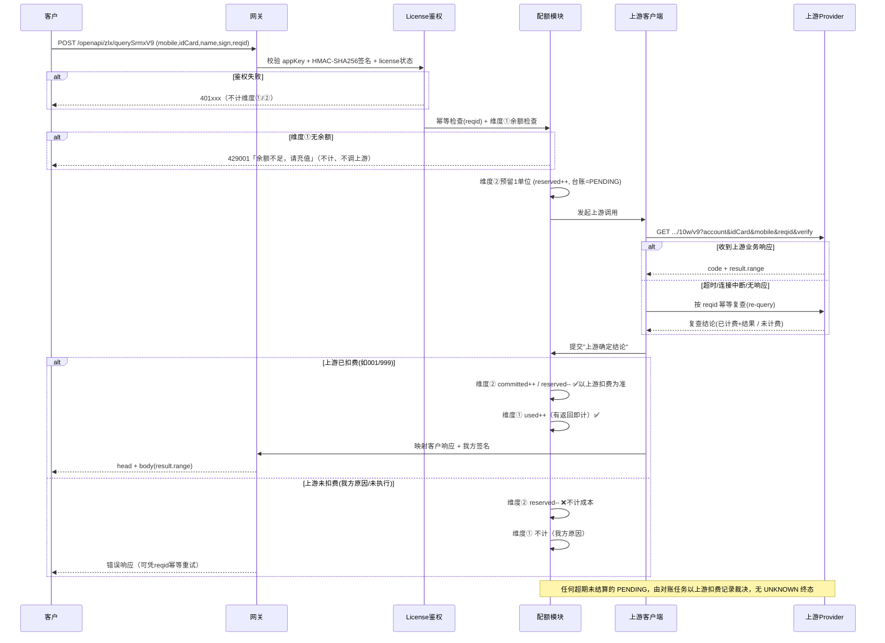
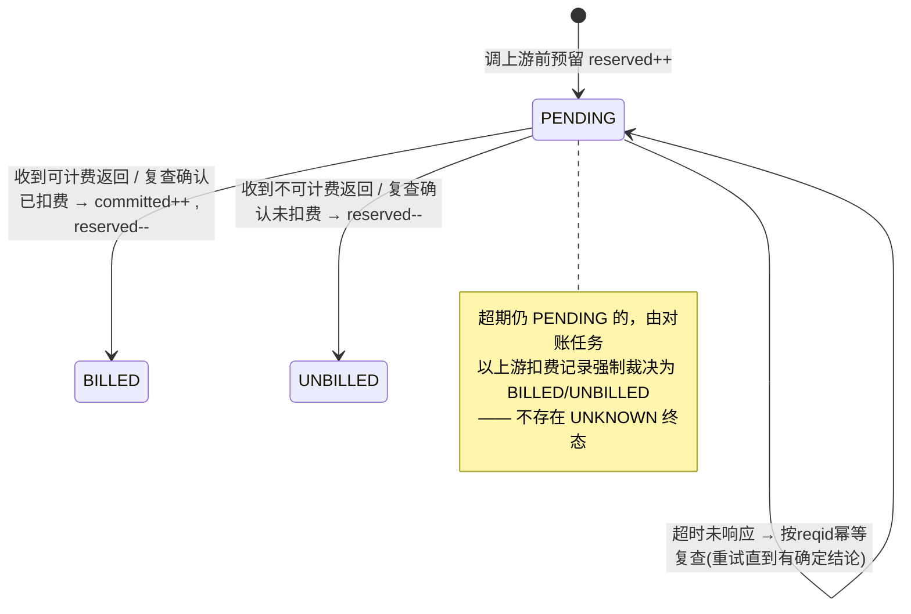

# 经济能力查询转接服务 — 设计文档（DESIGN.md）

> 版本：v0.2
> 角色定位：本服务是一个**接口转接（API Relay / Gateway）网关**。对外为客户（商户）提供经济能力查询 API；对内解析请求并调用上游数据源 `income_cls.md`（经济能力 10W-v9）获取数据后回传给客户。
> 在此基础上提供 **License 鉴权** 与 **双维度配额（计费）** 能力。

### 决策基线（v0.2 已确认）
1. **签名**：**客户侧**采用 **AppKey + HMAC-SHA256** 动态签名机制；**上游侧**因是第三方服务无法修改，保持 **MD5** 口径。
2. **维度①（客户用量）计数口径**：**有上游业务返回即计**。客户因**非我方原因**（如客户侧网络中断）没拿到结果也照常计费；仅当失败由**我方原因**（鉴权/参数拦截、我方上游配置错、我方内部错误、或根本没有上游返回）导致时不计。
3. **维度②（我方成本）计数口径**：**以上游实际扣费为准，凡上游扣费一律计入，绝不漏计**。
4. **无 UNKNOWN 态**：超时/无响应一律通过**幂等 re-query（按 reqid 复查）**得到确定结论，最终以**上游扣费记录**为准，因此请求计费状态只有"已计费/未计费"两种终态。
5. **配额模式**：**总量买断**，不按日/月周期重置，用尽即止（可再充值续量）。
6. **客户配额查询**：提供查询路由；当**无余额仍调用**主查询接口时，返回"余额不足，请充值"及对应状态码。

---

## 1. 背景与目标

### 1.1 业务背景
- 客户按 `docs/接口文档 - 经济能力.doc` 描述的方式调用**本服务**（网关风格：`appKey/appSecret` + REST）。
- 本服务解析客户输入，按 `docs/income_cls.md` 描述的方式调用**上游数据源**（GET + `account/key` MD5 签名）。
- 上游返回 `result.range`（收入模型评分 0~51），本服务封装为客户侧约定的响应结构后返回。

### 1.2 设计目标
1. **协议转接**：屏蔽上游接口细节，对客户提供稳定、统一的 API 契约。
2. **License 鉴权**：只有持有合法 license 的客户才能调用。
3. **双维度配额（总量买断）**：
   - 维度①（客户用量）：客户访问**本服务**的次数 —— **有返回即计**。
   - 维度②（我方成本）：该 license 下，本服务访问**上游**的次数 —— **以上游实际扣费为准**。
4. **计费正确性（核心难点）**：
   - 维度②**不漏计**：凡上游真实扣费必须被计入（即便我方侧发生超时/异常）。
   - 维度②**不空计**：上游确实未执行/未扣费（如网络根本没连通）则不计。
   - 通过"预留 → 以上游确定结论结算 → 对账兜底"实现，**消除不确定态**。

### 1.3 非目标（本期不做）
- 不做客户自助开通 / 充值前台（仅提供查询路由 + 预留数据模型）。
- 不做多上游数据源路由（当前仅对接 `income_cls.md`）。

---

## 2. 术语表

| 术语 | 含义 |
|---|---|
| 客户 / 商户 | 调用本服务的外部方 |
| License | 颁发给客户的授权凭证，含密钥与配额 |
| 上游 / Provider | `income_cls.md` 描述的经济能力数据源 |
| 维度①配额（service quota） | 客户调用本服务允许的次数（总量买断） |
| 维度②配额（upstream quota） | 该 license 下我方调用上游允许的次数（= 我方成本上限，总量买断） |
| 可计费（billable） | 上游确实执行并对我方扣费的一次查询 |
| 有返回（returned） | 上游产生了业务响应（含 re-query 复查到的结果） |
| re-query（幂等复查） | 超时/无响应时按 `reqid` 向上游复查，幂等、不重复扣费 |
| 计费台账（billing ledger） | 记录每次上游调用计费状态的追加写流水 |
| reqid | 客户传入的请求流水号，全局幂等键（见 §9.1） |
| requestId | 本服务生成的全链路追踪 ID，作日志前缀并随结果返回（见 §9） |

---

## 3. 系统架构



### 3.1 分层职责
| 层 | 职责 |
|---|---|
| API 网关层 | HTTP 接入、限流、HMAC-SHA256 签名校验入口、**生成 requestId 全链路追踪 ID**、统一响应封装 |
| License 鉴权 | 校验 appKey 合法性、签名、license 状态/有效期 |
| 配额模块 | 维度①计数、维度②预留/结算、原子计数、台账写入 |
| 请求解析 | 校验 `mobile/idCard/name` 等参数，规范化 |
| 上游客户端 | 构造上游签名请求、超时控制、**幂等复查**、结果解析、计费判定 |
| 结算/响应映射 | 依上游确定结论结算维度①②，上游结果 → 客户响应结构 + 我方返回签名 |
| 对账任务 | 周期性与上游扣费记录核对，保证维度②不漏计、不空计 |
| 存储 | License、配额计数、计费台账、请求日志 |

---

## 4. 核心调用流程



---

## 5. 对外接口契约（客户侧）

> 风格对齐 `接口文档 - 经济能力.doc`：`apiHost` 网关 + `appKey/appSecret`。

### 5.1 经济能力查询
- **路径**：`POST /openapi/zlx/querySrmxV9`
- **编码**：UTF-8，`Content-Type: application/json`
- **鉴权**：见 §8（HMAC-SHA256 签名）。

**请求体**
```json
{
  "mobile": "138xxxxxxxx",
  "idCard": "xxxxxxxxxxxxxxxxxX",
  "name": "张三",
  "reqid": "1778059529283"
}
```

| 字段 | 类型 | 必填 | 说明 |
|---|---|---|---|
| mobile | String | 是 | 手机号 |
| idCard | String | 是 | 身份证号（末位 X 大写） |
| name | String | 否 | 姓名 |
| reqid | String | 是 | 请求流水号，≤20 位，**幂等键** |

**鉴权字段**（建议放 Header，见 §8）：`appKey`、`timestamp`、`nonce`、`sign`。

**成功响应**（对齐 .doc 的 head/body 结构）
```json
{
  "head": {
    "errorCode": "0",
    "requestId": "lq8x2f-AC1001-9f3a1b2c-K7M2P9QXTV",
    "logId": "lq8x2f-AC1001-9f3a1b2c-K7M2P9QXTV",
    "time": 81,
    "errorMsg": "success",
    "timestamp": 1778059529352
  },
  "body": {
    "code": "001",
    "msg": "成功",
    "result": { "range": "39" },
    "uid": "E31778059529343a3114",
    "reqid": "1778059529283",
    "verify": "3E421FCD28E324DBAB16731D6A1C81BA"
  }
}
```

**无余额访问响应（决策 6）**：客户**无维度①余额仍调用**时，固定返回：
```json
{
  "head": {
    "errorCode": "429001",
    "requestId": "lq8x2f-AC1001-9f3a1b2c-K7M2P9QXTV",
    "logId": "lq8x2f-AC1001-9f3a1b2c-K7M2P9QXTV",
    "time": 1,
    "errorMsg": "余额不足，请充值",
    "timestamp": 1778059529352
  }
}
```
- 此时**不调用上游、不计维度①/②**。

**异常响应**（其它）
```json
{
  "head": {
    "errorCode": "505062",
    "logId": "471ba108...",
    "time": 204,
    "errorMsg": "失败原因",
    "timestamp": 1672822394403
  }
}
```

### 5.2 配额查询路由（决策 6）
- **路径**：`GET /openapi/zlx/quota`
- **鉴权**：同主接口（appKey + HMAC-SHA256 签名）。
- **用途**：供客户查询自身**维度①**（可用调用次数）余额与 license 状态。
- **说明**：维度②为我方成本口径，**不对客户暴露**。

**成功响应**
```json
{
  "head": { "errorCode": "0", "errorMsg": "success", "timestamp": 1778059529352 },
  "body": {
    "status": "ACTIVE",
    "serviceTotal": 100000,
    "serviceUsed": 37250,
    "serviceRemaining": 62750
  }
}
```

**无余额时**：`serviceRemaining = 0`，并在 `head` 返回 `errorCode = "429001"`、`errorMsg = "余额不足，请充值"`，提示客户充值。

### 5.3 网关错误码（本服务自定义，`head.errorCode`）
| errorCode | 含义 | 是否计维度① | 是否计维度② |
|---|---|---|---|
| 0 | 成功 | 是（有返回即计） | 以上游扣费为准 |
| 401001 | 缺少/非法 appKey | 否 | 否 |
| 401002 | 签名校验失败 | 否 | 否 |
| 401003 | license 已停用/过期 | 否 | 否 |
| 429001 | **维度①无余额（余额不足，请充值）** | 否 | 否 |
| 429002 | 维度②达成本上限（我方保护，临时不可用） | 否 | 否 |
| 400001 | 参数校验失败（我方拦截，我方/客户参数问题） | 否 | 否 |
| 502001 | 上游真未执行/未返回（网络不通且复查确认未扣费） | 否 | 否 |
| 502002 | 上游业务失败（我方原因，如配置/签名/欠费） | 否 | 否 |

---

## 6. 上游对接（Provider 侧）

> 对齐 `income_cls.md`（经济能力 10W-v9）。

- **URL**：`GET http://{server}:{port}/yrzx/finan/net/10w/v9`
- **入参**：`account`（我方账户）、`idCard`、`name`、`mobile`、`reqid`、`verify`
- **签名**：`verify = MD5(account + idCard + mobile + reqid + key).toUpperCase()`
- **出参**：`code/msg/uid/reqid/result.range/verify`

### 6.1 字段映射
| 客户侧 | → | 上游侧 |
|---|---|---|
| mobile | → | mobile |
| idCard | → | idCard |
| name | → | name |
| reqid | → | reqid（透传，保证 ≤20 位） |
| （我方配置）| → | account / key |

> `account/key` 为**我方与上游的凭证**，与客户的 license 无关，存于服务端安全配置（见 §11.4）。

### 6.2 上游返回码 → 客户返回码
直接透传上游 `code`（字典已对齐：001 成功 / 999 查无结果 / 003 余额不足 …），并在 `head.errorCode` 中体现网关层成败。

### 6.3 计数口径（决策 2 / 3）
| 场景 | 维度①（有返回即计） | 维度②（以上游扣费为准） |
|---|---|---|
| 上游成功(001) | ✅ 计 | ✅ 计（上游扣费） |
| 上游查无结果(999) | ✅ 计 | ✅ 计（上游已执行查询并扣费） |
| 超时/无响应，但复查确认上游**已扣费** | ✅ 计（视为有返回，客户可凭 reqid 幂等拉取） | ✅ **必须计**（不漏计） |
| 超时/无响应，复查确认上游**未扣费** | ❌ 不计（无返回） | ❌ 不计 |
| 网络根本未连通/连接中断且上游未执行 | ❌ 不计 | ❌ 不计 |
| 我方原因失败：02/003/004/012/013、参数/鉴权拦截、我方内部错误 | ❌ 不计（非客户原因） | ❌ 不计（上游未扣费） |

> 口径要点：
> - **维度①**：只要上游产生了业务返回即计费；客户因自身/网络原因未收到结果**仍计费**（决策 2）。仅"无上游返回"或"我方原因失败"不计。
> - **维度②**：唯一标准是"上游是否扣费"。凡上游扣费一律计入（决策 3），通过复查 + 对账保证不漏计；上游确实未扣费则不计。

---

## 7. License 与配额设计（核心）

### 7.1 License 数据模型
```text
License
├── licenseId        主键
├── appKey           客户公开标识
├── appSecret        客户签名密钥（HMAC-SHA256 加签用，加密存储）
├── status           ACTIVE / SUSPENDED / EXPIRED
├── validFrom        生效时间
├── validTo          失效时间（总量买断，时间仅作授权有效期，不做周期重置）
├── quotaService     维度①：{ total, used }            // 总量买断
├── quotaUpstream    维度②：{ total, committed, reserved } // 总量买断（成本上限）
└── rateLimit        限流配置(QPS/并发)
```

- **维度①剩余** = `quotaService.total - quotaService.used`
- **维度②剩余** = `quotaUpstream.total - quotaUpstream.committed - quotaUpstream.reserved`
- **总量买断（决策 5）**：配额为一次性买断额度，用尽即止；充值表现为对 `total` 增量续费，不按日/月自动重置。

### 7.2 两类配额语义
| | 维度① service | 维度② upstream |
|---|---|---|
| 计的是 | 客户访问本服务的次数 | 我方被上游扣费的次数（= 成本） |
| 计数口径 | **有上游返回即计**（决策 2） | **以上游实际扣费为准**（决策 3） |
| 计数时机 | 得到上游确定结论（含复查）后 | 得到上游确定结论后；对账兜底 |
| 关键原则 | 客户非我方原因未收到结果照常计 | **不漏计**（上游扣费必计）+ 不空计 |
| 重置 | 无（总量买断） | 无（总量买断） |

### 7.3 维度②计费模型：预留 → 以上游确定结论结算（无 UNKNOWN，决策 4）

核心思想：**上游扣费记录是唯一真相来源**。本地不保留任何"未知"终态——任何超时/无响应都通过**按 `reqid` 的幂等复查**收敛到确定结论；万一复查也暂不可达，则由对账任务以上游扣费记录裁决。请求计费状态只有两种终态：`BILLED`（已计费）/ `UNBILLED`（未计费）。



**流程：**
1. **预留**：调上游前，原子校验维度②剩余 > 0 并 `reserved++`，写入 `PENDING` 台账（以 `reqid` 为幂等键）。预留用于防止高并发"超卖"（成本超上限）。
2. **调用上游并取确定结论**：
   - **收到业务响应** → 查 §7.4 计费判定表：
     - 上游已扣费（如 001/999）→ `BILLED`：`committed++`、`reserved--`，**计成本**；同时计维度①。
     - 上游未扣费（我方原因）→ `UNBILLED`：`reserved--`，**不计**。
   - **超时/连接中断/无响应** → **按 `reqid` 幂等复查**（re-query，不会重复扣费）：
     - 复查确认上游已扣费 → `BILLED`：计维度②（不漏计）；并视为"有返回"计维度①，客户可凭 `reqid` 幂等拉取结果。
     - 复查确认上游未执行/未扣费 → `UNBILLED`：不计。
     - 复查暂不可达 → 保持 `PENDING`，进入异步复查队列与对账兜底（§7.6），最终必收敛为 `BILLED/UNBILLED`。
3. **为何没有 UNKNOWN**：因为最终一律以**上游扣费记录**为准（决策 3、4）。复查 + 对账保证每条记录都有确定归属，本地不接受"永久未知"。

### 7.4 上游返回码 → 是否已扣费（可计费）判定表
| 上游 code | 含义 | 是否扣费? | 备注 |
|---|---|---|---|
| 001 | 成功 | ✅ 是 | 标准扣费，计维度①② |
| 999 | 查无结果 | ✅ 是 | 上游已执行查询并扣费，计维度①② |
| 003 | 余额不足 | ❌ 否 | 我方上游账户欠费，未执行 → 告警 |
| 002 | 账号不存在 | ❌ 否 | 我方配置错误 → 告警 |
| 004 | 请给该账户授权 | ❌ 否 | 我方授权问题 → 告警 |
| 005/006/008/009/011/020 | 参数/签名格式错 | ❌ 否 | 我方应在调用前拦截，不应到达上游 |
| 012 | 接口错误 | ❌ 否 | 上游内部错误 |
| 013 | 校验签名错误 | ❌ 否 | 我方签名错误 → 告警 |

> 判定表应做成**配置**并与上游计费口径严格对齐；若上游对 999 的计费口径与此不同，以上游实际扣费记录为准（决策 3）。

### 7.5 并发与原子性
- 计数与预留必须**原子**执行，避免竞态导致超卖/重复扣：
  - 方案 A（推荐）：**Redis + Lua 脚本**对 `remaining` 做"检查并预留"原子操作，台账落库到关系库。
  - 方案 B：关系库**条件更新**：`UPDATE ... SET reserved=reserved+1 WHERE total-committed-reserved>0`，按受影响行数判断成功。
- **幂等**：以 `reqid`（或 `appKey+reqid`）为唯一键。
  - 命中已有 `BILLED` 台账 → 直接返回缓存结果，**不重复扣费、不重复计维度①②**。
  - 命中 `PENDING` → 触发/等待复查结果，避免并发重复调用上游。

### 7.6 对账与审计（保证维度②不漏计、不空计 —— 决策 3/4 的兜底）
- **上游扣费记录为唯一真相来源**。计费台账为追加写、不可篡改，含：reqid、appKey、上游 code、状态(BILLED/UNBILLED/PENDING)、时间戳、上游 logId/uid。
- **定时对账任务**：
  1. 拉取上游对账单 / 调用上游单笔查询接口，逐条与本地台账比对。
  2. 上游已扣费但本地未计（漏计）→ 强制补计 `committed++`（决策 3：必须计入），并告警。
  3. 本地已计但上游无扣费记录（空计）→ 冲正 `committed--`，并告警。
  4. 超期 `PENDING` → 依上游记录裁决为 `BILLED/UNBILLED`，清空 `reserved`。
- **冲正**：所有补计/冲正均留痕、可追溯。

### 7.7 配额耗尽行为
- **维度①耗尽（决策 6）**：返回 `429001`「余额不足，请充值」，**不调用上游**。
- 维度②达上限：返回 `429002`，**不调用上游**（保护我方成本），并告警；待续量后恢复。
- 可配置软阈值（如剩余 10%）触发到量告警通知。

---

## 8. 鉴权与签名（决策 1：客户侧 HMAC-SHA256 / 上游侧 MD5）

> 客户侧（本服务对外）使用 **AppKey + HMAC-SHA256 动态签名**；上游侧因是第三方服务无法修改，沿用 **MD5**。两侧签名相互独立、互不影响。

### 8.1 客户 → 本服务（HMAC-SHA256 动态签名）
- 客户持 `appKey`（公开标识）与 `appSecret`（HMAC 密钥，仅双方持有、不在请求中传输）。
- 请求头：
  - `X-App-Key`：appKey
  - `X-Timestamp`：请求时间戳（毫秒/秒，联调约定），用于防重放
  - `X-Nonce`：一次性随机串，用于防重放去重
  - `X-Sign`：签名值
- **签名算法（动态）**：
  ```
  signingString = appKey + "\n" + timestamp + "\n" + nonce + "\n" + sha256Hex(body)
  X-Sign = Base64( HMAC-SHA256(appSecret, signingString) )
  ```
  - 以 `appSecret` 为 HMAC 密钥，对 `signingString` 计算 HMAC-SHA256；`body` 先做 SHA-256 摘要再参与拼接（GET 无 body 时取空串摘要）。
  - 拼接顺序与编码（Base64/Hex）在联调时与客户最终固定。
- **服务端校验顺序**：
  1. appKey 存在且 license `ACTIVE`、在有效期内；
  2. `timestamp` 在容差窗口内（如 ±5 分钟），防重放；
  3. `nonce` 在窗口内未使用过（去重缓存）；
  4. 用服务端存储的 `appSecret` 重算签名并**常量时间比较**，一致才放行。
- **动态性**：签名随 `timestamp + nonce + body` 变化而变化，且有时效窗口，杜绝静态签名被重放盗用。
- 响应可选携带 `body.verify`：由本服务用 `appSecret` 对返回体做 HMAC-SHA256，供客户校验响应完整性。

### 8.2 本服务 → 上游（MD5，第三方不可改）
- 按 `income_cls.md`：`verify = MD5(account + idCard + mobile + reqid + key).toUpperCase()`。
- `account/key` 由服务端安全配置注入，不暴露给客户。

---

## 9. 全链路追踪（requestId / Trace）

为支撑后续所有 debug 与客户问题排查，本服务在**请求入口**生成一个全链路追踪标识 `requestId`，贯穿整条调用链，随结果返回给客户，并作为**所有日志行的前缀**。

### 9.1 与 reqid 的区别（重要）
| 标识 | 来源 | 粒度 | 用途 |
|---|---|---|---|
| `reqid` | **客户传入**的业务流水号（≤20 位） | 每个业务请求 | **幂等键**、计费去重、按 reqid 复查上游 |
| `requestId` | **本服务生成**的追踪 ID | 每次物理请求（每次到达网关） | **全链路追踪 / 日志前缀 / 排障**，返回客户 |

> 客户用同一 `reqid` 幂等重试时，会产生**不同的 `requestId`**（属于不同物理请求），二者关联关系记入日志与台账，便于还原"一次业务、多次物理调用"的全貌。

### 9.2 requestId 生成规则
在网关收到请求、完成基础校验后立即生成（鉴权前即生成，保证鉴权失败也可追踪）：

```
输入：
  ts        = 请求到达时间（毫秒时间戳）
  clientUuid= 客户标识（license 维度的客户 UUID；未鉴权时退化为 appKey/“anon”）
  body      = 原始请求体字节

bodyHash  = SHA-256(body) 的前 8 个 hex 字符
seed      = ts + "|" + clientUuid + "|" + SHA-256(body)
core      = Base32( SHA-256(seed) ) 前 10 位      // 抗碰撞、可读
requestId = ts(Base36) + "-" + clientShort + "-" + bodyHash + "-" + core
```

- **可排序**：前缀含时间戳，按字典序近似按时间排序，便于按时间窗捞日志。
- **唯一性**：`ts + clientUuid + body` 已高度唯一；`core` 为整体哈希进一步抗碰撞。即便同客户在同一毫秒发送相同 body（如并发重试），可附加进程内自增/随机 4 位 `rand` 兜底，确保物理唯一。
- **可读可定位**：从 requestId 即可肉眼读出大致时间、哪个客户、body 指纹，方便客户报障时快速比对。
- **入站透传**：若客户在 Header 携带 `X-Request-Id`，可选择信任并复用（便于客户侧串联），否则由本服务生成；最终值以返回为准。

### 9.3 返回给客户
- `requestId` 放入响应 `head`，并令 `head.logId = requestId`（与 `.doc` 的 logId 字段对齐，避免新增字段破坏兼容）。
- 同时通过响应头 `X-Request-Id` 返回，方便客户在不解析 body 时也能记录。

```json
{
  "head": {
    "errorCode": "0",
    "requestId": "lq8x2f-AC1001-9f3a1b2c-K7M2P9QXTV",
    "logId": "lq8x2f-AC1001-9f3a1b2c-K7M2P9QXTV",
    "errorMsg": "success",
    "timestamp": 1778059529352
  },
  "body": { "code": "001", "result": { "range": "39" }, "reqid": "1778059529283" }
}
```

### 9.4 日志前缀与上下文传播
- **日志前缀**：所有日志行以 `[requestId]` 开头，例如：
  ```
  [lq8x2f-AC1001-9f3a1b2c-K7M2P9QXTV] INFO  auth ok, appKey=AC1001
  [lq8x2f-AC1001-9f3a1b2c-K7M2P9QXTV] INFO  upstream call start reqid=1778059529283
  [lq8x2f-AC1001-9f3a1b2c-K7M2P9QXTV] WARN  upstream timeout, re-query by reqid
  [lq8x2f-AC1001-9f3a1b2c-K7M2P9QXTV] INFO  billed=true range=39
  ```
- **上下文传播**：
  - Java：用 **MDC**（`MDC.put("requestId", ...)`），日志 pattern 加 `[%X{requestId}]`；线程池/异步需透传 MDC。
  - Go：通过 `context.Context` 携带 requestId，封装 logger 自动注入；跨 goroutine 显式传递。
- **跨调用关联**：调用上游时记录 `requestId ↔ 上游 uid/logId` 的映射；写入计费台账，做到"我方 requestId ↔ 客户 reqid ↔ 上游 uid"三方可互查。
- **贯穿范围**：鉴权、配额、解析、上游调用、复查、对账、异常处理全部携带同一 requestId。

### 9.5 排障价值
- 客户报障只需提供 `requestId`（已随结果返回），即可在日志中一键检索整条链路。
- 计费争议时，凭 requestId 关联台账与上游 uid，复核维度①/②是否应计。

---

## 10. 错误处理与重试

| 类别 | 处理 |
|---|---|
| 客户参数错 | 前置校验，返回 `400001`，不调用上游、不计费 |
| 鉴权错 | `401xxx`，不计费 |
| 维度①无余额 | `429001`「余额不足，请充值」，不调用上游、不计费 |
| 上游超时/无响应 | **按 reqid 幂等复查**确定是否已扣费；已扣费→计维度②（不漏计）、计维度①；未扣费→不计 |
| 上游业务错（我方原因） | 按判定表 `UNBILLED`，不计费 |
| 服务内部错(5xx) | 若上游已扣费仍须保证维度②计入（对账兜底）；返回网关错误；告警 |

> **重试安全**：所有重试/复查携带相同 `reqid`，依赖上游幂等，避免重复扣费与重复计数。

---

## 11. 存储设计

### 11.1 license 表
`license_id, app_key, app_secret(enc), client_uuid, status, valid_from, valid_to, rate_limit, created_at, updated_at`
- 总量买断：无周期重置字段。
- `client_uuid`：客户 UUID，用于 requestId 生成与对账。

### 11.2 quota 表（或合并进 license）
`license_id, dim(SERVICE|UPSTREAM), total, used_or_committed, reserved, updated_at`

### 11.3 billing_ledger 表（追加写）
`id, app_key, reqid, request_id, upstream_logId, upstream_uid, upstream_code, state(PENDING|BILLED|UNBILLED), counted_service(bool), counted_upstream(bool), created_at, settled_at`
- 唯一索引：`(app_key, reqid)`；普通索引：`request_id`。
- `request_id`：全链路追踪 ID（§9），关联日志、客户 reqid 与上游 uid。
- **无 UNKNOWN 状态**（决策 4）；`PENDING` 仅为中间态，必由复查/对账收敛。

### 11.4 secrets 配置
- 上游 `account/key`、客户 `appSecret` 加密存储（KMS / Vault / 加密列），禁止明文落库与日志。

### 11.5 请求日志
- 每条日志以 `[requestId]` 为前缀（§9）；脱敏存储（idCard/mobile 掩码），便于排障与对账。
- 建议结构化字段：`requestId, reqid, appKey, stage, upstreamCode, billed, latencyMs`。

---

## 12. 技术选型建议（可替换）
- 语言/框架：Java(Spring Boot) 或 Go；高并发计数偏好 Go。
- 计数/幂等：Redis（Lua 原子）+ 关系库（MySQL/PG）做台账与对账。
- HTTP 客户端：连接池 + 显式连接/读超时 + 幂等复查 + 熔断（Resilience4j / sentinel）。
- 可观测：结构化日志 + Prometheus 指标（配额水位、上游成功率、计费状态分布、漏计/空计对账差异）+ 告警。

---

## 13. 非功能需求
- **限流**：按 license 维度 QPS/并发限制（与配额解耦）。
- **超时**：上游连接超时/读超时显式配置，配合按 reqid 幂等复查，避免线程/协程堆积。
- **安全**：HTTPS、密钥加密、PII 脱敏、防重放（timestamp+nonce）。
- **监控告警**：维度②水位、上游 003/013 等异常码、超期 PENDING 堆积、对账漏计/空计差异、维度①到量。
- **幂等**：reqid 全链路贯穿。

---

## 14. 关键设计取舍小结
1. **维度②"以上游扣费为准、不漏计"**：预留 + 上游确定结论结算 + 对账兜底；超时用幂等复查收敛，**不存在 UNKNOWN 终态**（决策 3/4）。
2. **维度①"有返回即计"**：客户因非我方原因未收到结果照常计费；仅无上游返回或我方原因失败不计（决策 2）。
3. **客户侧 HMAC-SHA256 动态签名 / 上游侧 MD5**：对外采用更安全的动态签名（防重放），上游因第三方不可改沿用 MD5（决策 1）。
4. **配额总量买断**，用尽即止、可续费，不做周期重置（决策 5）。
5. **客户配额查询路由 + 无余额"请充值"返回**（决策 6）。
6. **幂等以 reqid 为核心**，复查/重试不重复扣费、不重复计数。
7. **全链路追踪 requestId**：入口按"时间+客户UUID+请求体"生成，随结果返回、作日志前缀，串联 reqid 与上游 uid，支撑 debug 与客户报障（§9）。

---

## 15. 待联调确认（实现前对齐）
1. 客户侧 HMAC-SHA256 签名的**字段拼接顺序与编码（Base64/Hex）、时间戳精度、容差窗口**最终定义（联调约定）。
2. 上游对 `999 查无结果` 的**实际扣费口径**（以上游为准；据此校准 §7.4）。
3. 上游是否提供**对账文件 / 单笔查询（按 reqid 复查）接口**及其格式 —— 这是消除不确定态与对账兜底的前提。
4. `server:port`、`account/key` 等上游联调参数。
5. 维度②达上限时的客户提示文案与对接方告警渠道。
