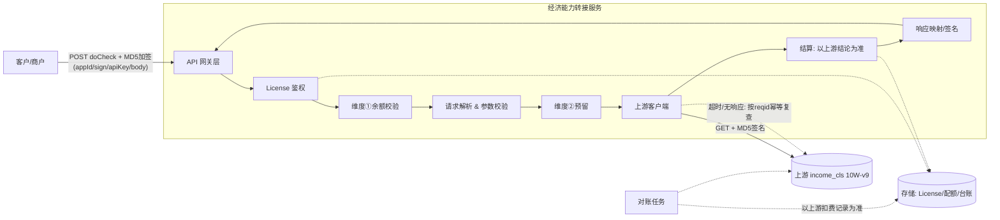
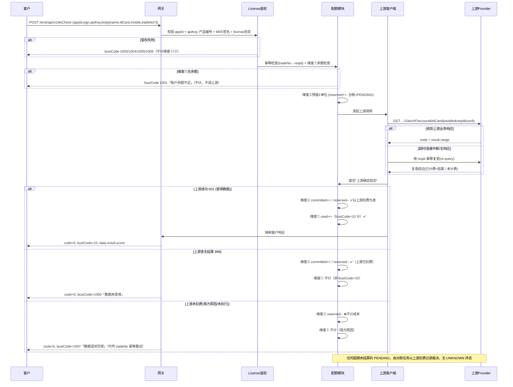
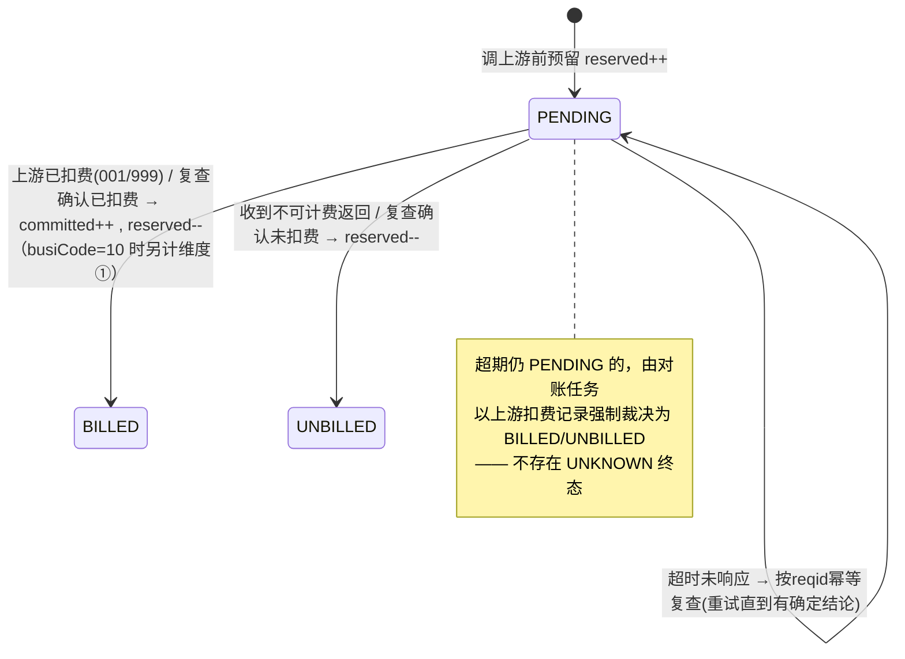

# 经济能力查询转接服务 — 设计文档（DESIGN.md）

> 版本：v0.4
> 角色定位：本服务是一个**接口转接（API Relay / Gateway）网关**。对外为客户（商户）提供经济能力查询 API（对齐《接口文档 - 经济能力》：`POST /v1/openapi/zlx/querySrmxV9`）；对内调用**上游数据源**获取评分后回传。
> 在此基础上提供 **License 鉴权** 与 **双维度配额（计费）** 能力。

> **v0.4 拓扑变更（重要）**：此前误把《伽马分层分_定制版》PDF 当作"对外契约"。修正为：
> - **对外（下游，权威=《接口文档 - 经济能力》.doc）**：端点 `POST /v1/openapi/zlx/querySrmxV9`，网关信封 `appKey/sign/encryptionType/body`（**MD5 加签**），响应 `head{errorCode,logId,time,errorMsg,timestamp} / body{code,msg,uid,reqid,verify,result{range}}`。`head.errorCode` 由内部 busiCode 映射（"0"=成功含查得/查无；非0=网关级错误，无 body）；查得/查无落在 `body.code` 001/999。
> - **对内（上游，可路由切换）**：
>   - **伽马分层分**（《伽马分层分_定制版》PDF，**默认**）：`POST /enol/api/v1/doCheck`，信封 `appId/sign/apiKey/encryptionType/body` + MD5，返回 `data.busiCode/result.score`。
>   - **income_cls**（备选）：`GET /yrzx/finan/net/10w/v9`，`account/key` MD5 签名，返回 `code/result.range`。
>   - 由 `UPSTREAM_PROVIDER` 选择当前生效者；各 provider 把原生响应归一化为 `UpstreamResult`（Code `001`查得/`999`查无）。

### 决策基线（v0.4 已确认）
1. **签名**：**客户侧（下游）**采用 **appKey + MD5 加签**（对 body 业务参数按键 ASCII 升序拼接后追加 `secret`，再 MD5；见 §8.1）；**上游侧**因是第三方服务无法修改，伽马保持 MD5 信封加签、income_cls 保持 `MD5(account+idCard+mobile+reqid+key)` 口径（§8.2）。
2. **维度①（客户用量 / 对用户计费）计数口径**：**仅查得数据（busiCode=10，上游 001）才对客户计费**。上游查无结果（999 → busiCode 1000）或任何未查得数据的情况一律**不计维度①、不向客户计费**；鉴权/参数拦截、我方内部错误、上游我方原因失败等同样不计。
3. **维度②（我方成本）计数口径**：**以上游实际扣费为准，凡上游扣费一律计入，绝不漏计**。
4. **无 UNKNOWN 态**：超时/无响应一律通过**幂等 re-query（按 reqid 复查）**得到确定结论，最终以**上游扣费记录**为准，因此请求计费状态只有"已计费/未计费"两种终态。
5. **配额模式**：**总量买断**，不按日/月周期重置，用尽即止（可再充值续量）。
6. **客户配额查询**：提供查询路由；当**无余额仍调用**主查询接口时，返回"余额不足，请充值"及对应状态码。

---

## 1. 背景与目标

### 1.1 业务背景
- 客户按《接口文档 - 经济能力》描述的方式调用**本服务**（`POST /v1/openapi/zlx/querySrmxV9`，信封 `appKey/sign/encryptionType/body` + MD5 加签，请求体 `mobile/idCard/name`）。
- 本服务鉴权后，按 `UPSTREAM_PROVIDER` 选择上游（默认伽马 PDF；备选 income_cls）并调用之。
- 上游返回收入模型评分（伽马 `result.score` / income_cls `result.range`，0~51），归一化后封装进下游 `body.result.range` 返回。

### 1.2 设计目标
1. **协议转接**：屏蔽上游接口细节，对客户提供稳定、统一的 API 契约。
2. **License 鉴权**：只有持有合法 license 的客户才能调用。
3. **双维度配额（总量买断）**：
   - 维度①（客户用量 / 对用户计费）：客户访问**本服务**的次数 —— **仅查得数据（busiCode=10）才计**，查无结果不计。
   - 维度②（我方成本）：该 license 下，本服务访问**上游**的次数 —— **以上游实际扣费为准**。
4. **计费正确性（核心难点）**：
   - 维度②**不漏计**：凡上游真实扣费必须被计入（即便我方侧发生超时/异常）。
   - 维度②**不空计**：上游确实未执行/未扣费（如网络根本没连通）则不计。
   - 通过"预留 → 以上游确定结论结算 → 对账兜底"实现，**消除不确定态**。

### 1.3 非目标（本期不做）
- 不做客户自助开通 / 充值前台（仅提供查询路由 + 预留数据模型）。
- 不做 V8（`/openapi/zlx/querySrmxV8`，发票明细数组）——本期仅 V9 经济能力评分。
- 多上游：当前提供 **provider 路由（伽马/income_cls，配置切换）**，但不做同请求并发对比/合并或自动故障转移。

---

## 2. 术语表

| 术语 | 含义 |
|---|---|
| 客户 / 商户 | 调用本服务的外部方 |
| License | 颁发给客户的授权凭证，含密钥与配额 |
| 上游 / Provider | `income_cls.md` 描述的经济能力数据源 |
| 维度①配额（service quota） | 客户调用本服务允许的次数（总量买断） |
| 维度②配额（upstream quota） | 该 license 下我方调用上游允许的次数（= 我方成本上限，总量买断） |
| 可计费（billable） | 上游确实执行并对我方扣费的一次查询 |
| 查得数据（returned） | 上游查得到数据（001 → busiCode 10），是**维度①对用户计费**的唯一条件；查无结果(999)不算 |
| re-query（幂等复查） | 超时/无响应时按 `reqid` 向上游复查，幂等、不重复扣费 |
| 计费台账（billing ledger） | 记录每次上游调用计费状态的追加写流水 |
| reqid | 客户传入的请求流水号，全局幂等键（见 §9.1） |
| requestId | 本服务生成的全链路追踪 ID，作日志前缀并随结果返回（见 §9） |

---

## 3. 系统架构



### 3.1 分层职责
| 层 | 职责 |
|---|---|
| API 网关层 | HTTP 接入、限流、信封解析、MD5 签名校验入口、**生成 requestId 全链路追踪 ID（响应里以 seqNo 暴露）**、统一响应封装 |
| License 鉴权 | 校验 appId 合法性、apiKey 产品编号、MD5 签名、license 状态/有效期 |
| 配额模块 | 维度①计数、维度②预留/结算、原子计数、台账写入 |
| 请求解析 | 校验 `mobile/idCard/name` 等参数，规范化 |
| 上游客户端 | 构造上游签名请求、超时控制、**幂等复查**、结果解析、计费判定 |
| 结算/响应映射 | 依上游确定结论结算维度①②，上游结果 → 客户响应结构 + 我方返回签名 |
| 对账任务 | 周期性与上游扣费记录核对，保证维度②不漏计、不空计 |
| 存储 | License、配额计数、计费台账、请求日志 |

---

## 4. 核心调用流程



---

## 5. 对外接口契约（客户侧）

> 权威=《接口文档 - 经济能力》：信封 `appKey/sign/encryptionType/body` + MD5 加签，响应 `head/body`。
> 通信：`POST` + HTTPS + JSON（UTF-8）。网关前缀 `/v1`。
> 环境：测试 apiHost `http://api-jcdz-test.jcszfw.com/v1`（联调提供正式地址）。

### 5.0 请求/响应公共结构

**请求信封**
| 字段 | 类型 | 必填 | 说明 |
|---|---|---|---|
| appKey | String | 是 | 网关分配的客户公开标识 |
| sign | String | 是 | 签名（见 §8.1，对 body 业务参数 MD5 加签） |
| encryptionType | int | 否 | 参数加密类型，`1`=明文（本期仅支持明文） |
| body | JSON | 是 | 接口请求体，见各接口定义 |

**响应信封（head/body）**
| 字段 | 类型 | 说明 |
|---|---|---|
| head.errorCode | String | `"0"`=成功（含查得/查无）；非 `"0"`=网关级错误（见 §5.3 映射） |
| head.logId | String | = 本服务 requestId（§9） |
| head.time | Number | 处理耗时 ms |
| head.errorMsg | String | 返回文字描述 / 错误原因 |
| head.timestamp | Number | 毫秒时间戳 |
| body | Object | 业务响应体（网关级错误时省略） |
| - code | String | `001`=查得 / `999`=查无（沿用 income_cls 口径） |
| - msg / uid / reqid / verify | String | 业务消息 / 上游流水号 / 请求流水号 / 上游签名（伽马为空） |
| - result.range | String | 收入模型评分 |

### 5.1 经济能力查询 V9
- **路径**：`POST /v1/openapi/zlx/querySrmxV9`
- **鉴权**：见 §8.1（appKey + MD5 签名）。

**请求示例**
```json
{
  "encryptionType": 1,
  "appKey": "y89098io",
  "sign": "0528999dd55c025b8f36fc72dceb1f63",
  "body": {
    "mobile": "138xxxx1009",
    "idCard": "330xxxxxxxx4312",
    "name": "张三"
  }
}
```

**body 参数**（《接口文档 - 经济能力》§3.1.3）
| 字段 | 类型 | 必填 | 说明 |
|---|---|---|---|
| mobile | String | 是 | 手机号 |
| idCard | String | 是 | 身份证（末位 X 大写） |
| name | String | 否 | 姓名 |

> 上游 reqid 由本服务内部生成（≤20），不再来自客户 tradeNo。

**成功响应（查得数据）**
```json
{
  "head": { "errorCode": "0", "logId": "<requestId>", "time": 81, "errorMsg": "success", "timestamp": 1778059529352 },
  "body": { "code": "001", "msg": "成功", "uid": "...", "reqid": "...", "verify": "", "result": { "range": "39" } }
}
```

**查无结果**：`head.errorCode="0"` + `body.code="999"`（无 `result` 节点），**不计维度①**。

**网关级错误（鉴权/配额/参数/系统，只返回 head）**
```json
{ "head": { "errorCode": "505062", "logId": "...", "time": 12, "errorMsg": "数据请求异常", "timestamp": 1672822394403 } }
```
- 维度①无余额、维度②达上限时**不调用上游、不计维度①/②**。

### 5.2 配额查询路由（本服务扩展，非 .doc 定义）
- **路径**：`GET /v1/openapi/zlx/quota`
- **鉴权**：同主接口（appKey + MD5 签名）。
- **用途**：供客户查询自身**维度①**（可用调用次数）余额与 license 状态；维度②为我方成本口径，**不对客户暴露**。
- **响应**：`{errorCode, errorMsg, status, serviceTotal, serviceUsed, serviceRemaining}`（内部扩展形态）。

### 5.3 内部 busiCode → head.errorCode 映射
> 查得/查无是业务结果，落在 `body.code`（001/999），`head.errorCode` 恒为 `"0"`。下表非 0 项为网关级错误（只返回 head）。

| 内部 busiCode | 含义 | head.errorCode | 触发条件 | 计维度① | 计维度② |
|---|---|---|---|---|---|
| 10 | 查得数据【计费】 | "0" (body.code 001) | 上游伽马 10 / income_cls 001 | 是 | 以上游扣费为准（是） |
| 1000 | 数据未查得 | "0" (body.code 999) | 上游伽马 1000 / income_cls 999 | 否 | 以上游扣费为准（是） |
| 1001 | 账户余额不足 | 505005 | 维度①无余额 | 否 | 否 |
| 1002 | 账户信息不存在 | 505004 | appKey 查无 license | 否 | 否 |
| 1003 | appKey 异常 | 505001 | 缺少/非法 appKey | 否 | 否 |
| 1005 | 账号信息异常 | 505002 | 签名校验失败 / IP 不在白名单 | 否 | 否 |
| 1006 | 透支余额已达上限 | 505006 | 维度②达成本上限 | 否 | 否 |
| 1007 | 数据请求异常 | 505062 | 参数校验失败 / 上游我方原因失败 / 内部错误 / 超时复查未决 | 否 | 否（复查/对账裁决） |
| 1009 | 服务尚未开通 | 505007 | license 停用/过期/未开通 | 否 | 否 |

> `head.errorCode` 字典中 `0` / `505062` 取自 .doc 示例，其余 `5050xx` 为内部约定（待联调对齐真实字典）。

---

## 6. 上游对接（Provider 侧）

> 对齐 `income_cls.md`（经济能力 10W-v9）。

- **URL**：`GET http://{server}:{port}/yrzx/finan/net/10w/v9`
- **入参**：`account`（我方账户）、`idCard`、`name`、`mobile`、`reqid`、`verify`
- **签名**：`verify = MD5(account + idCard + mobile + reqid + key).toUpperCase()`
- **出参**：`code/msg/uid/reqid/result.range/verify`

### 6.1 字段映射
| 客户侧 | → | 上游侧 |
|---|---|---|
| mobile | → | mobile |
| idCard | → | idCard |
| name | → | name |
| reqid | → | reqid（透传，保证 ≤20 位） |
| （我方配置）| → | account / key |

> `account/key` 为**我方与上游的凭证**，与客户的 license 无关，存于服务端安全配置（见 §11.4）。

### 6.2 上游返回码 → 客户 busiCode
上游 `code` 映射为客户 `data.busiCode`：`001 → 10`（查得数据，附 `score`）、`999 → 1000`（数据未查得）、其余我方原因失败（002/003/004/012/013 等）`→ 1007`（数据请求异常）并告警。

### 6.3 计数口径（决策 2 / 3，v0.3 修订）
| 场景 | busiCode | 维度①（仅 busiCode=10 计） | 维度②（以上游扣费为准） |
|---|---|---|---|
| 上游成功(001) | 10 | ✅ 计 | ✅ 计（上游扣费） |
| 上游查无结果(999) | 1000 | ❌ 不计（非查得数据） | ✅ 计（上游已执行查询并扣费） |
| 超时/无响应，但复查确认上游**已扣费**且查得数据 | 10 | ✅ 计 | ✅ **必须计**（不漏计） |
| 超时/无响应，复查确认上游**已扣费**但查无结果 | 1000 | ❌ 不计 | ✅ **必须计**（不漏计） |
| 超时/无响应，复查确认上游**未扣费** | 1007 | ❌ 不计 | ❌ 不计 |
| 网络根本未连通/连接中断且上游未执行 | 1007 | ❌ 不计 | ❌ 不计 |
| 我方原因失败：02/003/004/012/013、参数/鉴权拦截、我方内部错误 | 1007/100x | ❌ 不计 | ❌ 不计（上游未扣费） |

> 口径要点（v0.3）：
> - **维度①**：仅当**查得数据（busiCode=10）**时向客户计费；查无结果（1000）不计维度①（对齐 PDF：仅 busiCode=10 标【计费】）。
> - **维度②**：唯一标准是"上游是否扣费"。凡上游扣费一律计入（决策 3），通过复查 + 对账保证不漏计；上游确实未扣费则不计。**故 999 查无结果计维度②而不计维度①，两维度可分离。**

---

## 7. License 与配额设计（核心）

### 7.1 License 数据模型
```text
License
├── licenseId        主键
├── appId            客户公开标识（PDF：由商务分配）
├── appSecret        客户签名密钥（MD5 加签用 secret，加密存储）
├── status           ACTIVE / SUSPENDED / EXPIRED
├── validFrom        生效时间
├── validTo          失效时间（总量买断，时间仅作授权有效期，不做周期重置）
├── quotaService     维度①：{ total, used }            // 总量买断
├── quotaUpstream    维度②：{ total, committed, reserved } // 总量买断（成本上限）
└── rateLimit        限流配置(QPS/并发)
```

- **维度①剩余** = `quotaService.total - quotaService.used`
- **维度②剩余** = `quotaUpstream.total - quotaUpstream.committed - quotaUpstream.reserved`
- **总量买断（决策 5）**：配额为一次性买断额度，用尽即止；充值表现为对 `total` 增量续费，不按日/月自动重置。

### 7.2 两类配额语义
| | 维度① service | 维度② upstream |
|---|---|---|
| 计的是 | 客户访问本服务的次数 | 我方被上游扣费的次数（= 成本） |
| 计数口径 | **仅查得数据（busiCode=10）即计**（v0.3） | **以上游实际扣费为准**（决策 3） |
| 计数时机 | 得到上游确定结论（含复查）后 | 得到上游确定结论后；对账兜底 |
| 关键原则 | 仅 busiCode=10 计；查无结果(1000)不计 | **不漏计**（上游扣费必计）+ 不空计 |
| 重置 | 无（总量买断） | 无（总量买断） |

### 7.3 维度②计费模型：预留 → 以上游确定结论结算（无 UNKNOWN，决策 4）

核心思想：**上游扣费记录是唯一真相来源**。本地不保留任何"未知"终态——任何超时/无响应都通过**按 `reqid` 的幂等复查**收敛到确定结论；万一复查也暂不可达，则由对账任务以上游扣费记录裁决。请求计费状态只有两种终态：`BILLED`（已计费）/ `UNBILLED`（未计费）。



**流程：**
1. **预留**：调上游前，原子校验维度②剩余 > 0 并 `reserved++`，写入 `PENDING` 台账（以 `reqid` 为幂等键）。预留用于防止高并发"超卖"（成本超上限）。
2. **调用上游并取确定结论**：
   - **收到业务响应** → 查 §7.4 计费判定表：
     - 上游已扣费（如 001/999）→ `BILLED`：`committed++`、`reserved--`，**计成本（维度②）**；**仅当查得数据（001→busiCode 10）时另计维度①**。
     - 上游未扣费（我方原因）→ `UNBILLED`：`reserved--`，**不计**。
   - **超时/连接中断/无响应** → **按 `reqid` 幂等复查**（re-query，不会重复扣费）：
     - 复查确认上游已扣费 → `BILLED`：计维度②（不漏计）；若为查得数据（busiCode=10）再计维度①，客户可凭 `tradeNo` 幂等拉取结果。
     - 复查确认上游未执行/未扣费 → `UNBILLED`：不计。
     - 复查暂不可达 → 保持 `PENDING`，进入异步复查队列与对账兜底（§7.6），最终必收敛为 `BILLED/UNBILLED`。
3. **为何没有 UNKNOWN**：因为最终一律以**上游扣费记录**为准（决策 3、4）。复查 + 对账保证每条记录都有确定归属，本地不接受"永久未知"。

### 7.4 上游返回码 → 是否扣费（维度②）/ 客户 busiCode（维度①）判定表
| 上游 code | 含义 | 是否扣费?(维度②) | 客户 busiCode | 计维度①? | 备注 |
|---|---|---|---|---|---|
| 001 | 成功 | ✅ 是 | 10 | ✅ 是 | 查得数据，标准扣费，计维度①② |
| 999 | 查无结果 | ✅ 是 | 1000 | ❌ 否 | 上游已执行并扣费（维度②），但非查得数据，不计维度① |
| 003 | 余额不足 | ❌ 否 | 1007 | ❌ 否 | 我方上游账户欠费，未执行 → 告警 |
| 002 | 账号不存在 | ❌ 否 | 1007 | ❌ 否 | 我方配置错误 → 告警 |
| 004 | 请给该账户授权 | ❌ 否 | 1007 | ❌ 否 | 我方授权问题 → 告警 |
| 005/006/008/009/011/020 | 参数/签名格式错 | ❌ 否 | 1007 | ❌ 否 | 我方应在调用前拦截，不应到达上游 |
| 012 | 接口错误 | ❌ 否 | 1007 | ❌ 否 | 上游内部错误 |
| 013 | 校验签名错误 | ❌ 否 | 1007 | ❌ 否 | 我方签名错误 → 告警 |

> - **维度②（是否扣费）** 与 **维度①（busiCode=10）** 解耦：999 计维度②、不计维度①。
> - 判定表应做成**配置**并与上游计费口径严格对齐；若上游对 999 的计费口径与此不同，以上游实际扣费记录为准（决策 3）。

### 7.5 并发与原子性
- 计数与预留必须**原子**执行，避免竞态导致超卖/重复扣：
  - 方案 A（推荐）：**Redis + Lua 脚本**对 `remaining` 做"检查并预留"原子操作，台账落库到关系库。
  - 方案 B：关系库**条件更新**：`UPDATE ... SET reserved=reserved+1 WHERE total-committed-reserved>0`，按受影响行数判断成功。
- **幂等**：以 `reqid`（或 `appId+reqid`）为唯一键；客户侧以 `tradeNo` 推导该 `reqid`（§5.1）。
  - 命中已有 `BILLED` 台账 → 直接返回缓存结果，**不重复扣费、不重复计维度①②**。
  - 命中 `PENDING` → 触发/等待复查结果，避免并发重复调用上游。

### 7.6 对账与审计（保证维度②不漏计、不空计 —— 决策 3/4 的兜底）
- **上游扣费记录为唯一真相来源**。计费台账为追加写、不可篡改，含：reqid、tradeNo、appId、上游 code、busiCode、状态(BILLED/UNBILLED/PENDING)、时间戳、上游 logId/uid。
- **定时对账任务**：
  1. 拉取上游对账单 / 调用上游单笔查询接口，逐条与本地台账比对。
  2. 上游已扣费但本地未计（漏计）→ 强制补计 `committed++`（决策 3：必须计入），并告警。
  3. 本地已计但上游无扣费记录（空计）→ 冲正 `committed--`，并告警。
  4. 超期 `PENDING` → 依上游记录裁决为 `BILLED/UNBILLED`，清空 `reserved`。
- **冲正**：所有补计/冲正均留痕、可追溯。

### 7.7 配额耗尽行为
- **维度①耗尽（决策 6）**：返回 `busiCode 1001`「账户余额不足」，**不调用上游**。
- 维度②达上限：返回 `busiCode 1006`「透支余额已达上限」，**不调用上游**（保护我方成本），并告警；待续量后恢复。
- 可配置软阈值（如剩余 10%）触发到量告警通知。

---

## 8. 鉴权与签名（决策 1：客户侧 MD5 加签 / 上游侧 MD5）

> 客户侧（本服务对外）按 PDF 使用 **appId + MD5 加签**；上游侧因是第三方服务无法修改，沿用 **MD5**。两侧签名相互独立、互不影响。

### 8.1 客户 → 本服务（MD5 加签，对齐 PDF §3.1）
- 客户持 `appId`（公开标识，由商务分配）与 `secret`（加签密钥，仅双方持有、不在请求中传输）。
- 签名材料在请求信封中：`appId`、`apiKey`（固定 `gama_ctmz_layer_score`）、`sign`、`body`。
- **签名算法**：
  1. 取 `body` 中**所有业务参数**（含非空 `tradeNo`），剔除字节/文件类型与**值为空**的参数；按参数名的 ASCII 升序排序（比较第一个字符，相同则比较下一个字符，依此类推）。
  2. 将排序后的参数与其值拼成 `参数名参数值参数名参数值…`，末尾追加 `secret`，得到待签名字符串。
     - 例（业务参数 name/idCard/mobile，按 ASCII 升序 `idCard < mobile < name`）：`idCard330129199511153412mobile13290879000name张三secret`
     - 注：PDF §3.1 正文里那串 `name…mobile…idCard…secret` 仅为文字说明、顺序并不严格；**实际以 ASCII 升序为准**（与 PDF 末尾 Java 示例的 `Collections.sort` 一致）。
  3. 对待签名字符串做 **MD5**（**小写 hex**），赋值给 `sign`；服务端比较时大小写不敏感（统一转小写后常量时间比较）。
  - `appId / apiKey / sign / encryptionType` **不参与**拼接；`appId` 仅用于服务端定位 `secret`。
  - **`tradeNo` 非空时一并参与加签**（按上述规则排序，`tradeNo` 的 't' ASCII 大于 name 的 'n'，故排在末位）。
- **服务端校验顺序**：
  1. `appId` 存在且 license `ACTIVE`、在有效期内（否则 `1003`/`1009`）；
  2. `apiKey == gama_ctmz_layer_score`（否则 `1004`）；
  3. 用服务端存储的 `secret` 按同一算法重算签名并**常量时间比较**，一致才放行（否则 `1005`）。
- **加密类型**：`encryptionType=1` 明文（本期仅支持）；非 1 暂不支持，按 `1007` 处理。
- 上游 reqid 由 `tradeNo` 推导（§5.1）。

### 8.2 本服务 → 上游（MD5，第三方不可改）
- 按 `income_cls.md`：`verify = MD5(account + idCard + mobile + reqid + key).toUpperCase()`。
- `account/key` 由服务端安全配置注入，不暴露给客户。

---

## 9. 全链路追踪（requestId / Trace）

为支撑后续所有 debug 与客户问题排查，本服务在**请求入口**生成一个全链路追踪标识 `requestId`，贯穿整条调用链，**在响应里以 `seqNo`（交易流水号）字段暴露给客户**，并作为**所有日志行的前缀**。

### 9.1 与 reqid 的区别（重要）
| 标识 | 来源 | 粒度 | 用途 |
|---|---|---|---|
| `reqid` | 由客户 `tradeNo` 推导（无则本服务生成，≤20 位） | 每个业务请求 | **幂等键**、计费去重、按 reqid 复查上游 |
| `requestId`（响应 `seqNo`） | **本服务生成**的追踪 ID | 每次物理请求（每次到达网关） | **全链路追踪 / 日志前缀 / 排障**，以 `seqNo` 返回客户 |

> 客户用同一 `tradeNo` 幂等重试时，会产生**不同的 `seqNo`**（属于不同物理请求），二者关联关系记入日志与台账，便于还原"一次业务、多次物理调用"的全貌。

### 9.2 requestId 生成规则
在网关收到请求、完成基础校验后立即生成（鉴权前即生成，保证鉴权失败也可追踪）：

```
输入：
  ts        = 请求到达时间（毫秒时间戳）
  clientUuid= 客户标识（license 维度的客户 UUID；未鉴权时退化为 appId/“anon”）
  body      = 原始请求体字节

bodyHash  = SHA-256(body) 的前 8 个 hex 字符
seed      = ts + "|" + clientUuid + "|" + SHA-256(body)
core      = Base32( SHA-256(seed) ) 前 10 位      // 抗碰撞、可读
requestId = ts(Base36) + "-" + clientShort + "-" + bodyHash + "-" + core
```

- **可排序**：前缀含时间戳，按字典序近似按时间排序，便于按时间窗捞日志。
- **唯一性**：`ts + clientUuid + body` 已高度唯一；`core` 为整体哈希进一步抗碰撞。即便同客户在同一毫秒发送相同 body（如并发重试），可附加进程内自增/随机 4 位 `rand` 兜底，确保物理唯一。
- **可读可定位**：从 requestId 即可肉眼读出大致时间、哪个客户、body 指纹，方便客户报障时快速比对。
- **入站透传**：若客户在 Header 携带 `X-Request-Id`，可选择信任并复用（便于客户侧串联），否则由本服务生成；最终值以返回为准。

### 9.3 返回给客户
- `requestId` 作为响应 `head.logId` 返回。
- 同时通过响应头 `X-Request-Id` 返回，方便客户在不解析 body 时也能记录。

```json
{
  "head": { "errorCode": "0", "logId": "lq8x2f-y89098io-9f3a1b2c-K7M2P9QXTV", "time": 81, "errorMsg": "success", "timestamp": 1778059529352 },
  "body": { "code": "001", "msg": "成功", "uid": "...", "reqid": "...", "verify": "", "result": { "range": "39" } }
}
```

### 9.4 日志前缀与上下文传播
- **日志前缀**：所有日志行以 `[requestId]` 开头，例如：
  ```
  [lq8x2f-y89098io-9f3a1b2c-K7M2P9QXTV] INFO  auth ok, appId=y89098io
  [lq8x2f-y89098io-9f3a1b2c-K7M2P9QXTV] INFO  upstream call start reqid=1778059529283
  [lq8x2f-y89098io-9f3a1b2c-K7M2P9QXTV] WARN  upstream timeout, re-query by reqid
  [lq8x2f-y89098io-9f3a1b2c-K7M2P9QXTV] INFO  billed=true busiCode=10 score=39
  ```
- **上下文传播**：
  - Java：用 **MDC**（`MDC.put("requestId", ...)`），日志 pattern 加 `[%X{requestId}]`；线程池/异步需透传 MDC。
  - Go：通过 `context.Context` 携带 requestId，封装 logger 自动注入；跨 goroutine 显式传递。
- **跨调用关联**：调用上游时记录 `requestId ↔ 上游 uid/logId` 的映射；写入计费台账，做到"我方 requestId ↔ 客户 reqid ↔ 上游 uid"三方可互查。
- **贯穿范围**：鉴权、配额、解析、上游调用、复查、对账、异常处理全部携带同一 requestId。

### 9.5 排障价值
- 客户报障只需提供 `seqNo`（= requestId，已随结果返回），即可在日志中一键检索整条链路。
- 计费争议时，凭 requestId 关联台账与上游 uid，复核维度①/②是否应计。

---

## 10. 错误处理与重试

| 类别 | 处理 |
|---|---|
| 客户参数错 | 前置校验，返回 `busiCode 1007`，不调用上游、不计费 |
| 鉴权错 | `busiCode 1003/1004/1005/1009`，不计费 |
| 维度①无余额 | `busiCode 1001`「账户余额不足」，不调用上游、不计费 |
| 上游超时/无响应 | **按 reqid 幂等复查**确定是否已扣费；已扣费→计维度②（不漏计），查得数据(10)再计维度①；未扣费→不计 |
| 上游业务错（我方原因） | 按判定表 `UNBILLED`（`busiCode 1007`），不计费 |
| 服务内部错 | 若上游已扣费仍须保证维度②计入（对账兜底）；返回 `code=-1` 响应异常；告警 |

> **重试安全**：所有重试/复查携带相同 `reqid`（由 `tradeNo` 推导），依赖上游幂等，避免重复扣费与重复计数。

---

## 11. 存储设计

### 11.1 license 表
`license_id, app_id, app_secret(enc), client_uuid, status, valid_from, valid_to, rate_limit, created_at, updated_at`
- 总量买断：无周期重置字段。
- `app_id`：PDF 中由商务分配的客户公开标识；`app_secret` 为 MD5 加签 secret（加密存储）。
- `client_uuid`：客户 UUID，用于 requestId 生成与对账。

### 11.2 quota 表（或合并进 license）
`license_id, dim(SERVICE|UPSTREAM), total, used_or_committed, reserved, updated_at`

### 11.3 billing_ledger 表（追加写）
`id, app_id, trade_no, reqid, request_id, upstream_logId, upstream_uid, upstream_code, busi_code, state(PENDING|BILLED|UNBILLED), counted_service(bool), counted_upstream(bool), created_at, settled_at`
- 唯一索引：`(app_id, reqid)`；普通索引：`request_id`。
- `trade_no`：客户业务单号（幂等来源）；`reqid` 由其推导。
- `busi_code`：返回客户的业务码（§5.3），便于按 10/1000 等核对维度①。
- `request_id`：全链路追踪 ID（§9，= 响应 seqNo），关联日志、客户 reqid 与上游 uid。
- **无 UNKNOWN 状态**（决策 4）；`PENDING` 仅为中间态，必由复查/对账收敛。

### 11.4 secrets 配置
- 上游 `account/key`、客户 `secret`（MD5 加签）加密存储（KMS / Vault / 加密列），禁止明文落库与日志。

### 11.5 请求日志
- 每条日志以 `[requestId]` 为前缀（§9）；脱敏存储（idCard/mobile 掩码），便于排障与对账。
- 建议结构化字段：`requestId, reqid, tradeNo, appId, stage, upstreamCode, busiCode, billed, latencyMs`。

---

## 12. 技术选型建议（可替换）
- 语言/框架：Java(Spring Boot) 或 Go；高并发计数偏好 Go。
- 计数/幂等：Redis（Lua 原子）+ 关系库（MySQL/PG）做台账与对账。
- HTTP 客户端：连接池 + 显式连接/读超时 + 幂等复查 + 熔断（Resilience4j / sentinel）。
- 可观测：结构化日志 + Prometheus 指标（配额水位、上游成功率、计费状态分布、漏计/空计对账差异）+ 告警。

---

## 13. 非功能需求
- **限流**：按 license 维度 QPS/并发限制（与配额解耦）。
- **超时**：上游连接超时/读超时显式配置，配合按 reqid 幂等复查，避免线程/协程堆积。
- **安全**：HTTPS、密钥加密、PII 脱敏、IP 白名单（接入时提供外网 IP）。
- **监控告警**：维度②水位、上游 003/013 等异常码、超期 PENDING 堆积、对账漏计/空计差异、维度①到量。
- **幂等**：reqid 全链路贯穿。

---

## 14. 关键设计取舍小结
1. **维度②"以上游扣费为准、不漏计"**：预留 + 上游确定结论结算 + 对账兜底；超时用幂等复查收敛，**不存在 UNKNOWN 终态**（决策 3/4）。
2. **维度①"仅查得数据(busiCode=10)即计"**（v0.3，对齐 PDF：仅 10 标【计费】）；查无结果(1000)计维度②不计维度①，两维度解耦。
3. **客户侧 MD5 加签 / 上游侧 MD5**：对外对齐 PDF 的 MD5 加签（appId + body 排序 + secret），上游因第三方不可改沿用 MD5（决策 1）。
4. **配额总量买断**，用尽即止、可续费，不做周期重置（决策 5）。
5. **客户配额查询路由 + 无余额"账户余额不足"返回**（决策 6）。
6. **幂等以 reqid 为核心**（由 `tradeNo` 推导），复查/重试不重复扣费、不重复计数。
7. **全链路追踪 requestId（响应 seqNo）**：入口按"时间+客户UUID+请求体"生成，以 seqNo 随结果返回、作日志前缀，串联 reqid 与上游 uid，支撑 debug 与客户报障（§9）。

---

## 15. 待联调确认（实现前对齐）

### 15.0 已确认（按 PDF 拍板，本期实现据此落地）
- **加签排序**：以**参数名 ASCII 升序**为准（与 PDF 末尾 Java `Collections.sort` 示例一致）；PDF 正文里的示例串顺序不作准。
- **`tradeNo` 参与加签**：作为 `body` 业务参数，**非空时一并参与**排序拼接。
- **hex 大小写**：签名取**小写 hex**；服务端比较大小写不敏感。
- **空值剔除**：值为空（空串）的业务参数**不参与**加签。
- **防重放**：PDF 的 MD5 加签**不含 nonce / 时间戳**，本期**不实现** nonce 去重与时间戳容差（依赖 HTTPS + IP 白名单 + `appId+reqid` 幂等）。
- **配额查询路由**：`GET /openapi/zlx/quota` 为 PDF 之外的本服务扩展，**保留**，响应对齐 PDF 的 `code/msg/seqNo/data` 风格（§5.2）。
- **`score=0` 处理**：上游 `range=0`（不连续/收入能力弱）时，按 `busiCode=10` **原样透传** `score="0"`（PDF 标称 1-51，0 为上游边界值）。

### 15.1 仍待联调
1. `encryptionType` 是否需要支持**密文**（本期仅明文 `1`；非 1 暂按 `1007` 处理）。
2. 上游对 `999 查无结果` 的**实际扣费口径**（以上游为准；据此校准 §7.4）。
3. 上游是否提供**对账文件 / 单笔查询（按 reqid 复查）接口**及其格式 —— 这是消除不确定态与对账兜底的前提。
4. `server:port`、`account/key` 等上游联调参数；`tradeNo` 超过 20 位时与上游 reqid 的映射规则（本期：超长截断，缺省时生成内部 reqid）。
5. 各 `busiCode` 与上游 code 的最终映射（特别是我方原因失败是否细分到 1002/1005 等）。
6. 正式 / 测试访问地址与白名单外网 IP。

---

## 16. 管理后台（Admin Console）

> 面向**管理员（我方运营）**的内部控制台，与对外 PDF 契约相互独立。提供：① 查看普通用户（license/商户）的全部操作与上下游日志；② 增删用户与配置配额；③ 生成并绑定鉴权密钥（`appId + secret`）；④ 配置 IP 白名单限制访问。

### 16.0 决策基线（已确认）
1. **前端形态**：独立 **React + Vite SPA**，通过 admin REST JSON API 对接；生产构建产物由本服务静态托管于 `/admin`。
2. **管理员鉴权**：**独立管理员账号**（用户名 + 密码），登录后下发 **JWT（HS256）**；初始管理员由环境变量引导（`ADMIN_BOOTSTRAP_USER` / `ADMIN_BOOTSTRAP_PASS`）。与客户的 `appId/secret` 体系完全隔离。
3. **存储**：沿用内存适配器扩展（与现有骨架一致，生产换 Redis/关系库）。
4. **密钥体制**：沿用 PDF 的 **MD5 对称加签**——为用户生成 `appId + secret`，`secret` **仅创建/轮换时返回一次**、服务端加密存储（§11.4），不再可读取明文；支持**轮换**。
5. **审计粒度**：在 `billing_ledger` 之外新增**审计日志**，记录每次请求的：是否成功调用上游、是否查得数据、`busiCode`、上游 `code/uid/logId`、耗时、来源 IP、脱敏入参（name/idCard/mobile）、错误信息。
6. **IP 白名单**：**全局 + 每用户**两级；在业务入口（`doCheck` / `quota`）校验来源 IP。

### 16.1 管理员鉴权与会话
- **登录**：`POST /admin/api/login`，体 `{username, password}`；校验通过返回 `{token, expireAt}`。
- **令牌**：JWT（HS256），Header `Authorization: Bearer <token>`；签名密钥 `ADMIN_JWT_SECRET`，默认有效期 8h。
- **密码存储**：加盐哈希（开发期 salted SHA-256；**生产应换 bcrypt/argon2**），禁止明文落库。
- **中间件**：除 `/admin/api/login` 外，所有 `/admin/api/**` 需校验合法 JWT，否则 `401`。

### 16.2 普通用户（license）管理
| 操作 | 方法 / 路由 | 说明 |
|---|---|---|
| 列表 | `GET /admin/api/users` | 返回每个用户的 license 状态、两维度配额（total/used/committed/reserved）、IP 白名单、创建时间 |
| 详情 | `GET /admin/api/users/{licenseId}` | 单个用户聚合视图 |
| 新建 | `POST /admin/api/users` | 体 `{name?, serviceTotal, upstreamTotal, ipWhitelist?}`；**自动生成 `appId + secret` 并绑定**，响应**一次性**返回明文 `secret` |
| 修改 | `PATCH /admin/api/users/{licenseId}` | 改 `status`(ACTIVE/SUSPENDED/EXPIRED)、`serviceTotal`、`upstreamTotal`、`ipWhitelist` |
| 删除 | `DELETE /admin/api/users/{licenseId}` | 删除用户及其绑定密钥 |
| 轮换密钥 | `POST /admin/api/users/{licenseId}/rotate-secret` | 重新生成 `secret`，一次性返回明文 |

- **配额配置**：维度① `serviceTotal`（对用户计费上限）、维度② `upstreamTotal`（我方成本上限）；总量买断口径（§7.1）。增量续费表现为调高 `total`。
- **状态**：`SUSPENDED/EXPIRED` 的用户调用主接口返回 `busiCode 1009 服务尚未开通`（§5.3 / §8.1）。

### 16.3 操作记录 / 审计查询
- `GET /admin/api/audits?appId=&busiCode=&limit=&offset=`：按用户（`appId`）、业务码筛选，倒序返回审计记录。
- 字段：`requestId、appId、tradeNo、reqid、clientIP、calledUpstream(是否成功调用上游)、foundData(是否查得数据)、busiCode、busiMsg、upstreamCode、upstreamUID、upstreamLogId、billed(是否计维度①)、latencyMs、name/idCard/mobile(脱敏)、errMsg、createdAt`。
- **上下游日志串联**：审计记录以 `requestId`（= 响应 `seqNo`）为主键，可与计费台账（§11.3）、`[requestId]` 日志前缀（§9）三方互查，还原"一次请求"的全链路（来源 IP → 鉴权 → 配额 → 上游 code/uid → 客户 busiCode）。

### 16.4 IP 白名单
- **全局**：`GET/PUT /admin/api/ip-whitelist`，体 `{cidrs: ["1.2.3.4", "10.0.0.0/8"]}`；为空表示不限制。
- **每用户**：通过用户的 `ipWhitelist` 字段配置（§16.2）。
- **校验顺序（业务入口 `doCheck`/`quota`）**：
  1. 全局白名单非空且来源 IP 不在其中 → 拒绝（`code=-1`「IP 不在白名单」）。
  2. 用户白名单非空且来源 IP 不在其中 → `busiCode 1005 账号信息异常`（"IP 不在白名单"）。
  3. 支持单 IP 与 CIDR 段；来源 IP 取 `X-Forwarded-For` 首段（存在时）否则 `RemoteAddr`。

### 16.5 数据模型（新增，对应 §11 / 迁移 `0002_admin.sql`）
```text
admin_user
├── id              主键
├── username        唯一
├── password_hash   加盐哈希（生产 bcrypt/argon2）
├── role            ADMIN（本期单一角色）
└── created_at

audit_log（追加写）
├── id              主键
├── request_id      全链路追踪 ID（= seqNo）, 索引
├── app_id          用户标识, 索引
├── trade_no / reqid
├── client_ip
├── called_upstream bool（是否成功调用上游）
├── found_data      bool（是否查得数据 = busiCode 10）
├── busi_code / busi_msg
├── upstream_code / upstream_uid / upstream_logid
├── billed          bool（是否计维度①）
├── latency_ms
├── name_mask / id_card_mask / mobile_mask   PII 脱敏
├── err_msg
└── created_at

ip_whitelist_global
└── cidrs           文本数组（全局白名单）

-- license 表扩展（§11.1）
license += ip_whitelist (text[])   每用户白名单
```

### 16.6 安全与边界
- 管理员 API 与 SPA 仅限内网/受控网络访问；生产应叠加独立的运维网络隔离与审计。
- `secret` 明文仅在创建/轮换响应里出现一次，前端提示管理员立即保存；服务端只存加密值。
- 审计入参中的 `idCard/mobile/name` 一律脱敏存储与展示（§11.5）。
- 管理员的所有写操作（增删改、轮换、改白名单）应记录管理操作日志（本期记录到结构化日志，生产落库）。
