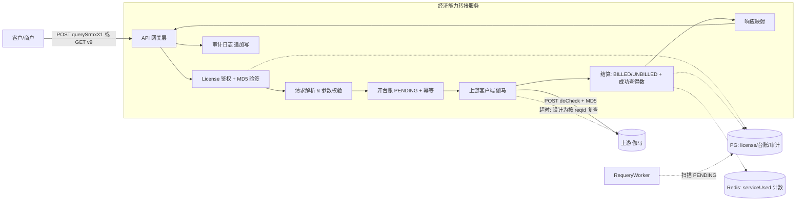
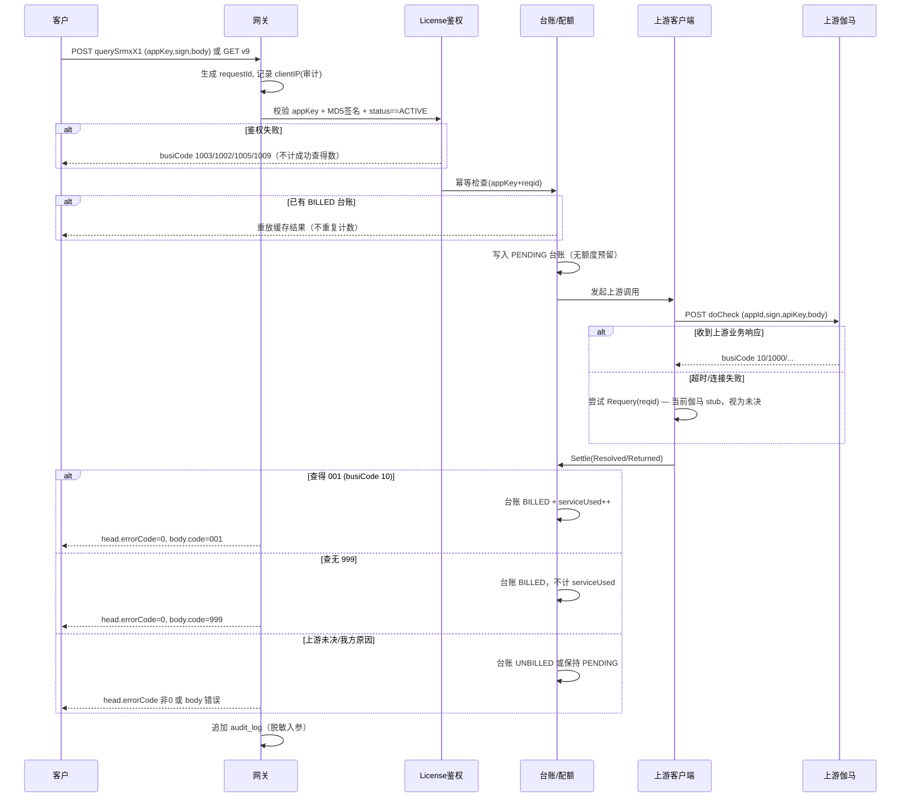
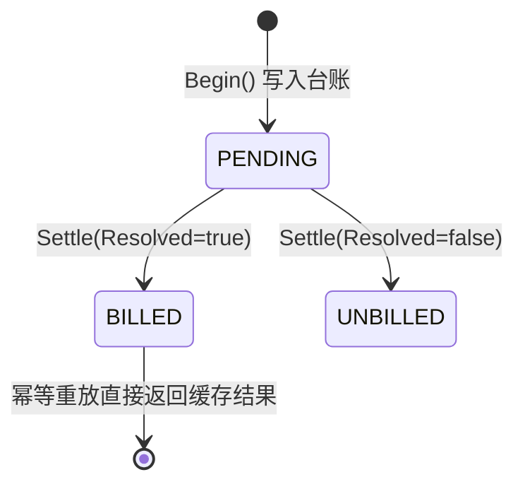

# 经济能力查询转接服务 — 设计文档（DESIGN.md）

> 版本：v0.9（服务版本 **x1**）
> 角色定位：本服务是一个**接口转接（API Relay / Gateway）网关**。对外为客户（商户）提供经济能力查询 API（当前版本 **x1**：`POST /v1/openapi/zlx/querySrmxX1`）；对内调用**上游数据源**（伽马分层分）获取评分后回传。
> 在此基础上提供 **License 鉴权** 与 **每路由独立的调用统计**（无额度限制）能力。

> **v0.9 变更（重要：demo license 治理 + 存储隔离防呆）**：
> - **端到端延迟优化：异步记账 + 鉴权缓存 + 连接复用（本次变更）**：请求关键路径只保留「鉴权 → 参数校验 → 开 PENDING 台账 → 调上游 → 映射响应」，其余全部移出：
>   - **异步记账（application.Bookkeeper）**：结算（Redis 计数 + PG 镜像 + 台账 UPDATE）与审计 INSERT 在响应构造后投递有界队列（每路由 1024 容量 / 2 worker），由常驻 worker 用独立 context 落库——关键路径每请求减少 3-5 次串行 DB 写。队列满/已关闭时**降级同步执行**（宁慢不丢计费凭证）；优雅停机在 HTTP Shutdown 后 **drain 全部余量**再关库。崩溃窗口内未落库的审计/计数丢失，但 PENDING 台账已在响应前同步写入（崩溃安全锚点不变，复查/对账兜底）。`/quota` 计数与后台审计因此为毫秒级最终一致。
>   - **鉴权缓存 + 单查询**：license+secret 同行一次 SELECT 取回（`FindByAppKeyWithSecret` 快路径），并按**域**做进程内 TTL 缓存（10s；v8/v9 同域共享）——命中时鉴权零 DB 读。后台改状态/删用户/轮换密钥经 `admin.WithLicenseChangeHook → auth.Invalidate` **即时失效**，TTL 只是多实例部署的兜底上界。不做负缓存（未知 appKey 恒查库）。
>   - **删除死幂等读**：所有路由的 reqid 均为请求内新生成（`parse.NewReqid`），台账幂等查询必 miss——`quota.Begin(reqidIsFresh=true)` 跳过该 SELECT；仅未来出现「客户传入 reqid」的路由才走完整幂等检查+重放。
>   - **上游连接复用**：共享 `http.Client` 显式 Transport（`MaxIdleConnsPerHost=64` 等，Go 默认仅 2——高并发同主机会反复重建 TCP+TLS）。个别上游需要的 `InsecureSkipVerify` 改为 **clone Transport 到私有副本**，不再篡改共享 client。
>   - 保持同步不动的两处：**鉴权**（必须先于上游调用）与 **PENDING 台账 INSERT**（崩溃对账锚点）。
>
> - **rlbd1（本次新增）**：人脸身份证比对一所路由——上游数脉 `facecompare`（`POST /v4/face_id_card/yisuo/compare`，form 提交，`sign = md5(appid&timestamp&app_security)`）；入参 `name`+`idCard`+（`image` base64 或 `url` 二选一），校验器 `parse.ParseFace`（`orchestrator.WithParser` 挂载）。归一：`code=200` 且 `incorrect` 为收费码（100/101/103/109/110/111/112）→`001` 查得（`result.range` 透出 data 富对象 JSON）；不收费码（104/106/107/108/113）及 `code≠200`→上游侧错误（不计费，`505062`）；人脸比对无「查无」概念，不产生 `999`。rlbd1 独立成域（redis db6 / datahub_rlbd1_db）。
> - **sfzhy（本次新增）**：身份证三要素核验路由——上游 `idverify`（`POST /api/idCardThreeElements`，JSON 提交，`signature = SHA256(升序 k=v&… + "&AppSecret=" + 商户密钥)`）；入参 `name`+`idCard`(15/18 位)+`profilePicture`(base64 人像照片)，校验器 `parse.ParseIDVerify`（`orchestrator.WithParser` 挂载）。归一：`Code=0`→`001` 查得（`result.range` 透出 Data 富对象 JSON `Result/ResultMessage/ImageScore`，上游 Result 0–5 均为可计费结论）；`Code≠0`（40x/45x/46x/50x）→上游侧错误（不计费，`505062`）；三要素核验无「查无」概念，不产生 `999`。sfzhy 独立成域（redis db7 / datahub_sfzhy_db）。
> - **rlbd2（本次新增）**：与 rlbd1 完全同一个人脸身份证比对一所上游接口（数脉 `facecompare`，同 endpoint/协议/校验器 `parse.ParseFace`），仅使用**另一套 appId/appSecret**；独立成域（redis db10 / datahub_rlbd2_db / 独立 license 与统计），与 rlbd1 互不影响。用于同一接口下需要区分不同上游账号（计费/对账）的场景。
> - **xfjy（本次新增）**：消费交易特征路由——上游 data-bean `consumetxn`（`POST /`，JSON 提交，公共参数 `procode(fk3002)/sceneid/reqtime/nonce/sign`，`sign = MD5(过滤空值升序 k=v&… + "&appkey=" + appkey)`，私有参数 `params{name/idcard/mobile/authlet}`）；入参 `name/idCard/mobile/authlet`（上游全标选填，网关仅做格式校验并要求至少一个查询要素 name/idCard/mobile，校验器 `parse.ParseConsumeTxn` 经 `orchestrator.WithParser` 挂载）。归一：`code=0 且 result=0`→`001` 查得（`result.range` 透出 `data.resultdata` 富对象 JSON）；`code=0 且 result=1`→`999` 查无（不计费）；`code≠0`→上游侧错误（不计费，`505062`）。xfjy 独立成域（redis db9 / datahub_xfjy_db）。
> - **tsfx（本次新增）**：投诉分析识别名单路由——上游 kfongtech `complaint`（`POST /inlet/api`，JSON 提交，外层 `{apiKey, param, sign}`：`param` 为业务参数 `{method=api.complaint.query/version=1.0.0/poly/mobile}` **AES 加密**、`sign` 为外层签名；响应 `{code, msg, token, data}`，`data` 为 **base64(gzip(命中结果数组))**，每条 `{callee, forbid}`，`forbid` 0未命中/1命中/-1异常）。入参 `mobile`+`poly`（命中级别 C1/C2/C3，均必填，校验器 `parse.ParseComplaint` 经 `orchestrator.WithParser` 挂载）。归一：`code=0000`→`001`（**调用成功即计费**，命中状态随 `result.range` 数组透出）；`code≠0000`→上游侧错误（不计费，`505062`）。本上游无「查无(999)」概念。tsfx 独立成域（redis db10 / datahub_tsfx_db）。**加密/加签**（已按上游官方 demo `docs/投诉分析识别/demo/demo1` 实现）：AES key/iv 由 `appSecret` 派生（`key=MD5(appSecret)大写[8,24)`、`iv=MD5(key)大写[8,24)`）；`param = AES/CBC/PKCS7(sortParam(业务参数), key, iv)` 转小写 hex；`sign = MD5(appSecret + sortParam(业务参数 + apiKey))` 小写 hex（`sortParam` 按 key ASCII 升序、剔除空值与 `sign` 拼成 `k=v&...`）。`upstream/complaint.go` 的 `encryptParam`/`signComplaint` 与 `mock_complaint.go` 镜像，故本地全链路可通。
> - **grgjj（本次新增）**：收入A_g版路由——上游 yrzx `incomeag`（`POST /yrzx/common/v2/credit/v2`，JSON 提交，请求体 `{account, type, data, reqid, verify}`：`data = Base64(3DES/ECB/PKCS5(明文业务JSON {name,cid,mobile}))`、`verify = MD5(account + 加密前JSON串 + reqid + type + key).toUpperCase()`；响应 `{code, msg, uid, reqid, result, verify}`，`result` 为同套 3DES 密文、解密得 `{cbjfzt 缴费状态, jfjs 缴费基数, jfsj 缴费时间}`）。入参 `name`+`idCard`(→cid)+`mobile`（均必填，校验器 `parse.ParseWithName` 经 `orchestrator.WithParser` 挂载）。归一：`code=001`→`001` 查得（`result.range` 透出解密后业务对象 JSON，计费）；`code=999`→`999` 查无（不计费）；其余（002/003/004/009/011/012/013/020…）→上游侧错误（不计费，`505062`）。grgjj 独立成域（redis db12 / datahub_grgjj_db）。**加密/加签**（已按上游官方 demo `yrzx_common_demo/ThreeDesUtil.java` 实现）：3DES 密钥（config `aesKey`）为 Base64 编码、解码后须 24 字节 DESede 密钥，同时用于加密 `data` 与解密 `result`（`upstream/des3ecb.go`）；MD5 加签密钥（config `key`）与 3DES 密钥是**两把独立凭证**。`upstream/incomeag.go` 的加解密/加签与 `mock_incomeag.go` 镜像，故本地全链路可通。
> - **grgjj 备用源（本次新增，双源串行寻源）**：grgjj 从单源升级为**双源命中即停**——同一种数据（公积金缴存）挂两个可互相替代的供应商，按优先级串行、第一个查得即停、后续源不再调用（省钱），主源查无/失败才回落备源。主源仍是 `incomeag`（priority 0）；新增备源 `bgjj`（priority 10，`upstream/bgjj.go`）：「备用公积金源」jeoho，`POST /api/nlv2/zl4`，**HTTPS 双向认证**（P12 客户端证书 `certPath/certPass`），请求体 `{merchant_id, timestamp, dsorderid, params, sign}`——`params` 为**明文对象** `{name, idcard, mobile}`（demo 默认 `isEncrpt=false`，HTTPS 已防中间人），`sign = MD5("k1=v1&…&params={name=.., idcard=.., mobile=..}&…&key=merchantKey")`（顶层键 ASCII 升序、剔空值与 sign，`params` 段为 Java map toString 形态，须与上游服务端解析后 toString 一致，故请求体 `params` 键序固定 name→idcard→mobile）。响应 `{code, message, data, orderid, dsorderid}`：`code=100` 查询成功→`data {date, score, jfzt}`；`201` 查无；`301` 非白名单IP 等为上游侧错误。**字段映射**（归一到 grgjj 既有下游契约，使下游无从察觉数据来自哪个源）：`jfzt→cbjfzt`、`score→jfjs`、`date→jfsj`。归一：某源查得→`001`（计费）；全查无→`999`；无查得+有失败→`002`（不计费）；全失败→上游侧错误（`505062`）。**串行寻源器** `upstream.Sourcer`（`sourcing.go`，与并发聚合 `Aggregator` 并存）：按 `(priority 升→成本升→配置顺序)` 稳定排序，命中即停，逐源落寻源轨迹（哪些源被短路、为何）供排障与成本对账；总时延预算硬闸门（缺省 9s，预算耗尽不再试下一个源）。装配层 `useSourcer` 判定：路由内 kind 不一致（异构可替代供应商）或任一源显式配了 `priority/costFen/costOn` 即走 Sourcer，否则维持 Aggregator。备源 `orderid` 为唯一上游标识，查得/查无/失败三路径均以 `UID`=`LogID`=`orderid` 落审计（失败也可向上游对账追查）。**部署机出口 IP 需先报 jeoho 加白**（否则 `301`）。
> - **grsb（本次新增）**：背景评估路由——上游 `bgpg`（`POST /api/getData`，JSON 提交；请求头带 `accountId`（账户 id）与 `prodId`（产品编号 `BJPG-01`），请求体 `{data}`：`data = Base64(AES/CBC/PKCS5(明文业务JSON {idCard,name}))`；响应 `{data, code, uuid, retMsg}`，`data` 为同套 AES 密文、解密得 `{xm 姓名, sfz 身份证, jfdw 缴费单位, grsf 个人身份, jfjs 缴费基数, cbjfzt 参保状态, jfsj 缴费时间}`）。入参**仅** `name`+`idCard` 两项且均必填——上游参数表没有 `mobile`，故**不能沿用三要素口径**，专属校验器 `parse.ParseBgPG` 经 `orchestrator.WithParser` 挂载（手机号既不校验也不透传）。归一：`code=200`→`001` 查得（`result.range` 透出解密后业务对象的 **全字段** compact JSON，不裁剪成 grgjj 的三字段口径，计费）；`code=2-404` 或 `3-404`→`999` 查无（不计费）；其余（2-500/2-501/2-502/2-503/2-504/2-505/2-506/2-507/2-508/2-509/3-506/3-507/3-510）→上游侧错误（不计费，`505062`）。上游只有 `uuid` 一个可对账标识，查得/查无/失败三路径均以 `UID`=`LogID`=`uuid` 落审计。grsb 独立成域（redis db13 / datahub_grsb_db）。**加密**（按上游文档 §3 工具类 `AesUtil` 实现，`upstream/aescbc.go`）：`encryptKey` 是 **hex 文本**，须 `Hex.decodeHex` 解码后才是 AES 密钥（32 个 hex 字符 = 16 字节 = AES-128；直接 `[]byte()` 会得到 `invalid key size 32`），密钥推导 `aesKeyFromHex` 显式校验 16/24/32 字节并带单元测试，非法立即报错不静默降级；IV 固定为 16 个 **ASCII 字符** `"0000000000000000"`（0x30×16，**不是**零字节）。`upstream/bgpg.go` 与 `mock_bgpg.go` 镜像，故本地全链路可通。**注意 `2-508 请求ip不在白名单内` 说明该上游按源 IP 放行，部署机出口 IP 需先报上游加白。**
> - **sfsm（本次新增）**：身份证实名核验路由——上游 `idcheck`（数脉 `POST /v4/id_card/check`，**form 提交**：上游文档明确「如 body 传参以表单方式提交，不要 json 方式」；与 `rlbd1`/`rlbd2` 是**同一服务商、同一套鉴权**，故直接复用 `signFaceCompare`：`sign = md5(appid&timestamp&app_security)`。表单字段 `appid`/`timestamp`/`sign`/`name`/`idcard`；`secretMode` 选填，首版**不发**即明文传参，若将来要加密则为 AES/ECB/PKCS5+Base64、key = `app_security`，且届时必须仍走 POST form）。响应 `{msg, success, code, data{result, order_no, desc, sex, birthday, address}}`。入参**仅** `name`+`idCard` 两项且均必填——上游业务参数表没有 `mobile`，故专属校验器 `parse.ParseIDCheck` 经 `orchestrator.WithParser` 挂载（手机号既不校验也不透传）；该口径与 grsb 的 `parse.ParseBgPG` 恰好相同，两者共用不导出的 `parseNameIDCard`，但各保留独立导出入口，将来任一上游口径变动时就地拆开即可。归一（依据上游「返回字段说明」里的收费标注，是计费正确性的唯一依据）：`code=200` 且 `result=0` 一致（收费）或 `result=1` 不一致（收费）→ **同为 `001` 查得计费**——「不一致」是上游给出的确定核验结论，不是查无，若误归 `999` 则该收的钱收不到、对账对不平，下游要判一致性请读 `result.range` 里的 `result`/`desc`；`result=2` 无记录（文档标「预留」，未标收费）→ `999` 查无不计费；`code≠200`（`400` 参数错误 / `404` 资源不存在 / `500` 系统内部错误 / `501` 第三方异常 / `601` 未开通权限 / `602` 账号停用 / `603` 余额不足 / `604` 接口停用 / `606` 调用超限 / `1001` 其它）→ 上游侧错误（不计费，`505062`）。另有两处**防误计费**的 fail closed：`data.result` 用指针接，缺失时不退化成 `0`（否则错误返回体的空 `data` 会被当成「一致」而计费）；`result` 超出 `0/1/2` 枚举时按上游侧错误处理。上游只有 `order_no` 一个可对账标识，查得/查无/失败三路径均以 `UID`=`LogID`=`order_no` 落审计，且 `order_no` 由 `sanitizeRange` 从 `result.range` 剥掉、不透给下游。sfsm 独立成域（redis db14 / datahub_sfsm_db）。文档签名例子（`appid=xyzxyzxyz`、`timestamp=1555378976238`、`app_security=efcefcefcefcefc` → `4e7e1974b79f3656aeaf03f1158f5d5d`）在 `upstream/idcheck_test.go` 里逐字验算；文档注「sign 不满 32 位需补 0」是 Java BigInteger 吃前导零的修补说明，Go 的 `hex.EncodeToString` 恒定 32 位，单测另有一条守住该前提。
> - **域模型**：`x1 / v8v9 / zlf / blk / rlbd1 / rlbd2 / sfzhy / xfjy / tsfx / lxf / grgjj / grsb / sfsm` 各域独立（v8/v9 共用 v8v9 域与同一套 license，其余路由独立成域，见 v0.8）。跨域使用 license 一律 `505004`。
> - **demo license 按域独立、且不进生产**：修复历史问题——旧实现把**同一个** demo license（`LIC-DEMO-0001` / `y89098io`，secret 公开）播种进**每个域库（含生产）**，导致这一个 token 能访问所有路由。现在：relay 生产（postgres）启动**不再播种** demo；迁移 `0004_per_route_license.sql` 自动删除旧共享 demo；开发态（memory / `SEED_DEMO=1` 的建库脚本）按域播种互不相同的 demo appKey（`model.DemoAppKey`：x1=`y89098io`、v8v9=`y890v8v9`、zlf=`y8909zlf`、blk=`y8909blk`）。
> - **启动期存储隔离防呆**：`cmd/relay` 装配前校验任意两个**不同的域**不得配置同一个 PG 库（host:port/name）或同一个 Redis 逻辑库（addr/db），违者拒绝启动（v8/v9 同域共库属设计内共享，不受影响）。
> - **后台前端**：路由标签页明确标注作用域——x1/zlf/blk 为独立数据库；v8/v9 标注共用同一套 license、统计与日志按路由独立。

> **v0.8 变更（重要：License 域 + 每路由独立统计）**：
> - **「路由」与「license 域」解耦**。路由（version）= 对外接口 + 上游，共 5 条：`x1 / v9 / v8 / zlf / blk`；license 域 = 存储边界（独占一套 DB + Redis + license 表），共 4 个：`x1 / v8v9 / zlf / blk`。映射 `model.RouteDomain`：`v8`、`v9` → `v8v9` 域，其余路由各自成域。
> - **每个用户按路由独立申请 license，但 v8/v9 共用一个**：因此一个商户最多有 **4 个 license**（`x1`、`v8v9`、`zlf`、`blk`）。`v8v9` 域内 license 表只有一行——同一套 `appKey/appSecret/状态` 同时在 `v8` 与 `v9` 两条路由鉴权通过；在任一路由后台对该 license 增删改/轮换密钥，对另一路由同步生效。
> - **统计/台账/审计按路由独立**：`quota` 主键改为 `(license_id, route, dim)`；`billing_ledger`、`audit_log` 增加 `version`(=route) 列。共享 license 的 `v8`、`v9` **调用次数 / 成功查得数 / 操作日志各自独立**，互不影响。
> - **新增「调用次数」统计（totalCalls）**：`dim='CALL'`，在 `quota.Settle` 中当上游已应答（`decision.Result != nil`，即查得或查无，= CalledUpstream）时 +1；按路由独立。原「成功查得数」（`dim='SERVICE'`，仅 busiCode=10）保留。`GET /quota{X1..}` 与管理后台同时返回 `serviceUsed` 与 `totalCalls`。
> - **存储装配按域**：每个域用其 owner 路由的 `database/redis` 开一套库（owner：`x1→x1, v8v9→v9, zlf→zlf, blk→blk`）；`v8` 在 config 中不再单列 `database/redis`，复用 `v9`(v8v9 域 owner) 的库/Redis。
> - 后台「版本切换」5 个标签（x1/v9/v8/zlf/blk）：`v8`、`v9` 标签展示同一份用户（共享 license），但统计列与操作记录各自独立。

> **v0.7 变更（重要）**：
> - **彻底移除维度②**（上游配额 / 上游调用计数 / 对账作业）。后台只保留单一统计「成功查得数」。删除内容：`QuotaRepository` 的预留/提交/释放、Redis 双维度计数、`billing_ledger.counted_upstream`、`quota.total/reserved` 列与 `UPSTREAM` 行、`ReconciliationJob`、管理端 `serviceTotal/upstreamTotal` 字段。台账状态机（PENDING→BILLED/UNBILLED）与异步复查 worker（RequeryWorker）保留，仅用于幂等与成功查得数结算；**当前伽马 `Requery` 为 stub**，复查 worker 对伽马上游暂无实际效果。
> - **彻底移除 IP 白名单**：删除全局/每用户 IP 白名单表、字段、管理端页面与网关拦截逻辑；来源 IP 仅写入审计。生产 IP 准入交由**阿里云 ECS 安全组**等网络层控制。
> - **管理后台增强**：用户增加手机号（脱敏展示）、密钥创建时间（`secret_created_at`）、授权过期日期（`valid_to`）；支持按 uuid(appKey)/名称/手机号检索用户与过滤审计。
> - **持久化**：支持 `postgres`+`redis` 生产路径；同 RDS 实例内 `dev_db`（开发/e2e）与 `prod_db`（生产）+ Redis 逻辑库 `db0`/`db1` 隔离。
> 本文 §7.x / §11.2 中关于维度② 的预留/提交/释放/对账描述均**已作废**，以本节为准。
>
> **v0.6 变更**：**取消额度限制**。不再对客户做余额拦截、也不再做成本上限拦截；任何持有效 license 的客户均可不受次数限制地调用。系统**仅统计每个用户累计成功查得数据的次数**（上游 001 → busiCode 10）。`busiCode 1001 账户余额不足` 与 `1006 透支余额已达上限` 不再触发。

> **v0.5 变更**：
> - **服务版本升级为 x1**：对外路由由旧版 `querySrmxV9` 改为 `POST /v1/openapi/zlx/querySrmxX1`。请求/响应契约保持不变（仍为 `appKey/sign/encryptionType/body` + MD5 加签、`head/body` 信封）。
> - **旧版 v9（兼容保留）**：[`income_cls.md`](./income_cls.md)（`GET /yrzx/finan/net/10w/v9`，`account/key` 验签 `verify=MD5(account+idCard+mobile+reqid+key)`，响应 `code/msg/uid/result.range/verify`）是**本服务旧版本（v9）下游契约**，仍对老客户提供（§5.4）。它与 x1 **共用同一上游（伽马）、同一 license/鉴权（account=appKey、key=appSecret）与成功查得数统计**，仅对外的请求/响应格式不同。**income_cls.md 不是上游**。
> - **上游唯一**：上游数据源**只有伽马分层分**（《伽马分层分_定制版》PDF，代码中的 `gama`）：`POST /enol/api/v1/doCheck`，信封 `appId/sign/apiKey/encryptionType/body` + MD5，返回 `data.busiCode/result.score`，归一化为 `UpstreamResult`（Code `001`查得/`999`查无）。
> - **对外（下游）**：端点 `POST /v1/openapi/zlx/querySrmxX1`，网关信封 `appKey/sign/encryptionType/body`（**MD5 加签**），响应 `head{errorCode,logId,time,errorMsg,timestamp} / body{code,msg,uid,reqid,verify,result{range}}`。`head.errorCode` 由内部 busiCode 映射（"0"=成功含查得/查无；非0=网关级错误，无 body）；查得/查无落在 `body.code` 001/999。

### 决策基线
1. **签名**：**客户侧（下游）**采用 **appKey + MD5 加签**（对 body 业务参数按键 ASCII 升序拼接后追加 `secret`，再 MD5；见 §8.1）；**上游侧（伽马）**因是第三方服务无法修改，沿用伽马 MD5 信封加签（对 body 业务参数按键 ASCII 升序拼接后追加 `secret`，再 MD5；见 §8.2）。
2. **成功查得数统计（v0.6，口径按路由取见 §6.5）**：**默认仅查得数据（busiCode=10，上游 001）才计入用户的「成功查得数」**。上游查无结果（999 → busiCode 1000）、鉴权/参数拦截、我方内部错误、上游我方原因失败等一律**不计**。这是本服务唯一对客户维度的统计口径。**例外**：上游码表对查无也标【计费】的路由（`billing.billNotFoundRoutes`，当前只有 `blk`）连 `999` 一起计——上游照收我方的钱，不同步计费就是我方净亏。
3. **无额度限制 + 单维度统计（v0.7）**：**不做任何次数上限拦截**，且**已彻底移除维度②上游配额/调用计数与对账作业**。台账（PENDING→BILLED/UNBILLED）与异步复查仅用于幂等与「成功查得数」结算，不再有任何上游计数或对账门槛。
4. **无 UNKNOWN 态**：超时/无响应一律通过**幂等 re-query（按 reqid 复查）**得到确定结论，最终以**上游扣费记录**为准，因此请求结算状态只有"已计费/未计费"两种终态。
5. **客户查询路由**：提供 `GET /v1/openapi/zlx/quota` 查询路由，返回该用户**累计成功查得数**与 license 状态（无余额/上限概念）。

---

## 1. 背景与目标

### 1.1 业务背景
- 客户调用**本服务 x1**（`POST /v1/openapi/zlx/querySrmxX1`，信封 `appKey/sign/encryptionType/body` + MD5 加签，请求体 `mobile/idCard/name`）。
- 本服务鉴权后调用唯一上游**伽马分层分**（《伽马分层分_定制版》PDF）。
- 上游返回收入模型评分（伽马 `result.score`，0~51），归一化后封装进下游 `body.result.range` 返回。

### 1.2 设计目标
1. **协议转接**：屏蔽上游接口细节，对客户提供稳定、统一的 API 契约。
2. **License 鉴权**：只有持有合法 license 的客户才能调用。
3. **成功查得数统计（v0.7，单维度）**：
   - 仅一个对客户的统计口径——**累计成功查得数**：客户调用本服务且**查得数据（busiCode=10）才计**，查无结果/错误一律不计（按路由取，`blk` 等「上游对查无也收费」的路由连查无一起计，见 §6.5）。
   - ~~维度②（我方上游成本）~~：**已移除**（不再有上游配额、上游调用计数与对账）。
4. **结算正确性**：
   - 通过"开台账 → 以上游确定结论结算 → 异步幂等复查"驱动 PENDING→BILLED/UNBILLED，**消除不确定态**；查得时累计成功查得数。

### 1.3 非目标（本期不做）
- 不做客户自助开通 / 充值前台（仅提供查询路由 + 预留数据模型）。
- 不做 V8（`/openapi/zlx/querySrmxV8`，发票明细数组）——本期仅 x1 经济能力评分。
- 多上游：`upstream.Aggregator` 保留 `len==1` 直通能力；当前所有路由均为单源。多源串行轮询模型见 `add-upstream-multi` skill（参考 DataHub_SWFP 仓）；仍不做「同一子源多家备份自动故障转移」。

---

## 2. 术语表

| 术语 | 含义 |
|---|---|
| 客户 / 商户 | 调用本服务的外部方 |
| License | 颁发给客户的授权凭证，含 `appKey`/`appSecret`、状态与成功查得数统计 |
| appKey | 网关分配给客户的公开标识（下游信封字段名；DB 列 `app_key`） |
| appSecret | 客户 MD5 加签密钥（仅创建/轮换时一次性返回；DB 列 `app_secret_enc`） |
| 上游 / Provider | 伽马分层分（《伽马分层分_定制版》PDF）经济能力数据源 |
| 成功查得数（serviceUsed） | 客户调用本服务且**计费**的**累计次数**；无上限。默认等于「查得数据」次数（busiCode=10，上游 001），`blk` 等 §6.5 例外路由还含查无 |
| 查得数据（returned） | 计费判定位（`BillingDecision.Returned`），由 `billing.TableFor(route)` 定：默认只有 001，例外路由（blk）还含 999。**它只决定计不计费，不决定下游 `body.code`**——报文形态恒由上游归一码定，见 §7.4 |
| re-query（幂等复查） | 超时/无响应时按 `reqid` 向上游复查的设计能力；**当前伽马 client 的 Requery 为 stub** |
| 计费台账（billing ledger） | 记录每次请求结算状态的追加写流水（PENDING/BILLED/UNBILLED） |
| reqid | 幂等键：x1 由本服务内部生成（≤20）；v9 由客户传入 |
| requestId | 本服务生成的全链路追踪 ID，作日志前缀并随 `head.logId` 返回（§9） |

---

## 3. 系统架构


```mermaid
flowchart LR
    Client[客户/商户] -->|"POST querySrmxX1 或 GET v9"| GW[API 网关层]

    subgraph Service[经济能力转接服务]
        GW --> Auth[License 鉴权 + MD5 验签]
        Auth --> Parse[请求解析 & 参数校验]
        Parse --> Ledger[开台账 PENDING + 幂等]
        Ledger --> UC[上游客户端 伽马]
        UC --> Settle[结算: BILLED/UNBILLED + 成功查得数]
        Settle --> Map[响应映射]
        Map --> GW
        GW --> Audit[审计日志 追加写]
    end

    UC -->|"POST doCheck + MD5"| Upstream[(上游 伽马)]
    UC -.->|超时: 设计为按 reqid 复查| Upstream

    Auth -.-> DB[(PG: license/台账/审计)]
    Settle -.-> DB
    Settle -.-> Redis[(Redis: serviceUsed 计数)]
    Worker[RequeryWorker] -.->|扫描 PENDING| DB
```

### 3.1 分层职责
| 层 | 职责 |
|---|---|
| API 网关层 | HTTP 接入、信封解析、**生成 requestId**（`head.logId` / `X-Request-Id`）、解析来源 IP（仅审计，**不做 IP 拦截**）、统一响应封装 |
| License 鉴权 | 校验 appKey、license 存在、`status==ACTIVE`、MD5 签名 |
| 配额/台账模块 | **无额度拦截**；幂等检查 → 开 PENDING 台账 → 结算时 BILLED/UNBILLED；查得时 **IncServiceUsed** |
| 请求解析 | 校验 `mobile/idCard/name` 等参数，x1 内部生成 reqid |
| 上游客户端 | 构造伽马 MD5 请求、超时控制、结果归一化（001/999） |
| 结算/响应映射 | 依上游结论结算台账 + 累计成功查得数；映射 x1 head/body 或 v9 JSON |
| 异步复查 | `RequeryWorker` 周期扫描 PENDING 台账（**伽马 Requery 当前 stub，无实际复查**） |
| 存储 | PostgreSQL（license/台账/审计/管理员）+ Redis（成功查得数原子计数）；或 memory（开发） |
| 管理后台 | JWT 管理员、用户 CRUD、密钥轮换、审计查询、React SPA |

---

## 4. 核心调用流程


```mermaid
sequenceDiagram
    participant C as 客户
    participant GW as 网关
    participant L as License鉴权
    participant Q as 台账/配额
    participant U as 上游客户端
    participant P as 上游伽马

    C->>GW: POST querySrmxX1 (appKey,sign,body) 或 GET v9
    GW->>GW: 生成 requestId, 记录 clientIP(审计)
    GW->>L: 校验 appKey + MD5签名 + status==ACTIVE
    alt 鉴权失败
        L-->>C: busiCode 1003/1002/1005/1009（不计成功查得数）
    end
    L->>Q: 幂等检查(appKey+reqid)
    alt 已有 BILLED 台账
        Q-->>C: 重放缓存结果（不重复计数）
    end
    Q->>Q: 写入 PENDING 台账（无额度预留）
    Q->>U: 发起上游调用
    U->>P: POST doCheck (appId,sign,apiKey,body)

    alt 收到上游业务响应
        P-->>U: busiCode 10/1000/...
    else 超时/连接失败
        U->>U: 尝试 Requery(reqid) — 当前伽马 stub，视为未决
    end

    U->>Q: Settle(Resolved/Returned)
    alt 查得 001 (busiCode 10)
        Q->>Q: 台账 BILLED + serviceUsed++
        GW-->>C: head.errorCode=0, body.code=001
    else 查无 999
        Q->>Q: 台账 BILLED，不计 serviceUsed
        GW-->>C: head.errorCode=0, body.code=999
    else 上游未决/我方原因
        Q->>Q: 台账 UNBILLED 或保持 PENDING
        GW-->>C: head.errorCode 非0 或 body 错误
    end
    GW->>GW: 追加 audit_log（脱敏入参）
```

---

## 5. 对外接口契约（客户侧）

> 权威=《接口文档 - 经济能力》：信封 `appKey/sign/encryptionType/body` + MD5 加签，响应 `head/body`。
> 通信：`POST` + HTTPS + JSON（UTF-8）。网关前缀 `/v1`。
> 环境：测试 apiHost `http://api-jcdz-test.jcszfw.com/v1`（联调提供正式地址）。

### 5.0 请求/响应公共结构

**请求信封**
| 字段 | 类型 | 必填 | 说明 |
|---|---|---|---|
| appKey | String | 是 | 网关分配的客户公开标识 |
| sign | String | 是 | 签名（见 §8.1，对 body 业务参数 MD5 加签） |
| encryptionType | int | 否 | 参数加密类型，`1`=明文（本期仅支持明文） |
| body | JSON | 是 | 接口请求体，见各接口定义 |

**响应信封（head/body）**
| 字段 | 类型 | 说明 |
|---|---|---|
| head.errorCode | String | `"0"`=成功（含查得/查无）；非 `"0"`=网关级错误（见 §5.3 映射） |
| head.logId | String | = 本服务 requestId（§9） |
| head.time | Number | 处理耗时 ms |
| head.errorMsg | String | 返回文字描述 / 错误原因 |
| head.timestamp | Number | 毫秒时间戳 |
| body | Object | 业务响应体（网关级错误时省略） |
| - code | String | `001`=查得 / `999`=查无（沿用旧版 v9 业务码口径） |
| - msg / uid / reqid / verify | String | 业务消息 / 上游流水号 / 请求流水号 / 上游签名（伽马为空） |
| - result.range | String | 收入模型评分 |

### 5.1 经济能力查询 x1
- **路径**：`POST /v1/openapi/zlx/querySrmxX1`
- **鉴权**：见 §8.1（appKey + MD5 签名）。

**请求示例**
```json
{
  "encryptionType": 1,
  "appKey": "y89098io",
  "sign": "0528999dd55c025b8f36fc72dceb1f63",
  "body": {
    "mobile": "138xxxx1009",
    "idCard": "330xxxxxxxx4312",
    "name": "张三"
  }
}
```

**body 参数**（《接口文档 - 经济能力》§3.1.3）
| 字段 | 类型 | 必填 | 说明 |
|---|---|---|---|
| mobile | String | 是 | 手机号 |
| idCard | String | 是 | 身份证（末位 X 大写） |
| name | String | 否 | 姓名 |

> 上游 reqid 由本服务内部生成（≤20），不再来自客户 tradeNo。

**成功响应（查得数据）**
```json
{
  "head": { "errorCode": "0", "logId": "<requestId>", "time": 81, "errorMsg": "success", "timestamp": 1778059529352 },
  "body": { "code": "001", "msg": "成功", "uid": "...", "reqid": "...", "verify": "", "result": { "range": "39" } }
}
```

**查无结果**：`head.errorCode="0"` + `body.code="999"`（无 `result` 节点），**不计成功查得数**。

**网关级错误（鉴权/参数/系统，只返回 head）**
```json
{ "head": { "errorCode": "505062", "logId": "...", "time": 12, "errorMsg": "数据请求异常", "timestamp": 1672822394403 } }
```
- v0.6+ **无额度拦截**，不会因余额/上限拒绝请求。

### 5.2 查询路由（本服务扩展，非 .doc 定义）
- **路径**：`GET /v1/openapi/zlx/quota`
- **鉴权**：同主接口（appKey + MD5 签名）。
- **用途**：供客户查询自身**累计成功查得数**与 license 状态。无额度限制，不返回余额/上限。
- **响应**：`{errorCode, errorMsg, status, serviceUsed}`，其中 `serviceUsed` = 累计成功查得数据的次数。

### 5.3 内部 busiCode → head.errorCode 映射
> 查得/查无是业务结果，落在 `body.code`（001/999），`head.errorCode` 恒为 `"0"`。下表非 0 项为网关级错误（只返回 head）。

| 内部 busiCode | 含义 | head.errorCode | 触发条件 | 计成功查得数 |
|---|---|---|---|---|
| 10 | 查得数据 | "0" (body.code 001) | 上游伽马 busiCode 10 | 是 |
| 1000 | 数据未查得 | "0" (body.code 999) | 上游伽马 busiCode 1000 | 否 |
| 1002 | 账户信息不存在 | 505004 | appKey 查无 license | 否 |
| 1003 | appKey 异常 | 505001 | 缺少/非法 appKey | 否 |
| 1005 | 账号信息异常 | 505002 | 签名校验失败 | 否 |
| 1007 | 数据请求异常 | 505062 | 参数校验失败 / 上游我方原因失败 / 内部错误 / 超时复查未决 | 否 |
| 1009 | 服务尚未开通 | 505007 | license 非 ACTIVE（SUSPENDED/EXPIRED） | 否 |

> v0.6 起取消额度限制，`1001 账户余额不足`、`1006 透支余额已达上限` 不再触发（常量保留以兼容历史）。

> `head.errorCode` 字典中 `0` / `505062` 取自 .doc 示例，其余 `5050xx` 为内部约定（待联调对齐真实字典）。

### 5.4 旧版 v9 兼容接口（income_cls.md）

> 面向仍在使用旧格式的老客户保留。**与 x1 共用同一上游（伽马）、license 鉴权与成功查得数统计**，仅对外协议不同。新接入一律用 x1（§5.1）。

- **路径**：`GET /yrzx/finan/net/10w/v9`（HTTP GET，UTF-8，JSON）。
- **入参**（query）：`account`（=客户 appKey）、`idCard`、`name`（选填）、`mobile`、`reqid`（≤20，幂等键）、`verify`。
- **验签**：`verify = MD5(account + idCard + mobile + reqid + key).toUpperCase()`，其中 `key` = 客户 `appSecret`（服务端按 `account` 定位）。
- **响应**：`{code, msg, uid, reqid, result{range}, verify}`；`code`：`001` 查得 / `999` 查无 / 错误码字典（`002/003/004/005/006/008/009/011/012/013/020`，见 income_cls.md）。
- **响应签名**：`verify = MD5(code + uid + key).toUpperCase()`（是签名字段 code+uid+key 的一致口径，**待与旧版实现联调确认**）。
- **错误码映射**（内部 busiCode → v9 code）：`10→001`、`1000→999`、`1002→002`、`1009→004`、`1003→009`、`1005→013`、其余（含 1007 上游/我方原因/超时未决）→`012`。入参存在性/格式在网关层校验：account 空→`009`、reqid 空或 >20→`008`、idCard 空/格式→`005`、mobile 空/格式→`020`、verify 空→`011`。
- **幂等**：以客户传入的 `reqid` 为台账幂等键（x1 为内部生成）。
- **统计口径同 x1**：仅查得数据（→`001`）累计成功查得数；查无（`999`）不计。

---

## 6. 上游对接（Provider 侧）

> 上游按版本路由：`x1 → gama`（伽马分层分）、`v9/v8 → income`（经济能力）、`zlf → rental`（租赁分V2-D / 守信）、`blk → blacklist`（黑名单因子V35 / 应诺尔）、`rlbd1 → facecompare`（人脸身份证比对一所 / 数脉）、`rlbd2 → facecompare`（同 rlbd1 上游接口、独立 appId/appSecret）、`sfzhy → idverify`（身份证三要素核验）、`xfjy → consumetxn`（消费交易特征 / data-bean）、`tsfx → complaint`（投诉分析识别名单 / kfongtech）、`lxf → lxscore`（灵犀分 score_195_v1 / fullink）、`grgjj → incomeag`（收入A_g版 / yrzx，主源）**+ bgjj**（备用公积金 / jeoho，备源）、`grsb → bgpg`（背景评估 BJPG-01）、`sfsm → idcheck`（身份证实名核验 / 数脉，与 facecompare 同服务商同签名）。每条路由的上游按 `versions.<route>.upstreams` 列表配置：单源路由套 `upstream.Aggregator`（`len==1` 直通）；**多源可替代路由**（同一种数据、不同供应商，如 grgjj）套 `upstream.Sourcer` 串行寻源（命中即停，`useSourcer` 按混合 kind 或显式 `priority/cost` 判定选用）；多源互补路由（各查各的、结果拼段）仍走 `Aggregator` 并发聚合。下文 §6~§6.3 以伽马为例，§6.4 描述租赁分V2-D，§6.5 描述黑名单因子V35。

- **URL**：`POST https://{域名}/enol/api/v1/doCheck`
- **请求信封**：`appId`（商务分配）、`sign`、`apiKey`（固定 `gama_ctmz_layer_score`）、`encryptionType`(1=明文)、`body{name?, idCard, mobile}`
- **签名**：`sign = MD5(body 非空业务参数按键 ASCII 升序拼接 key+value … + secret)`（小写 hex；`appId/sign/apiKey/encryptionType` 不参与）
- **出参**：`code`（0 成功）、`msg`、`seqNo`（上游流水号）、`data.busiCode`、`data.busiMsg`、`data.result.score`
- **归一化**：`data.busiCode 10 → UpstreamResult.Code "001"`（查得，附 `score`）、`1000 → "999"`（查无）、其余 busiCode（1001/1002/1003/1005/1006/1007/1009 等，均为我方在伽马侧的账户/参数/系统问题）→ 视为上游侧错误，触发 re-query/对账兜底、不计费。

### 6.1 字段映射
| 客户侧（下游 body） | → | 上游侧（伽马 body） |
|---|---|---|
| mobile | → | mobile |
| idCard | → | idCard |
| name | → | name |
| （内部生成 reqid，≤20，用于幂等/复查） | → | （伽马以 seqNo 返回上游流水号） |
| （我方配置）| → | appId / secret / apiKey |

> `appId/secret` 为**我方与伽马的凭证**，与客户的 license 无关，存于服务端安全配置（见 §11.4）。

### 6.2 上游 busiCode → 客户 busiCode
归一化后的上游 `Code` 映射为客户 `body.code` / 内部 busiCode：`001 → 10`（查得数据，附 `range`）、`999 → 1000`（数据未查得）、其余我方原因失败（伽马 1001/1002/1003/1005/1006/1007/1009 等）`→ 1007`（数据请求异常）并告警。

### 6.3 计数口径（v0.7 现行）
| 场景 | busiCode | 累计成功查得数 (serviceUsed) |
|---|---|---|
| 上游成功(001) | 10 | ✅ +1 |
| 上游查无结果(999) | 1000 | ❌ 不计 |
| 鉴权/参数拦截 | 1003/1005/1009/1007 等 | ❌ 不计 |
| 超时/上游未决 | 1007 | ❌ 不计（台账可能保持 PENDING） |
| 幂等重放（已有 BILLED） | 10 或 1000 | ❌ 不重复计数 |

### 6.4 租赁分V2-D 上游（rental，zlf 版本）

> 上游：**租赁分V2-D / 守信**（`shouxin168`，代码中的 `rental`）。对外 zlf 版本契约与 x1 完全一致，仅此上游对接方式不同。

- **URL**：生产 `POST https://shouwei.shouxin168.com/api/lightning/product/query`；测试 `http://sit-shouwei.shouxin168.com/sandbox/lightning/product/query`（需上游加服务器 IP 白名单）。
- **传输**：`POST`，`Content-Type: application/x-www-form-urlencoded`，表单字段 `institution_id`（机构号）+ `biz_data`。
- **biz_data**：业务数据 JSON 经 **AES/ECB/PKCS5Padding** 加密后 **Base64** 编码。明文字段：`name`/`phone`/`ident_number`（必传）、`service`（默认 `buer_unique_service`）、`mode`（默认 `mode_rent_score_v2_d`）、`licenseUrl`/`licenseType`（授权书 OSS 地址与类型，0图片/1pdf）、`encryption`（可选）。
- **授权书**：调用方**不需要**传授权书；本服务用**固定本地文件**（`upstream.licenseFile`）在启动时上传 OSS（`approve_files/` 前缀）一次，缓存 `licenseUrl` 供所有查询复用。
- **出参**：外层 `resp_code`/`resp_data`/`resp_msg`/`resp_order`/`timestamp`；主体 `score1`（float，500-700：[500-550]高、(550-590]中、(590-700]低）。
- **归一化**：`resp_code SW0000 → UpstreamResult.Code "001"`（查得，`Range = score1` 字符串）、`SW0002 → "999"`（查无）、其余 SW*（`SW0001`认证失败、`SW003x`签名/验签/解密、`SW004x`未开通/限额/余额、`SW0017/SW0018`参数、`SW10xx`格式、`SW9999`系统）→ 视为上游侧错误：不计费，交由 re-query/对账兜底。
- **字段映射**：客户 `mobile → phone`、`idCard → ident_number`、`name → name`；`institution_id`/`aesKey`/`oss.*`/`licenseFile`/`licenseType` 为我方与上游凭证，存于服务端安全配置（YAML）。
- **计数口径**：与 §6.3 一致——仅 `SW0000`（归一 001 → busiCode 10）计入成功查得数。

### 6.5 黑名单因子V35 上游（blacklist，blk 版本）

> 上游：**黑名单因子V35 / 应诺尔**（`enol`，代码中的 `blacklist`）。**与 gama 同一 enol 端点 + 同一 MD5 信封**，是 `GamaClient` 的近亲；对外 blk 版本契约与 x1 完全一致，仅此上游对接方式不同。

- **URL**：`POST https://{域名}/enol/api/v1/doCheck`（测试 `testenol.cn`、生产 `api.enolfax.com`；需上游加服务器 IP 白名单）。与 gama 同端点。
- **请求信封**：`appId`（商务分配）、`sign`、`apiKey`（**固定 `blackIntV35`**）、`encryptionType`(**`2`=MD5**)、`body{name, idCard, mobile, tradeNo?}`。
- **关键差异（PII MD5）**：`encryptionType=2` 时，body 的 `name/idCard/mobile` 传 **MD5 小写 hex 摘要值**（由本服务内部计算，调用方仍传明文）；`tradeNo` 保持明文且可选（当前不注入）。
- **签名**：`sign = MD5(body 非空业务参数按键 ASCII 升序拼接 key+value … + secret)`（小写 hex；复用 `signGama`，对**实际发送的值**即 MD5 后的值加签；`appId/sign/apiKey/encryptionType` 不参与）。
- **出参**：外层 `code`(0 成功)/`msg`/`seqNo`；主体 `data.busiCode`/`data.busiMsg`/`data.result`。`result` 为**富对象**：`whether_hit`(0/1)、`hit_grade`(0-5)、`hit_type[]`（P1-P8 共 8 个场景，每个含 `m1/m3/m6`）。
- **归一化**：`data.busiCode 10 → UpstreamResult.Code "001"`（查得，`Range = json.Marshal(result)` 紧凑 JSON 字符串）、`1000 → "999"`（查无）、其余 busiCode（1001–1009，我方在应诺尔侧的账户/参数/系统问题）→ 视为上游侧错误：不计费，交由 re-query/对账兜底。
- **富对象 → 单字符串**：下游 `result.range` 只有单字符串，故将上游 `result` 整体 `json.Marshal` 为紧凑 JSON 字符串写入 `UpstreamResult.Range`，经下游 `result.range` 原样透出，客户自行 `JSON.parse`。
- **字段映射**：客户 `mobile → mobile`、`idCard → idCard`、`name → name`（`encryptionType=2` 时取 MD5 后入 body）；`appId/secret/apiKey/encryptionType` 为我方与上游凭证/约定，存于服务端安全配置（YAML）。
- **计数口径（与 §6.3 不同，已按上游对齐）**：黑名单因子V35 文档 §2.1 把
  **`10 查询成功【计费】` 与 `1000 未查得【计费】` 双双标了计费**——上游对未查得
  照样收我方的钱，故本服务对 blk 的 `1000→999` **也计入成功查得数**。实现方式是
  `billing.TableFor("blk")` 把 `999` 加进 returnedCodes（登记表见
  `billing.billNotFoundRoutes`），**不是**把归一码改成 001：下游必须照常看到
  `body.code=999`（查无就是查无），计费与报文形态在此处必然分叉。
  注意同为应诺尔 enol、同端点同 busiCode 语义的 **x1（伽马）`1000` 不带计费标注、
  不计费**——逐产品看文档，禁止复用兄弟路由的结论。详见 `billing-scope` skill。

---

## 7. License 与成功查得数设计（v0.7 现行）

### 7.1 License 数据模型（代码 / DB）
```text
License (表 license)
├── license_id        主键
├── app_key           客户公开标识 appKey（唯一）
├── app_secret_enc    客户 MD5 加签 secret（当前 e2e 明文存储；生产应加密）
├── client_uuid       内部 UUID（requestId 等用途）
├── name              商户展示名/备注
├── mobile            联系手机号（管理后台脱敏展示）
├── status            ACTIVE / SUSPENDED / EXPIRED
├── valid_from        生效时间
├── valid_to          授权过期日期（后台展示；鉴权当前仅检查 status）
├── secret_created_at 当前密钥创建/轮换时间
├── rate_limit        JSONB（schema 预留，代码未读取）
├── created_at / updated_at

Quota (表 quota, 主键 (license_id, route, dim))
├── license_id
├── route             路由名 (x1/v9/v8/zlf/blk)，使共享 license 的 v8/v9 计数独立
├── dim               SERVICE(成功查得数) | CALL(调用次数)
├── used_or_committed 该 (license,route,dim) 的累计计数
└── updated_at
```

- **无额度上限**：不做任何次数拦截。
- **按路由独立计数**：`v8v9` 域内 `v8`、`v9` 共用一行 license，但 quota 行按 `route` 分开（计数互不影响）。计数行由首次累加时 UPSERT 按需创建。
- **Active()**：代码仅判断 `status == "ACTIVE"`，**未**按 `valid_to` 日期自动过期。

### 7.2 调用统计语义（按路由独立）
两个统计口径，均按 `(license, route)` 独立累计；共享 license 的 v8/v9 互不影响：

| 统计 | dim | 计的是什么 | 计数时机 |
|---|---|---|---|
| 成功查得数 serviceUsed | SERVICE | 客户调用且**计费**的累计次数（默认=查得数据 busiCode=10；`blk` 等 §6.5 例外路由还含查无） | `Settle` 时 `Returned=true` → `IncServiceUsed`，`Returned` 由 `billing.TableFor(route)` 定 |
| 调用次数 totalCalls | CALL | **成功调用到上游**（上游已应答查得或查无，= CalledUpstream）的累计次数 | `Settle` 时 `decision.Result != nil` → `IncTotalCalls` |

- 鉴权失败 / 参数非法 / 上游连不上（PENDING 未决）**不计** totalCalls；上游应答的查无（999）**计** totalCalls，是否计 serviceUsed 按路由取（默认不计，`blk` 计——见 §6.5）。
- **自然月缓存命中**（x1/v8/v9，见 §17）：serviceUsed 口径与回源一致（查得计、查无不计），但 **totalCalls 不增**（确实没调上游）。于是两者的差额天然就是缓存省下的上游调用量。
- 每个台账仅结算一次（同步路径或复查 worker），故计数不重复。
- 存储：memory 内存计数；生产 Redis `quota:{licenseId}:{route}:svc_used` / `:call_total` + PG `quota` 表镜像。
- 查询：`GET /v1/openapi/zlx/quota{X1..}` 返回 `{errorCode, errorMsg, status, serviceUsed, totalCalls}`。

### 7.3 台账状态机（幂等 + 结算）


```mermaid
stateDiagram-v2
    [*] --> PENDING: Begin() 写入台账
    PENDING --> BILLED: Settle(Resolved=true)
    PENDING --> UNBILLED: Settle(Resolved=false)
    BILLED --> [*]: 幂等重放直接返回缓存结果
```

**流程（`quota.Service` + `QueryOrchestrator`）：**
1. **Begin**：按 `(appKey, reqid)` 查台账；若已有 **BILLED** → 幂等重放，不重复计数。
2. 否则 append **PENDING** 台账（**无预留、无余额检查**）。
3. 调用上游伽马 → `billing.Decide` 产出 `BillingDecision`。
4. **Settle**：
   - `Resolved && Returned` → 台账 **BILLED** + `serviceUsed++`
   - `Resolved && !Returned`（查无）→ 台账 **BILLED**，不计数
   - `!Resolved` → 台账 **UNBILLED**
5. 超时路径：orchestrator 尝试 `upstream.Requery`；**当前伽马实现恒返回不可达**，视为未决 → `1007` / PENDING 留待 worker。

### 7.4 上游伽马 busiCode → 客户响应
| 伽马 busiCode | 含义 | 归一化 Code | 客户 busiCode | serviceUsed |
|---|---|---|---|---|
| 10 | 查询成功【计费】 | 001 | 10 | +1 |
| 1000 | 数据未查得（无计费标注） | 999 | 1000 | 0 |
| 其它 | 我方伽马账户/参数/系统问题 | - | 1007 | 0 |

> **归一码与计费口径是两件事**：上表最后一列是 x1 的口径，不通用。归一码只描述
> "有没有数据"（决定 `body.code`），是否计费由**该路由的**计费码表
> `billing.TableFor(route)` 决定。目前只有 blk 例外（其上游对未查得也收费，
> `999` 照样 `serviceUsed+1`，但 `body.code` 仍是 `999`）。**全部 14 条路由的
> 逐码计费口径与文档出处，见 `billing-scope` skill——改任何一条前先读它。**

### 7.5 并发与原子性
- **serviceUsed 递增**必须原子：Redis `INCR` + PG 写回（生产）；memory 单 mutex（开发）。
- **幂等**：`(app_key, reqid)` 唯一约束；BILLED 命中直接重放。

### 7.6 异步复查（RequeryWorker）
- 周期扫描 `PENDING` 台账，尝试上游复查并结算。
- **现状**：`upstream/gama.go` 的 `Requery` 为 stub（`Reachable=false`），对伽马上游**无实际复查**；inline 复查同理。

### 7.7 已移除（v0.6/v0.7 勿再实现）
- ~~维度①余额检查、1001/1006 错误~~
- ~~维度②预留/committed/reserved、上游配额、对账任务 ReconciliationJob~~
- ~~全局/每用户 IP 白名单拦截~~

---

## 8. 鉴权与签名（决策 1：客户侧 MD5 加签 / 上游侧 MD5）

> 客户侧（本服务对外）使用 **appKey + MD5 加签**；上游侧（伽马）因是第三方服务无法修改，沿用伽马 **MD5**。两侧签名相互独立、互不影响。

### 8.1 客户 → 本服务（appKey + MD5 加签）
- 客户持 `appKey`（公开标识，由我方分配）与 `appSecret`（加签密钥，仅双方持有、不在请求中传输）。
- 签名材料在请求信封中：`appKey`、`sign`、`encryptionType`、`body`。**本服务下游不使用 `apiKey`**（`apiKey` 仅存在于上游伽马侧）。
- **签名算法**：
  1. 取 `body` 中**所有业务参数**，剔除字节/文件类型与**值为空**的参数；按参数名的 ASCII 升序排序（比较第一个字符，相同则比较下一个字符，依此类推）。
  2. 将排序后的参数与其值拼成 `参数名参数值参数名参数值…`，末尾追加 `appSecret`，得到待签名字符串。
     - 例（业务参数 name/idCard/mobile，按 ASCII 升序 `idCard < mobile < name`）：`idCard330129199511153412mobile13290879000name张三<appSecret>`
  3. 对待签名字符串做 **MD5**（**小写 hex**），赋值给 `sign`；服务端比较时大小写不敏感（统一转小写后常量时间比较）。
  - `appKey / sign / encryptionType` **不参与**拼接；`appKey` 仅用于服务端定位 `appSecret`。
- **服务端校验顺序**（见 §5.3 错误码）：
  1. `appKey` 存在（否则 `1003`，head.errorCode 505001）；
  2. `appKey` 匹配到 license（否则 `1002`，505004）；
  3. license `status == ACTIVE`（否则 `1009`，505007）；**注意**：当前代码**未**校验 `valid_to` 日期；
  4. 用服务端存储的 `appSecret` 按同一算法重算签名并**常量时间比较**，一致才放行（否则 `1005`，505002）。
- **加密类型**：`encryptionType=1` 明文（本期仅支持）；非 1 暂不支持，按 `1007` 处理。
- 上游 reqid 由本服务内部生成（≤20 位，§5.1），不来自客户。

### 8.2 本服务 → 上游伽马（MD5，第三方不可改）
- 按《伽马分层分_定制版》PDF §3.1：`sign = MD5(body 非空业务参数按键 ASCII 升序拼接 key+value … 末尾追加 secret)`，取**小写 hex**；`appId/sign/apiKey/encryptionType` 不参与拼接。
- 请求信封 `appId`（商务分配）+ `apiKey`（固定 `gama_ctmz_layer_score`）+ `encryptionType=1`。
- `appId/secret` 由服务端安全配置注入，不暴露给客户。

---

## 9. 全链路追踪（requestId / Trace）

为支撑后续 debug 与客户问题排查，本服务在**请求入口**生成全链路追踪标识 `requestId`，贯穿整条调用链，**在响应 `head.logId` 与 Header `X-Request-Id` 中返回**，并作为结构化日志的关键字段。

### 9.1 与 reqid 的区别（重要）
| 标识 | 来源 | 粒度 | 用途 |
|---|---|---|---|
| `reqid` | 幂等键：x1 内部生成；v9 客户传入 | 每个业务请求 | **幂等键**、台账去重 |
| `requestId`（响应 `head.logId`） | **本服务生成**的追踪 ID | 每次物理请求 | **全链路追踪 / 日志前缀 / 排障** |

### 9.2 requestId 生成规则
在网关收到请求、完成 body 缓冲后立即生成（鉴权前即生成，保证鉴权失败也可追踪）：

```
输入：
  ts         = 请求到达时间（毫秒时间戳）
  clientShort= 信封 appKey（未鉴权时从 body 解析；空则 "anon"）
  body       = 原始请求体字节

bodyHash  = SHA-256(body) 的前 8 个 hex 字符
seed      = ts + "|" + clientShort + "|" + SHA-256(body) hex
core      = Base32( SHA-256(seed) ) 前 10 位
requestId = ts(Base36) + "-" + clientShort(≤8) + "-" + bodyHash + "-" + core
```

实现见 `internal/common/reqid/reqid.go`、`internal/api/middleware.go`。

### 9.3 返回给客户
- `requestId` 作为响应 `head.logId` 返回。
- 同时通过响应头 `X-Request-Id` 返回。
- 若请求 Header 已带 `X-Request-Id`，网关**直接复用**该值。

```json
{
  "head": { "errorCode": "0", "logId": "lq8x2f-y89098io-9f3a1b2c-K7M2P9QXTV", "time": 81, "errorMsg": "success", "timestamp": 1778059529352 },
  "body": { "code": "001", "msg": "成功", "uid": "...", "reqid": "...", "verify": "", "result": { "range": "39" } }
}
```

### 9.4 日志前缀与上下文传播
- **日志前缀**：所有日志行以 `[requestId]` 开头，例如：
  ```
  [lq8x2f-y89098io-9f3a1b2c-K7M2P9QXTV] INFO  auth ok, appKey=y89098io
  [lq8x2f-y89098io-9f3a1b2c-K7M2P9QXTV] INFO  upstream call start reqid=1778059529283
  [lq8x2f-y89098io-9f3a1b2c-K7M2P9QXTV] WARN  upstream timeout, re-query by reqid
  [lq8x2f-y89098io-9f3a1b2c-K7M2P9QXTV] INFO  billed=true busiCode=10 score=39
  ```
- **上下文传播**：Go 通过 `context.Context`（`appctx.RequestID`）携带 requestId；slog 结构化字段 `requestId`。
- **跨调用关联**：审计与台账写入 `request_id`；上游 uid 记入 audit/ledger。

### 9.5 排障价值
- 客户报障只需提供 `head.logId`（= requestId），即可在日志中检索整条链路。
- 计费争议时，凭 requestId 关联台账与上游 uid，复核是否应计入成功查得数。

---

## 10. 错误处理与重试

| 类别 | 处理 |
|---|---|
| 客户参数错 | 前置校验，返回 `busiCode 1007`，不调用上游、不计数 |
| 鉴权错 | `busiCode 1003/1002/1005/1009`，不计数 |
| 上游超时/无响应 | 尝试 Requery（**伽马 stub**）→ 未决则 `1007`，台账可能 PENDING |
| 上游业务错（我方伽马账户/配置） | `UNBILLED`，`busiCode 1007`，不计数 |
| 服务内部错 | 返回网关级错误；不计数 |

---

## 11. 存储设计

### 11.1 license 表（`migrations/0001_init.sql`）
`license_id, app_key, app_secret_enc, client_uuid, name, mobile, status, valid_from, valid_to, secret_created_at, rate_limit, created_at, updated_at`

- `app_key`：客户公开标识（下游字段名 appKey）。
- `app_secret_enc`：客户 MD5 secret；**当前实现为明文存储**（e2e/开发），生产应加密。
- `mobile`：联系手机号；管理后台列表脱敏展示（前3+后4）。
- `valid_to` / `secret_created_at`：授权过期日、当前密钥创建/轮换时间（后台展示）。
- `rate_limit`：schema 预留，**代码未读取**。

### 11.2 quota 表
`license_id, route, dim('SERVICE'|'CALL'), used_or_committed, updated_at`，主键 `(license_id, route, dim)`（迁移 `0003_per_route_stats.sql`）。

- 计数按 `(license, route, dim)` 独立：`dim='SERVICE'` = 累计成功查得数（busiCode=10），`dim='CALL'` = 累计调用次数（CalledUpstream）。共享 license 的 v8/v9 行按 `route` 分开。
- 计数行由首次累加时 UPSERT 按需创建（建用户时不预插）。
- 生产环境 Redis 为热计数（`quota:{licenseId}:{route}:svc_used` / `:call_total`），PG 为持久镜像（`persistence/redis/quota.go`）。

### 11.3 billing_ledger 表（追加写）
`id, app_key, version, trade_no, reqid, request_id, upstream_logid, upstream_uid, upstream_code, busi_code, state(PENDING|BILLED|UNBILLED), counted_service(bool), created_at, settled_at`

- `version` = 产生该台账的路由（x1/v9/v8/zlf/blk）；唯一索引改为 `(app_key, version, reqid)`，使共享 license 的 v8/v9 幂等键互不冲突；普通索引：`request_id`、`state`。
- `counted_service`：是否计入成功查得数（与 `Returned` 一致）。
- **无** `counted_upstream` 列（v0.7 已删）。

### 11.4 admin_user / audit_log（`migrations/0002_admin.sql`）
- `admin_user`：管理员账号（username 唯一，password_hash 加盐 SHA-256）。
- `audit_log`：每次请求追加写；`version`(=route)、`app_key`、脱敏入参、`client_ip`（仅记录，**不用于拦截**）、上下游 metadata。后台按 `version` 作用域过滤（共享 license 的 v8/v9 操作日志各自独立）。

### 11.5 环境与隔离
| 环境 | 配置文件 | PG 库 | Redis DB |
|---|---|---|---|
| 开发/e2e | `config.aliyun.e2e.yaml` | `dev_db` | 0 |
| 生产 | `config.aliyun.prod.yaml` | `prod_db` | 1 |

重建：`scripts/recreate_schema.sql` + `scripts/recreate_databases.go`（删旧表 → 重跑 migrations → SeedDemo）。

### 11.6 请求日志 / PII
- 结构化日志带 `requestId`；审计表存 `name_mask/id_card_mask/mobile_mask`（`common/mask`）。

---

## 12. 技术选型（当前实现）
- **语言**：Go 1.22+；入口 `cmd/relay`。
- **HTTP**：标准库 `net/http`（Go 1.22+ 路由模式）。
- **持久化**：
  - 开发：`persistence/memory`（单进程 mutex，默认）。
  - 生产/e2e：`persistence/postgres`（pgxpool）+ `persistence/redis`（成功查得数 INCR）。
- **管理后台**：React + Vite SPA，JWT（HS256），静态托管 `/admin/`。
- **配置**：YAML + `CONFIG_FILE` 环境变量（`cmd/relay/config.go`）。
- **测试**：PowerShell 编排 `test/run.ps1` + `test/cases/*.go`（`//go:build ignore`）。

---

## 13. 非功能需求
- **超时**：上游连接/读超时可配置（`upstream.timeout`，默认 4s）。
- **安全**：HTTPS（部署侧）、密钥与 PII 脱敏、**IP 准入由 ECS 安全组/网络层控制**（网关不做 IP 白名单）。
- **幂等**：`(app_key, reqid)` 全链路贯穿。
- **可观测**：结构化 slog 日志（带 requestId）；Prometheus 等指标待接入。

---

## 14. 关键设计取舍小结（v0.7 现行）
1. **无额度限制**：任意 ACTIVE license 可无限调用；仅统计成功查得数。
2. **单维度统计**：仅 busiCode=10（上游 001）累计 `serviceUsed`；查无/错误不计。
3. **台账 + 幂等**：PENDING→BILLED/UNBILLED 驱动结算与重放；无维度②预留/对账。
4. **客户 MD5 / 上游 MD5**：两侧独立加签（§8）。
5. **全链路 requestId**：`head.logId` + `X-Request-Id` + 审计/台账关联（§9）。
6. **IP 准入外置**：网关不拦截 IP；ECS 安全组 + 审计记录 `client_ip`。
7. **管理后台**：YAML 引导管理员、用户手机号/密钥时间/过期日、检索与审计过滤。

---

## 15. 待联调确认（实现前对齐）

### 15.0 已确认（按 PDF 拍板，本期实现据此落地）
- **加签排序**：以**参数名 ASCII 升序**为准（与 PDF 末尾 Java `Collections.sort` 示例一致）；PDF 正文里的示例串顺序不作准。
- **`tradeNo` 参与加签**：作为 `body` 业务参数，**非空时一并参与**排序拼接。
- **hex 大小写**：签名取**小写 hex**；服务端比较大小写不敏感。
- **空值剔除**：值为空（空串）的业务参数**不参与**加签。
- **防重放**：MD5 加签不含 nonce/时间戳；依赖 HTTPS + `appKey+reqid` 幂等 + **网络层 IP 控制**（非应用内白名单）。
- **配额查询路由**：`GET /openapi/zlx/quota` 为 PDF 之外的本服务扩展，**保留**，响应对齐 PDF 的 `code/msg/seqNo/data` 风格（§5.2）。
- **`score=0` 处理**：上游 `range=0`（不连续/收入能力弱）时，按 `busiCode=10` **原样透传** `score="0"`（PDF 标称 1-51，0 为上游边界值）。

### 15.1 仍待联调
1. `encryptionType` 是否需要支持**密文**（本期仅明文 `1`；非 1 暂按 `1007` 处理）。
2. ~~上游对 `999 查无结果` 的**实际扣费口径**~~ —— **已按各上游文档逐条核定**，
   结论固化在 `billing.TableFor` 与 `billing-scope` skill 的权威表里。仅剩三处
   缺上游书面口径待确认：**bgjj**（备用公积金，文档无码表）、**sfsm**（idcheck，
   该源文档未落到本仓 `docs/`）、**tsfx**（投诉分析，状态码字典无计费列）。
3. 上游是否提供**对账文件 / 单笔查询（按 reqid 复查）接口**及其格式 —— 这是消除不确定态与对账兜底的前提。
4. 伽马上游联调参数：正式/测试`域名`、`appId/secret`、`apiKey`；reqid 由本服务内部生成（≤20 位）。
5. 各 `busiCode` 与上游 code 的最终映射（特别是我方原因失败是否细分到 1002/1005 等）。
6. 正式 / 测试访问地址与**网络层**外网 IP 白名单（阿里云 ECS 安全组 / RDS 白名单）。

---

## 16. 管理后台（Admin Console）

> 面向**管理员（我方运营）**的内部控制台。提供：① 普通用户 CRUD 与密钥轮换；② 累计成功查得数展示；③ 操作/审计记录查询与检索；④ React SPA 托管于 `/admin/`。
>
> **v0.7 已移除**：全局/每用户 IP 白名单管理页与 API；IP 准入交由阿里云 ECS 安全组。

### 16.0 决策基线（与代码一致）
1. **前端形态**：React + Vite SPA；生产构建产物由 relay 静态托管 `/admin/`（`admin.spaDir`）。
2. **管理员鉴权**：独立账号 + JWT（HS256）；**初始管理员由配置文件** `admin.bootstrapUser` / `admin.bootstrapPass` 引导（**非**环境变量）。与客户 appKey/secret 体系隔离。
3. **存储**：`storage.driver=memory`（开发）或 `postgres`+`redis`（生产/e2e）。
4. **密钥**：为用户生成 `appKey` + `secret`；`secret` **仅创建/轮换响应返回一次**；DB 列 `app_secret_enc`（当前明文，生产应加密）。
5. **审计**：每次下游请求追加 `audit_log`（上游是否调用、是否查得、busiCode、脱敏入参、client_ip 等）。
6. **无额度配置**：仅展示 `serviceUsed`（累计成功查得数）与 `totalCalls`（累计调用次数），均为当前路由作用域。

### 16.1 管理员鉴权与会话
- **登录**：`POST /admin/api/login`，体 `{username, password}` → `{token, expireAt}`。
- **令牌**：JWT HS256，`Authorization: Bearer <token>`；密钥 `admin.jwtSecret`，TTL `admin.tokenTTL`（默认 8h）。
- **密码**：加盐 SHA-256（`admin/credential.go`）；生产应换 bcrypt/argon2。
- **中间件**：除 login 外所有 `/admin/api/**` 需 JWT，否则 401。

### 16.2 普通用户（license）管理
| 操作 | 方法 / 路由 | 说明 |
|---|---|---|
| 列表/检索 | `GET /admin/api/users?q=` | `q` 模糊匹配 appKey / 名称 / 手机号；返回 `serviceUsed`、手机号、密钥创建时间、过期日期等 |
| 详情 | `GET /admin/api/users/{licenseId}` | 单个用户 |
| 新建 | `POST /admin/api/users` | 体 `{name?, mobile?}`；自动生成 appKey+secret+clientUuid；**一次性**返回明文 secret |
| 修改 | `PATCH /admin/api/users/{licenseId}` | 改 `status`、`mobile` |
| 删除 | `DELETE /admin/api/users/{licenseId}` | 删 license + quota |
| 轮换密钥 | `POST /admin/api/users/{licenseId}/rotate-secret` | 新 secret 一次性返回；更新 `secret_created_at` |

- **展示字段**：appKey、名称、手机号（前端脱敏 `138****1009`）、状态、成功查得数、密钥创建时间、过期日期、创建时间。
- **状态**：`SUSPENDED/EXPIRED` → 主接口 `busiCode 1009`。

### 16.3 操作记录 / 审计查询
- `GET /admin/api/audits?appKey=&q=&busiCode=&limit=&offset=`
  - `appKey`：精确匹配
  - `q`：按 uuid(appKey)/名称/手机号解析用户 → 过滤其 appKey 集合
  - `busiCode`、`limit`（默认100，最大500）、`offset`
- 字段：`requestId, appKey, tradeNo, reqid, clientIp, calledUpstream, fromCache, foundData, busiCode, busiMsg, upstreamCode, upstreamUid, upstreamLogId, billed, latencyMs, nameMask, idCardMask, mobileMask, errMsg, createdAt`
- `fromCache=true` 的行是自然月结果缓存命中（`calledUpstream=false` 但 `billed=true`，见 §17）。

### 16.4 数据模型（`migrations/0002_admin.sql` + license 扩展）
```text
admin_user(id, username, password_hash, role, created_at)

audit_log(id, request_id, version, app_key, trade_no, reqid, client_ip,
          called_upstream, found_data, busi_code, busi_msg,
          upstream_code, upstream_uid, upstream_logid, billed,
          latency_ms, name_mask, id_card_mask, mobile_mask, err_msg,
          from_cache, created_at)
-- version(=route) 列由 0003 增加；后台按路由作用域过滤操作日志（共享 license 的 v8/v9 不混淆）
-- from_cache 列由 0007 增加（billing_ledger 同步增加），标记自然月缓存命中（§17）

license 扩展字段（0001）: name, mobile, secret_created_at
-- 无 ip_whitelist 列（v0.7 已删）
-- 无 ip_whitelist_global 表（v0.7 已删）
```

### 16.5 安全与边界
- 管理 API / SPA 应仅限内网或受控网络；生产叠加 ECS 安全组。
- `secret` 明文仅创建/轮换响应出现一次。
- 审计与管理入参 PII 脱敏存储（`common/mask`）。
- **不做应用层 IP 白名单**；`client_ip` 仅审计。

---

## 17. 自然月结果缓存（x1 / v8 / v9）

同一个人（`name+idCard+mobile`）在同一自然月内的重复查询直接回放本月首查结果，跨月才重新回源上游。默认**关闭**，按路由用 `versions.<route>.cache.enabled` 开启。代码：`internal/domain/cache`（纯域逻辑）+ `redis/resultcache.go` / `memory/resultcache.go`（适配器）。

### 17.1 Key / Value / TTL

```
qc:{group}:{YYYYMM}:{fingerprint}
```

- `group`：缓存共享组，缺省 = 路由名。**x1 与 v8/v9 对接的是不同上游产品**，评分口径不保证一致，默认各自独立；确认数据等价后可把两条路由的 `cache.shareGroup` 配成同一个值来共享，无需改代码。
- `YYYYMM`：Asia/Shanghai 自然月桶（`time.FixedZone(+8)`，不依赖宿主机 tzdata）。**把月份写进 key 是这个设计的关键**：九月的查询根本不会去读八月的 key，所以「跨月必须回源」这条规则不依赖 TTL 的精确性，TTL 退化成纯粹的内存回收手段。
- `fingerprint`：`HMAC-SHA256(pepper, name\0idCard\0mobile)` 取前 128 位 hex。必须是 HMAC 而非裸哈希——身份证号空间可枚举（出生日期+地区码+校验位），裸 SHA-256 的 Redis 快照泄露即可反查明文身份证。`pepper` 由配置注入，与 Redis 凭证分开保管；留空启动直接失败（`cache.ErrNoPepper`）。参与哈希的是 `parse.Parse` 归一化后的值。
- Value：归一化后的 `model.UpstreamResult`（不是上游原始报文）+ 首次回源的 `requestId`，JSON 字段名压到 1-2 字符（每条要驻留一整月，字段名开销会被乘以月活去重人数）。
- TTL = 距下个自然月 1 日 0 点的秒数 + 随机抖动（缺省 0~12h）。抖动避免几百万 key 在月初同一瞬间集体到期造成 Redis CPU 尖刺；因为月份已在 key 里，抖动期内残留的上月 key 永远不会被读到，对业务语义零影响。
- **只缓存确定结论**：`001` 查得与 `999` 查无。上游错误、鉴权失败、参数非法一律不入缓存——这些是「结论未确定」，缓存下来会把一次偶发的上游故障固化成整月的错误答案。

### 17.2 读路径

`runCore` 最前面查缓存，命中则 `quota.Begin`（同步 PG INSERT）与上游调用**全部跳过**：

- **命中比不带缓存更快**：省掉 1 次上游 HTTP（200ms~2s）、1 次同步 PG INSERT、1 次 PG UPDATE，只多 1 次 Redis GET（内网 0.3~1ms）。
- **未命中只多 1 次 Redis GET**（约 +0.5ms，相对 200ms+ 的上游调用是噪声级别）。
- **Redis 故障降级**：缓存读写走独立的短超时（缺省 150ms），**任何错误一律当作未命中**并记 warn，绝不让 Redis 抖动传导成下游请求失败或变慢。

回放的字段口径：`body.uid` / `upstream_logid` 用缓存里的**原值**（对账能追回上游那笔订单），`body.reqid` 与 `head.logId` 用**本次请求**的新流水号——下游看到的流水号每次唯一，不会被下游的去重逻辑误判成重复报文。

### 17.3 写路径（不占用响应耗时）

复用异步记账器 `Bookkeeper`：`bookTask.cacheSet` 携带已算好的 key/entry/TTL，真正的 Redis `SETEX` 在常驻 worker 协程上执行，与响应写回 socket 并发进行。

两条铁律：

1. `Submit` 在队列满或已关闭时会降级为同步执行（现有的「宁可慢几毫秒也不丢计费凭证」策略）。这条路径上**主动把 `cacheSet` 置 nil**：计费凭证不能丢，缓存条目丢了只是损失一次上游调用，绝不允许它在背压时反过来拖慢响应。
2. 入队发生在响应 flush 之前、实际写入发生在之后。这个顺序是**有意的**：万一进程此刻崩溃，宁愿缓存里留下一条客户没收到的结果（客户重试时命中，钱只收一次，上游钱已经花了），也不愿把已经付费买到的结果丢掉。

### 17.4 计费口径

`quota.SettleCached` 与 `Settle` 并列：

| 缓存命中结论 | serviceUsed | totalCalls | 台账 |
|---|---|---|---|
| `001` 查得 | **+1** | 不增 | 一次 INSERT 成 `BILLED` + `counted_service=true` + `from_cache=true` |
| `999` 查无 | 不计 | 不增 | 一次 INSERT 成 `BILLED` + `counted_service=false` + `from_cache=true` |

- 对客户的计费口径与回源**完全一致**（查得计、查无不计）。
- **缓存白名单与「查无也计费」的路由必须互斥**：上表按 `cache.Entry.Found()` 记账，只认 `001`。若给 `blk` 这类 §6.5 路由开缓存，该收费的查无会被重放成不收费，账目随命中率漂移。`attachResultCache` 用 `billing.BillsNotFound(route)` 在启动时拒绝这种组合；将来要放开，得先让命中路径认得该路由的计费码表，而不是只放宽白名单。
- `totalCalls` 的语义是「调用上游次数」，命中确实没调上游，故不增。于是 `serviceUsed`（收入侧）与 `totalCalls`（成本侧）的差额天然就是缓存省下的上游调用量，不必另加计数器。
- 台账不走「先 PENDING 后 UPDATE」两步：命中路径不存在「上游是否已扣费未知」的窗口，结论在读到缓存那一刻即确定，没有需要 PENDING 锚点保护的崩溃窗口。

### 17.5 可观测性

`migrations/0007_from_cache_flag.sql` 给 `billing_ledger` 与 `audit_log` 各加一列 `from_cache`。理由：命中时 `called_upstream=false` 但 `billed=true`，后台看起来像「没调上游却收了钱」的脏数据；这一列把它解释清楚，同时让「本月命中率」变成一句 SQL，也让上游对账时能一眼排除掉没有独立上游订单号的行。后台审计列表已加「走缓存」列。

### 17.6 运维前提与容量

- ★ **Redis `maxmemory-policy` 必须是 `volatile-lru`**。缓存 key 都带 TTL、配额计数器 `quota:*` 不带 TTL；`volatile-lru` 只淘汰带 TTL 的 key，于是内存吃紧时淘汰压力只落在缓存上，累计计数绝对安全。若误配成 `allkeys-lru`，计数器可能被淘汰后从 0 重建，客户可见的 `serviceUsed` 会静默回退。（`redis/quota.go ensure()` 已改为每次用 `EXISTS` 探活重新 seed，不再用进程内守卫，把这个隐患从「静默丢数」降级为「从 PG 镜像恢复」。）
- 监控：`used_memory / maxmemory > 60%` 报警、`evicted_keys > 0` 报警。这是判断「什么时候真该升级实例」的客观信号。
- 单条内存占用约 **400~500 字节**（key ≈ 44B + value ≈ 130~180B + Redis 每 key 固有开销 ≈ 64~100B）。按 x1+v8+v9 每月去重人数估算峰值：10 万→约 50MB，100 万→约 500MB，300 万→约 1.5GB，1000 万→约 5GB。**去重人数 300 万/月以内，2 核 4G 的 Redis 够用**（建议缓存占用控制在 maxmemory 的 60% 以内，给 BGSAVE/复制缓冲留头寸）。
- PostgreSQL **不增加任何负载**：命中把每请求的 PG 写从 3 次（INSERT PENDING + UPDATE 结算 + INSERT 审计）降到 2 次（INSERT 终态台账 + INSERT 审计），且都在异步 worker 上。

### 17.7 哪些路由可以开

`cmd/relay/main.go` 的 `cacheableRoutes` 白名单当前只有 **x1 / v8 / v9**。缓存身份只含个人三要素，所以只有**入参恰好就是这三项**的路由才可能命中正确的条目。`rlbd1/rlbd2/sfzhy`（人像照片）、`xfjy`（授权书编号）、`tsfx`（命中级别策略 poly）等入参含额外判别字段的路由**绝不可加入**——缓存键看不见那些字段，会把「换了照片/换了策略的另一次查询」错判为同一次。`zlf/blk/lxf/grgjj` 虽同为三要素入参，但上游合约对结果复用的限制尚未逐一确认，暂不开放。配置开关 + 白名单双重把关：给白名单外的路由开启会让**启动直接失败**，而不是静默生效。

### 17.8 明确不做

- **并发穿透（cache stampede）**：冷 key 上同时来 N 个同一人的请求会 N 次全部回源。只影响成本不影响正确性；后续可加进程内 singleflight 收敛，先看真实命中率数据再决定。
- **不引入 PG 缓存表**：会把关键路径上的 Redis GET（0.3ms）换成 PG 查询（几 ms），与「不增加延迟」的目标相悖；而缓存丢失的代价仅仅是一次上游调用。
- **不做缓存主动失效 UI**：如需强制回源，删对应 Redis key 即可。
